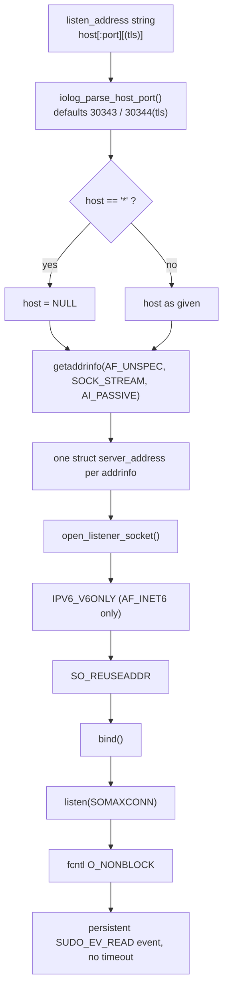
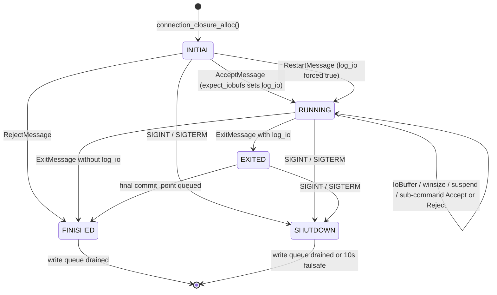
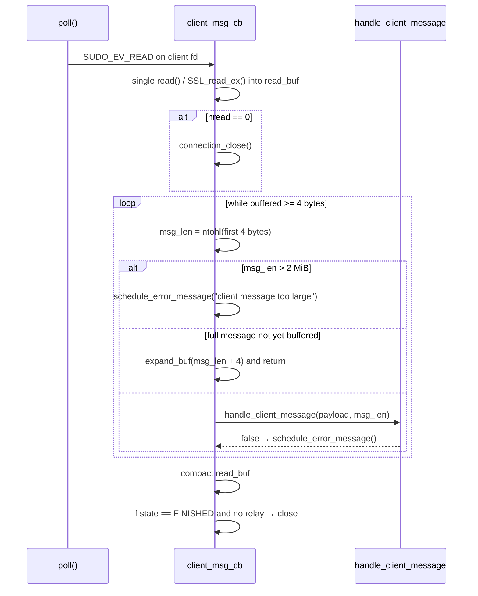
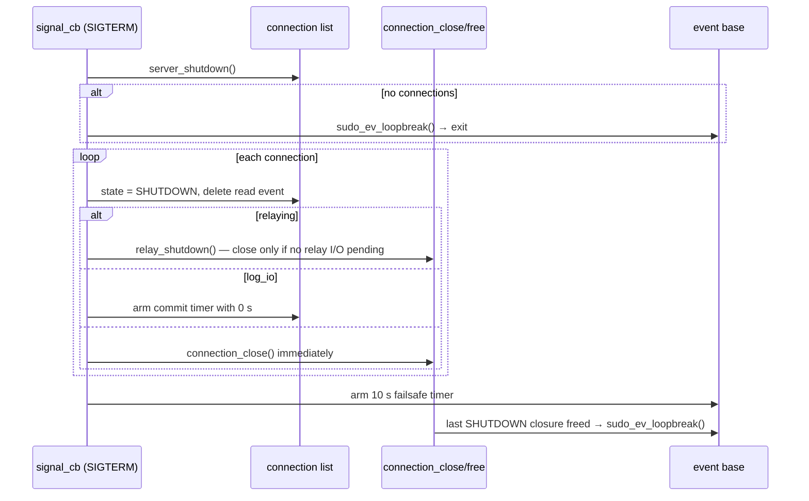

# 01. Daemon Architecture & Connection Lifecycle

> **Reference:** sudo 1.9.18 — `36f7128256a93571ec378daa5c209d6883036d31` (2026-07-19)
> **C sources:** `logsrvd/logsrvd.c`, `logsrvd/logsrvd.h`, `logsrvd/logsrv_util.c`, `logsrvd/logsrv_util.h`, `lib/util/event.c`, `include/sudo_event.h`, `logsrvd/logsrvd_conf.c` (listener address resolution and timeout accessors only), `logsrvd/logsrvd_local.c`, `logsrvd/logsrvd_journal.c`, `logsrvd/logsrvd_relay.c`, `logsrvd/logsrvd_queue.c` (call sites into the lifecycle only), `lib/util/sudo_debug.c`, `docs/sudo_logsrvd.man.in`, `docs/sudo_logsrvd.conf.man.in`
> **Requirement prefix:** `ARCH-`
> **Refresh:** see [README.md](README.md)

## Overview

`sudo_logsrvd` is a **single process, single threaded, non-blocking event loop**. There
is exactly one `fork(2)` in the entire daemon — the one that detaches it from the
terminal at startup (`logsrvd/logsrvd.c:2122`) — and there are no threads anywhere. Every
listener, every client connection, every relay connection, every timer and every signal
is multiplexed through one `struct sudo_event_base` allocated in `main()`
(`logsrvd/logsrvd.c:2281`) and driven by `sudo_ev_dispatch()` at
`logsrvd/logsrvd.c:2302`. This is the single most important architectural fact for a
reimplementation: there is no per-connection isolation, no worker pool, and no
concurrency to reason about. A callback that blocks blocks the whole daemon, and the C
code is written on the assumption that no callback ever does.

`main()` (`logsrvd/logsrvd.c:2210-2308`) performs a fixed sequence: set the program name
and locale, set a `0077` umask, read `sudo.conf` and register the debug subsystem, check
the protobuf-c runtime version, parse command-line options, read `sudo_logsrvd.conf`,
raise `RLIMIT_NOFILE`, allocate the event base, bind the listeners, scan the relay
outgoing queue, register signal events, daemonize, ignore `SIGPIPE`, and dispatch. Every
failure before the "point of no return" comment at `logsrvd/logsrvd.c:2298` is reported
on stderr and terminates the process; nothing after it can fail cleanly except by
breaking out of the event loop.

Listeners are created from the resolved `listen_address` list. Each *resolved*
`struct addrinfo` — not each configuration line — becomes one `struct listener` with its
own socket and its own persistent read event (`logsrvd/logsrvd.c:1766-1804`). Because
address resolution uses `AF_UNSPEC` with `AI_PASSIVE`
(`logsrvd/logsrvd_conf.c:566-589`), the default `*:30343` typically produces two
listeners, one IPv4 and one IPv6, and the IPv6 one has `IPV6_V6ONLY` set so the two do
not collide (`logsrvd/logsrvd.c:1680-1687`).

Every accepted connection gets a `struct connection_closure`
(`logsrvd/logsrvd.h:89-127`) allocated by `connection_closure_alloc()`
(`logsrvd/logsrvd.c:190-252`) and threaded onto a global `connections` tail queue
(`logsrvd/logsrvd.c:78`). The closure owns up to four events — a persistent read event, a
persistent write event, a one-shot commit timer, and (for TLS) a one-shot handshake
event — plus one read buffer and two lists of write buffers (in-flight and recycled).
The closure carries an `enum connection_status state` (`logsrvd/logsrvd.h:56-63`) that
drives message admissibility, and a `struct client_message_switch *cms` vtable
(`logsrvd/logsrvd.h:130-147`) chosen at allocation time that decides whether messages are
stored locally, journalled to disk, or forwarded to a relay.

Reads and writes are asymmetric. The **read event is persistent and carries no
timeout at all** (`logsrvd/logsrvd.c:1373`, with an explicit comment saying so): a client
may sit idle indefinitely and the server will never hang up on it. The **write event is
persistent but is armed with `server.timeout` every time output is queued** and is
deleted the moment the write queue drains (`logsrvd/logsrvd.c:1110-1116`). So the
configured `timeout` is a *write* and *TLS handshake* deadline, not an idle deadline —
which is at odds with how `sudo_logsrvd.conf(5)` describes it (see
[Timeouts](#timeouts-what-is-actually-armed)).

Shutdown is cooperative. `SIGINT`/`SIGTERM` do not exit; they mark every live connection
`SHUTDOWN`, stop reading from all of them, and give I/O-logging connections a chance to
emit one last `commit_point` before closing (`logsrvd/logsrvd.c:975-1017`). The loop is
broken either when the last connection is freed (`logsrvd/logsrvd.c:180-181`) or when a
10-second failsafe timer fires (`logsrvd/logsrvd.c:1005-1014`), whichever comes first.

`SIGHUP` reloads the configuration and rebuilds the listener set in place, reusing
listener sockets whose address string is unchanged, without disturbing any active
connection (`logsrvd/logsrvd.c:1809-1900`). `SIGUSR1` dumps a snapshot of listeners,
connections and the relay queue to the debug log (`logsrvd/logsrvd.c:1906-1987`).

## Process startup and option parsing

Options are parsed with `getopt_long()` from the short string `"f:hnR:V"` and the long
table at `logsrvd/logsrvd.c:2199-2206`. There are only five: `-f/--file`, `-h/--help`,
`-n/--no-fork`, `-R/--random-drop`, `-V/--version`. Any unrecognized option falls to
`usage()`, which prints the one-line synopsis to stderr and exits with `EXIT_FAILURE`
(`logsrvd/logsrvd.c:2171-2176`). Note that `getopt_long` runs *after* `sudo.conf` has been
read and the debug subsystem registered (`logsrvd/logsrvd.c:2238-2241`), so debug output
is already live before the command line is examined.

`-R` is a debugging aid only. The value is a percentage parsed with `strtod()` and
divided by 100; it is consulted exactly once, in `handle_iobuf()`
(`logsrvd/logsrvd.c:766-774`), to randomly abort a connection so client restart logic can
be exercised. It affects no other message type.

The configuration file path is remembered in the file-static `conf_file`
(`logsrvd/logsrvd.c:81`) and is reused verbatim by `server_reload()` on `SIGHUP`
(`logsrvd/logsrvd.c:1885`), so `-f` survives reloads.

## Daemonization, pidfile, and privileges

`daemonize()` (`logsrvd/logsrvd.c:2112-2162`) always `chdir("/")`, warning but continuing
if that fails. In the default (forking) mode it calls `sudo_debug_fork()` — a thin
wrapper around `fork()` that refreshes the debug PID prefix in the child
(`lib/util/sudo_debug.c:479-491`) — has the parent `_exit(EXIT_SUCCESS)`, then `setsid()`,
writes the pidfile, and redirects all three standard descriptors to `/dev/null`. In
`-n` mode there is no fork, no `setsid()`, and no pidfile; only stdin is unconditionally
redirected, while stdout and stderr are redirected *only if they are not already open*
(tested with `fcntl(F_GETFL) == -1`).

Both modes finish by calling `logsrvd_warn_stderr(false)`
(`logsrvd/logsrvd.c:2159`), which clears the flag that makes `sudo_warn`/`sudo_fatal`
echo to stderr (`logsrvd/logsrvd_conf.c:175`, `1424-1426`, `1450-1452`). This happens in
`-n` mode too, so diagnostics printed after daemonization go only to the configured log
destination even in the foreground.

There is **no privilege separation of any kind**. `sudo_logsrvd` never calls `setuid`,
`setgid`, `initgroups`, or `chroot`; it runs for its entire life with whatever
credentials it was started with, normally root. The configured `iolog_uid`/`iolog_gid`
are used only as the ownership applied to created I/O log directories and files by the
storage layer (`logsrvd/logsrvd_local.c:427`, `logsrvd/logsrvd_journal.c:99-123`), not to
the daemon process.

## The event loop

The event base is sudo's own `lib/util/event.c`, backed by `poll(2)` (or `select(2)`
where poll is unavailable). Four properties matter for a reimplementation:

1. **Timeouts are absolute deadlines on the monotonic clock.** `sudo_ev_add()` converts
   the relative `struct timespec` to an absolute time via `sudo_gettime_mono()` and
   inserts the event into a sorted timeouts queue (`lib/util/event.c:534-553`).
2. **Re-adding an already-inserted event only touches its timeout.** If the event is
   already `SUDO_EVQ_INSERTED`, passing a non-NULL timeout *resets* the deadline, and
   passing NULL *removes* the deadline entirely (`lib/util/event.c:504-511`, `533-553`).
   The backend registration is not duplicated. This is why the code can call
   `sudo_ev_add(write_ev, timeout)` repeatedly without leaking registrations.
3. **Non-persistent events are removed from the base before their callback runs**
   (`lib/util/event.c:726-727`). The commit timer relies on this: after it fires it is no
   longer `SUDO_EVQ_INSERTED`, which is exactly the condition `enable_commit()` tests.
4. **Signals are deferred, not asynchronous.** The installed `sigaction` handler only
   records the signal in `signal_pending[]` and writes one byte to a self-pipe
   (`lib/util/event.c:361-386`); the actual callback runs from the event loop
   (`lib/util/event.c:94-133`, `680-687`). Signal callbacks therefore never interleave
   with connection callbacks, and no locking is required anywhere in the daemon.

`sudo_ev_loopbreak()` sets a flag that aborts the loop after the currently running
callback returns (`lib/util/event.c:730-735`, `775-789`). The loop also returns on its own
if the base ever has no registered events at all (`lib/util/event.c:669-672`), which in
practice never happens because the listeners and signal events stay registered for the
life of the process.

The commit timer is allocated as `sudo_ev_alloc(-1, SUDO_EV_TIMEOUT, ...)`
(`logsrvd/logsrvd.c:234-235`). `SUDO_EV_TIMEOUT` is not part of `SUDO_EV_MASK`
(`include/sudo_event.h:37`), so `sudo_ev_init()` masks it off and the event ends up with
`events == 0`: a pure timer with no descriptor, no `SUDO_EV_PERSIST`, and no backend
registration.

## Listener sockets

`open_listener_socket()` (`logsrvd/logsrvd.c:1667-1713`) treats `IPV6_V6ONLY` and
`SO_REUSEADDR` failures as warnings and continues, but treats `socket()`, `bind()`,
`listen()` and the `O_NONBLOCK` `fcntl()` as fatal for that one address. A failed address
does not abort startup: `server_setup()` counts successfully registered listeners and only
fails if the count is zero (`logsrvd/logsrvd.c:1858-1866`), at which point `main()` calls
`sudo_fatalx()` (`logsrvd/logsrvd.c:2285-2286`).

`listener_cb()` (`logsrvd/logsrvd.c:1731-1764`) performs exactly **one** `accept()` per
readable event. Because the listener event is persistent and the listening socket is
non-blocking, a backlog is drained one connection per loop iteration. There is no
connection limit; the two `TODO` comments at `logsrvd/logsrvd.c:1752` and
`logsrvd/logsrvd.c:1759` acknowledge that the daemon does not pause accepting on `ENOMEM`,
`ENFILE` or `EMFILE`. The only mitigation is the `RLIMIT_NOFILE` bump at startup.

Note that the *accepted* socket is never put into non-blocking mode. Only the listening
socket (`logsrvd/logsrvd.c:1700-1704`) and the outbound relay socket
(`logsrvd/logsrvd_relay.c:360`) get `O_NONBLOCK`. On Linux and the BSDs `accept()` does not
inherit the flag, so all client `read(2)`/`write(2)` calls are blocking calls issued only
when `poll()` has already reported the descriptor ready. The code still checks for
`EAGAIN` (`logsrvd/logsrvd.c:1089`, `1206`), so it is correct either way, but a very large
single `write()` can in principle block the whole daemon.

## Connection state machine

`enum connection_status` (`logsrvd/logsrvd.h:56-63`) has six values. Only five are reached
by a client connection; `CONNECTING` belongs to the relay path.

`CONNECTING` is set by the relay code while an upstream connection is being established;
`connection_closure_free()` uses it as the signal that a journal replay failed and must be
re-queued (`logsrvd/logsrvd.c:108-111`).

Admissibility is enforced per message type before the vtable is called. `handle_accept()`
and `handle_reject()` reject only `EXITED` and `FINISHED`
(`logsrvd/logsrvd.c:523-527`, `560-564`) because sub-command accepts and rejects arrive
mid-session. `handle_exit()`, `handle_iobuf()`, `handle_winsize()` and `handle_suspend()`
require exactly `RUNNING` (`logsrvd/logsrvd.c:593-597`, `744-748`, `792-796`, `828-832`).
`handle_restart()` and `handle_client_hello()` require exactly `INITIAL`
(`logsrvd/logsrvd.c:665-669`, `873-877`). A state violation sets
`closure->errstr = "state machine error"` and returns false, which the read loop turns
into a `ServerMessage.error` followed by a close.

## Read path

The read buffer starts at 64 KiB (`logsrvd/logsrvd.c:218-219`). `expand_buf()`
(`logsrvd/logsrv_util.c:52-89`) either compacts the buffer in place or reallocates it to
`sudo_pow2_roundup(needed)`, preserving the unconsumed bytes, so a single 2 MiB message
grows the buffer to 2 MiB and it stays that size for the life of the connection. Exactly
one `read()` is issued per readable event; the persistent event brings the callback back
for whatever is left.

`handle_client_message()` (`logsrvd/logsrvd.c:893-959`) unpacks the whole `ClientMessage`
with protobuf-c and dispatches on `type_case`. Unknown `type_case` values are a protocol
error (`logsrvd/logsrvd.c:950-954`). A zero-length message is explicitly permitted by the
framing loop ("could be zero bytes", `logsrvd/logsrvd.c:1249`); protobuf-c decodes it to a
`ClientMessage` with `type_case == 0`, which falls into the `default` arm and is rejected.

## Write path

`fmt_server_message()` (`logsrvd/logsrvd.c:348-384`) packs a `ServerMessage`, refuses
anything over 2 MiB, prefixes the 4-byte network-order length, and appends the buffer to
`closure->write_bufs`. Buffers come from `get_free_buf()`
(`logsrvd/logsrvd.c:311-346`), which recycles from `closure->free_bufs` and grows the
recycled buffer to `sudo_pow2_roundup(len)` when needed. Queuing a message never arms the
write event by itself — every caller arms it explicitly with
`logsrvd_conf_server_timeout()`:

| Message | Queued at | Write event armed at |
|---|---|---|
| `ServerHello` | `logsrvd/logsrvd.c:1365` | `logsrvd/logsrvd.c:1368` |
| `log_id` (local) | `logsrvd/logsrvd_local.c:216` | `logsrvd/logsrvd_local.c:218` |
| `log_id` (journal) | `logsrvd/logsrvd_journal.c:585` | `logsrvd/logsrvd_journal.c:587` |
| `commit_point` | `logsrvd/logsrvd.c:1306` | `logsrvd/logsrvd.c:1308` |
| `error` | `logsrvd/logsrvd.c:496` | `logsrvd/logsrvd.c:498` |

`server_msg_cb()` (`logsrvd/logsrvd.c:1022-1123`) writes from the head buffer only,
advances `buf->off` by the bytes actually written, and moves the buffer to the free list
when `off == len`. When the queue becomes empty it deletes the write event — thereby
also clearing its timeout — and, if `error`, `FINISHED` or `SHUTDOWN` is set, closes the
connection (`logsrvd/logsrvd.c:1110-1116`). A write timeout is fatal to the connection
(`logsrvd/logsrvd.c:1042-1045`), as is a write event that fires with an empty queue
(`logsrvd/logsrvd.c:1047-1050`).

Under TLS the read and write events cross-dispatch. `SSL_read_ex()` returning
`SSL_ERROR_WANT_WRITE` arms a *temporary* write event and sets `read_instead_of_write`, so
the next writable callback re-enters `client_msg_cb()` and then tears the temporary event
down (`logsrvd/logsrvd.c:1168-1184`, `1031-1040`). `SSL_write_ex()` returning
`SSL_ERROR_WANT_READ` sets `write_instead_of_read`, so the next readable callback
re-enters `server_msg_cb()` (`logsrvd/logsrvd.c:1062-1068`, `1140-1144`). One consequence:
the "timed out reading from client" branch at `logsrvd/logsrvd.c:1146-1149` is reachable
only through this redirect, since the read event itself never has a deadline.

## Timeouts: what is actually armed

| Event | Timeout used | Armed by |
|---|---|---|
| Listener read | none | `logsrvd/logsrvd.c:1792` |
| Client read | **none** | `logsrvd/logsrvd.c:1373` |
| Client write | `server.timeout` (default 30 s, 0 disables) | `logsrvd/logsrvd.c:498`, `1174`, `1308`, `1368`; `logsrvd_local.c:218`; `logsrvd_journal.c:587` |
| TLS handshake | `server.timeout` | `logsrvd/logsrvd.c:1643`, `1506`, `1524` |
| Commit timer | `ACK_FREQUENCY` = 10 s, or 0 s for the final one | `logsrvd/logsrvd.c:726`, `640`, `996` |
| Shutdown failsafe | `SHUTDOWN_TIMEO` = 10 s | `logsrvd/logsrvd.c:1009` |

`logsrvd_conf_server_timeout()` returns `NULL` when the configured value is zero
(`logsrvd/logsrvd_conf.c:252-260`), and `sudo_ev_add()` with a NULL timeout removes any
existing deadline, so `timeout = 0` genuinely disables the write deadline rather than
setting it to zero.

`sudo_logsrvd.conf(5)` describes `timeout` as "the amount of time … `sudo_logsrvd` will
wait for the client to respond" (`docs/sudo_logsrvd.conf.man.in:188-194`). Read literally
that suggests a read/idle deadline; the code implements a write and handshake deadline
only. Where the man page and the code disagree, the code is what a client observes.

## Shutdown and draining

`connection_closure_free()` captures `state == SHUTDOWN` *before* freeing and, if the
connection list is then empty, breaks the loop (`logsrvd/logsrvd.c:102`, `180-181`). The
failsafe event created at `logsrvd/logsrvd.c:1007-1013` guarantees termination even if a
client never drains. Note that the listeners are **not** removed during shutdown, so a
connection accepted during the drain window is added to the list with state `INITIAL`;
its eventual close will not trigger the `loopbreak`, leaving the 10-second failsafe as the
only exit path in that case.

After `sudo_ev_dispatch()` returns, `main()` removes the pidfile (only when it forked) and
calls `logsrvd_conf_cleanup()`, then returns 0 (`logsrvd/logsrvd.c:2302-2307`).

## Reload

`server_reload()` (`logsrvd/logsrvd.c:1879-1900`) re-reads `conf_file`; if that fails
nothing changes at all. On success it calls `server_setup()`, which does a
remove-then-reuse dance keyed on the address *string* `sa_str`: listeners whose string is
absent from the new config are freed first (closing their sockets), then the new address
list is walked and each address either adopts a surviving listener or creates a new one
(`logsrvd/logsrvd.c:1824-1862`). Because the key is the configuration string and not the
resolved `sockaddr`, a DNS change behind an unchanged hostname does **not** rebind. If the
reload leaves zero listeners the daemon calls `sudo_fatalx()` and exits
(`logsrvd/logsrvd.c:1887-1888`). Finally `sudo.conf` is re-read and the debug instance is
re-registered, which is what closes and reopens the debug file
(`logsrvd/logsrvd.c:1890-1896`). Active connections are untouched.

---

## Requirements

### ARCH-001 — Single-process, single-threaded event loop

- **C source:** `logsrvd/logsrvd.c:2281-2302`, `logsrvd/logsrvd.c:2112-2162`, `lib/util/event.c:649-754`
- **Severity if divergent:** informational

The server DOES run all listeners, client connections, relay connections, timers and
signal handling in a single thread of a single process driven by one `sudo_event_base`.
The only `fork(2)` is the daemonization fork at `logsrvd/logsrvd.c:2122`; there is no
fork or thread per connection and no worker pool.

Consequences that *are* externally observable and are captured as separate requirements:
ordering of callbacks is deterministic, signal handling is deferred to the loop
(ARCH-021), and there is no lock contention or per-connection isolation. A
reimplementation using one goroutine per connection is free to do so; this requirement
exists so that behavior differences traceable to concurrency (e.g. interleaved writes,
ordering of a commit point relative to a queued error) can be attributed correctly.

### ARCH-002 — Command-line options

- **C source:** `logsrvd/logsrvd.c:2198-2206`, `logsrvd/logsrvd.c:2246-2272`, `logsrvd/logsrvd.c:2164-2196`
- **Severity if divergent:** low

The server DOES accept exactly five options — `-f`/`--file` (config path),
`-h`/`--help`, `-n`/`--no-fork`, `-R`/`--random-drop` (percentage), and
`-V`/`--version` — parsed with `getopt_long()`.

`-h` prints help to stdout and exits 0; `-V` prints `"<progname> version <PACKAGE_VERSION>"`
and returns 0; any unrecognized option prints
`usage: <progname> [-n] [-f conf_file] [-R percentage]` to **stderr** and exits 1.

### ARCH-003 — `-R` random drop applies only to IoBuffer messages

- **C source:** `logsrvd/logsrvd.c:2257-2264`, `logsrvd/logsrvd.c:765-774`
- **Severity if divergent:** informational

The server DOES divide the `-R` argument by 100 and, for each received `IoBuffer` message
only, draw `arc4random() / (double)UINT32_MAX` and abort the connection with errstr
`"randomly dropping connection"` when the draw is below that fraction. No other message
type is subject to the drop. An invalid numeric argument (trailing garbage or `errno`
set) is fatal at startup.

### ARCH-004 — Startup order and failure exits

- **C source:** `logsrvd/logsrvd.c:2210-2308`
- **Severity if divergent:** low

The server DOES execute startup in this order: `initprogname`, `setlocale`,
`bindtextdomain`/`textdomain`, `umask(0077)`, register the fatal callback, read
`sudo.conf` for debug settings, register the debug instance, verify the protobuf-c
runtime is ≥ 1.3.0, parse options, read `sudo_logsrvd.conf`, raise `RLIMIT_NOFILE`,
allocate the event base, set up listeners, scan the relay outgoing queue, register signal
events, daemonize, ignore `SIGPIPE`, dispatch.

Failure of `sudo_conf_read()`, `logsrvd_conf_read()` or `logsrvd_queue_scan()` returns
`EXIT_FAILURE` (1). Failure to allocate the event base or to register at least one
listener calls `sudo_fatalx()`, which also exits 1 (`lib/util/fatal.c`). All of these
occur before the fork, so failures are visible on the terminal.

### ARCH-005 — Process umask is 0077

- **C source:** `logsrvd/logsrvd.c:2231-2232`
- **Severity if divergent:** medium

The server DOES set `umask(S_IRWXG|S_IRWXO)` — i.e. `0077` — as one of the first actions
in `main()`, and never restores it except transiently while writing the pidfile
(ARCH-008). Every file and directory the daemon creates is therefore masked to
owner-only unless the creating code explicitly `chmod`s or `fchmod`s afterwards.

### ARCH-006 — `RLIMIT_NOFILE` is raised at startup

- **C source:** `logsrvd/logsrvd.c:2082-2107`, called from `logsrvd/logsrvd.c:2279`
- **Severity if divergent:** low

The server DOES attempt `setrlimit(RLIMIT_NOFILE, {RLIM_INFINITY, RLIM_INFINITY})` and,
if that fails, falls back to setting both the soft and hard limits to the current hard
limit. Failure of either call is a warning, not fatal. This is the only defense against
descriptor exhaustion, since there is no connection cap (ARCH-013).

### ARCH-007 — Daemonization

- **C source:** `logsrvd/logsrvd.c:2112-2162`, `lib/util/sudo_debug.c:479-491`
- **Severity if divergent:** low

The server DOES, unless `-n` was given: `chdir("/")`, `fork()`, `_exit(EXIT_SUCCESS)` in
the parent, `setsid()` in the child (fatal on failure), write the pidfile, and `dup2()`
`/dev/null` onto stdin, stdout and stderr.

With `-n` it DOES still `chdir("/")` and redirect stdin to `/dev/null`, but redirects
stdout/stderr only if `fcntl(fd, F_GETFL)` reports them closed, and does not fork,
`setsid()`, or write a pidfile.

### ARCH-008 — Pidfile creation and removal

- **C source:** `logsrvd/logsrvd.c:2041-2077`, `logsrvd/logsrvd.c:2136`, `logsrvd/logsrvd.c:2303-2304`
- **Severity if divergent:** low

The server DOES write the pidfile only in the forking path, only when
`logsrvd_conf_pid_file()` is non-NULL, as `"<pid>\n"`. The parent directory is created if
missing with mode `0751` owned by root:root (`sudo_open_parent_dir(..., ROOT_UID,
ROOT_GID, S_IRWXU|S_IXGRP|S_IXOTH, false)`), the file is opened with
`O_WRONLY|O_CREAT|O_NOFOLLOW` and mode `0644`, and the umask is temporarily relaxed to
`S_IWGRP|S_IWOTH` (`0022`) for the duration and restored afterwards. `O_NOFOLLOW` means a
symlinked pidfile is refused, matching `sudo_logsrvd.conf(5)`.

The pidfile is unlinked after the event loop returns, and only when the daemon forked
(`!nofork`). It is *not* removed on `sudo_fatal*()` — `logsrvd_cleanup()` is an empty stub
(`logsrvd/logsrvd.c:2030-2035`).

### ARCH-009 — stderr diagnostics are disabled after daemonization in both modes

- **C source:** `logsrvd/logsrvd.c:2158-2159`, `logsrvd/logsrvd_conf.c:175`, `1424-1426`, `1450-1452`
- **Severity if divergent:** low

The server DOES call `logsrvd_warn_stderr(false)` at the end of `daemonize()`
unconditionally, including in `-n` mode. After that point `sudo_warn`/`sudo_warnx`/
`sudo_fatal` output goes only to the configured destination (syslog or logfile) and is no
longer duplicated to stderr. `logsrvd_warn_stderr()` is called from nowhere else in the
daemon.

### ARCH-010 — `SIGPIPE` is ignored

- **C source:** `logsrvd/logsrvd.c:2300`
- **Severity if divergent:** medium

The server DOES `signal(SIGPIPE, SIG_IGN)` immediately after daemonizing and before
entering the event loop. Writes to a socket whose peer has gone away therefore fail with
`EPIPE` and are handled as ordinary write errors (`logsrvd/logsrvd.c:1091-1092`) rather
than killing the process.

### ARCH-011 — No privilege dropping, no chroot

- **C source:** `logsrvd/logsrvd.c` (whole file — absence of `setuid`/`setgid`/`chroot`), `logsrvd/logsrvd_local.c:427`, `logsrvd/logsrvd_journal.c:122-123`
- **Severity if divergent:** informational

The server DOES run with unchanged credentials for its entire lifetime. There is no
privilege separation, no `setuid`/`setgid`/`initgroups`/`chroot` call anywhere in
`logsrvd/`. The configured `iolog_uid`, `iolog_gid` and `iolog_mode` are applied as the
ownership and mode of *created I/O log objects*, not to the daemon process.

### ARCH-012 — One listener per resolved address; wildcard yields IPv4 and IPv6

- **C source:** `logsrvd/logsrvd_conf.c:523-599`, `logsrvd/logsrvd.c:1766-1804`, `logsrvd/logsrvd_conf.c:1756-1790`
- **Severity if divergent:** medium

The server DOES resolve each `listen_address` with `getaddrinfo()` using
`ai_family = AF_UNSPEC`, `ai_socktype = SOCK_STREAM`, `ai_flags = AI_PASSIVE`, and DOES
create one socket, one `struct listener` and one persistent read event for **each**
returned `addrinfo`. A host of `*` is passed to `getaddrinfo()` as `NULL`, so on a
dual-stack host `*:30343` produces two listeners.

Default ports come from `iolog_parse_host_port()`: `30343` for plaintext and `30344` when
the address carries the `(tls)` suffix (`logsrvd/logsrv_util.h:32-33`). When no
`listen_address` is configured at all, the default is `*:30344(tls)` if a server TLS
certificate path is configured, otherwise `*:30343`.

### ARCH-013 — Listener socket options and backlog

- **C source:** `logsrvd/logsrvd.c:1667-1713`
- **Severity if divergent:** medium

For each listener the server DOES, in this order: create the socket; for `AF_INET6` set
`IPV6_V6ONLY = 1`; set `SO_REUSEADDR = 1`; `bind()`; `listen(sock, SOMAXCONN)`; set
`O_NONBLOCK` via `fcntl`.

`setsockopt` failures for `IPV6_V6ONLY` and `SO_REUSEADDR` produce a warning and the
listener is still used. Failure of `socket()`, `bind()`, `listen()` or the `fcntl()`
closes the socket and abandons that one address.

`SO_REUSEPORT` is never set, and there is no configurable backlog.

### ARCH-014 — At least one listener must bind, but partial failure is tolerated

- **C source:** `logsrvd/logsrvd.c:1809-1874`, `logsrvd/logsrvd.c:2284-2286`
- **Severity if divergent:** medium

The server DOES count successfully registered listeners and treat the setup as successful
when the count is greater than zero. If some addresses fail to bind but at least one
succeeds, the daemon starts and serves the ones that worked. If none succeed, `main()`
calls `sudo_fatalx("unable to setup listen socket")` and exits 1; the same check on a
`SIGHUP` reload terminates the running daemon (`logsrvd/logsrvd.c:1887-1888`).

### ARCH-015 — Accept behavior: one connection per readable event, no cap

- **C source:** `logsrvd/logsrvd.c:1731-1764`
- **Severity if divergent:** low

The server DOES call `accept()` exactly once per readable listener event. `EAGAIN` and
`EINTR` are silently ignored; any other `accept()` error produces a `sudo_warn("accept")`
and the listener remains registered and armed. There is **no maximum connection count**
and no back-pressure: the daemon does not stop accepting on `ENOMEM`, `ENFILE` or
`EMFILE` (explicit `TODO`s at `logsrvd/logsrvd.c:1752` and `logsrvd/logsrvd.c:1759`).

### ARCH-016 — `SO_KEEPALIVE` on accepted client sockets

- **C source:** `logsrvd/logsrvd.c:1744-1750`
- **Severity if divergent:** low

The server DOES set `SO_KEEPALIVE` on each accepted socket when the `server`
`tcp_keepalive` setting is true (its default). Failure produces a warning only. No
keepalive interval, idle time or probe count is configured; system defaults apply. Given
that the read event has no timeout (ARCH-024), TCP keepalive is the *only* mechanism by
which the server detects a vanished client that never sends `ExitMessage`.

### ARCH-017 — Accepted sockets remain in blocking mode

- **C source:** `logsrvd/logsrvd.c:1742` (no `fcntl` on the accepted fd), contrast `logsrvd/logsrvd.c:1700-1704` and `logsrvd/logsrvd_relay.c:360`
- **Severity if divergent:** informational

The server DOES leave the accepted client socket in blocking mode; `O_NONBLOCK` is set
only on listening sockets and on outbound relay sockets. All client `read(2)`/`write(2)`
calls are therefore blocking calls issued only after `poll()` reported readiness. The
code nonetheless treats `EAGAIN`/`EINTR` as "try again later"
(`logsrvd/logsrvd.c:1089-1090`, `1206-1207`).

### ARCH-018 — Peer address extraction; unsupported families rejected

- **C source:** `logsrvd/logsrvd.c:1577-1592`
- **Severity if divergent:** low

The server DOES record the peer address as a text string in `closure->ipaddr` using
`inet_ntop()` for `AF_INET` and `AF_INET6`. Any other address family causes the
connection to be closed immediately with `errno = EAFNOSUPPORT` and the warning
`"unable to get remote IP addr"`. This string is what appears in every per-connection
warning and in the `SIGUSR1` dump; for journal-replay closures the journal path is used
instead (`logsrvd/logsrvd.c:517-518` and equivalents).

### ARCH-019 — `SIGHUP` reloads configuration and rebuilds listeners without dropping connections

- **C source:** `logsrvd/logsrvd.c:1879-1900`, `logsrvd/logsrvd.c:1809-1874`
- **Severity if divergent:** medium

On `SIGHUP` the server DOES re-read the configuration file remembered from `-f`. If the
read fails, nothing changes. If it succeeds it DOES rebuild the listener set, DOES
re-read `sudo.conf` and re-register the debug instance (which reopens the debug file), and
DOES leave every active client connection untouched — no state reset, no re-handshake, no
close.

Listener reuse is keyed on the *configuration address string* (`sa_str`), not on the
resolved socket address: listeners whose string is gone from the new config are freed
first, then each new address adopts a surviving listener with the same string or binds a
new socket. A hostname whose DNS mapping changed but whose config string did not will
keep its old socket.

### ARCH-020 — `SIGUSR1` dumps server state to the debug log

- **C source:** `logsrvd/logsrvd.c:1906-1987`, `logsrvd/logsrvd.c:2004-2006`
- **Severity if divergent:** low

On `SIGUSR1` the server DOES write to the debug log (at `SUDO_DEBUG_INFO`) the server ID
string, the configuration file path, the list of listen addresses with resolved IPs, and
for each active connection: peer address or journal path, socket/journal fd, relay name
and socket if relaying, numeric `state`, `errstr` if set, `log_io`, `store_first`, and
elapsed time if non-zero. It then calls `logsrvd_queue_dump()`. Nothing is written to
stdout/stderr and no connection is affected.

Note a C bug worth not replicating: `closure->tls` is never assigned anywhere, so the
`" (TLS)"` suffix at `logsrvd/logsrvd.c:1955` never appears even for TLS connections.

### ARCH-021 — Signals are handled synchronously from the event loop

- **C source:** `lib/util/event.c:361-386`, `lib/util/event.c:94-133`, `logsrvd/logsrvd.c:2015-2028`
- **Severity if divergent:** informational

The server DOES install `sigaction` handlers with `SA_RESTART|SA_SIGINFO` and a full
`sa_mask` that only set `signal_pending[signo]` and write one byte to a non-blocking
self-pipe. Signal *callbacks* run from the event loop like any other event. Signal
handling therefore never interleaves with connection callbacks and never needs
synchronization. Handlers are installed for `SIGHUP`, `SIGINT`, `SIGTERM` and `SIGUSR1`
only, before daemonization.

### ARCH-022 — No `SIGCHLD` handling

- **C source:** `logsrvd/logsrvd.c:2293-2296` (registration list), `logsrvd/logsrvd.c:2122` (only fork)
- **Severity if divergent:** informational

The server DOES NOT register a `SIGCHLD` handler and never reaps children, because it
never forks after startup. The single startup fork is a self-detach in which the *parent*
exits; there is no child process to reap.

### ARCH-023 — Connection closure allocation and handler selection

- **C source:** `logsrvd/logsrvd.c:190-252`
- **Severity if divergent:** high

For each accepted connection the server DOES allocate a closure with `state = INITIAL`,
`iolog_dir_fd = -1`, a 64 KiB read buffer, a persistent `SUDO_EV_READ` event bound to
`client_msg_cb`, a persistent `SUDO_EV_WRITE` event bound to `server_msg_cb`, and a
one-shot timer bound to `server_commit_cb`; and DOES append it to the global connection
list.

The message-handling vtable is chosen once, at allocation time, and never changes:

- journal replay closures (`relay_only`) use `cms_relay` and get **no** write event and
  **no** commit event, and `sock` is set to `-1`;
- when relay `store_first` is configured, `store_first` is set and `cms_journal` is used;
- otherwise `cms_local` is used.

A TLS listener additionally allocates a one-shot `ssl_accept_ev` read event bound to
`tls_handshake_cb`. Allocation failure at any step frees the partially built closure.

### ARCH-024 — The client read event has no timeout

- **C source:** `logsrvd/logsrvd.c:1372-1374`
- **Severity if divergent:** medium

The server DOES arm the client read event with a NULL timeout, with the explicit comment
*"No read timeout, client messages may happen at arbitrary times."* A connected client
that sends nothing is never disconnected by the server on time grounds. The only
detection mechanisms for a dead peer are TCP keepalive (ARCH-016) and the peer closing
the socket.

The `"timed out reading from client"` branch at `logsrvd/logsrvd.c:1146-1149` is reachable
only via the TLS `read_instead_of_write` redirect from a timed-out *write* event
(`logsrvd/logsrvd.c:1031-1040`).

### ARCH-025 — `start_protocol` sends `ServerHello` and arms both events

- **C source:** `logsrvd/logsrvd.c:1350-1377`, `logsrvd/logsrvd.c:386-400`
- **Severity if divergent:** breaking

The server DOES, on entering the protocol, queue a `ServerHello` (with
`server_id = "Sudo Audit Server <PACKAGE_VERSION>"` and `subcommands = true`), arm the
write event with `server.timeout`, and arm the read event with no timeout. The hello is
not written synchronously — it goes out on the next writable event.

When there is no write event (journal replay closures) the hello is skipped and only the
read event is armed. `redirect` and the `servers` array in `ServerHello` are not populated
(explicit `TODO` at `logsrvd/logsrvd.c:393`).

### ARCH-026 — Protocol start is deferred behind TLS handshake and relay connect

- **C source:** `logsrvd/logsrvd.c:1650-1659`, `logsrvd/logsrvd.c:1545-1552`, `logsrvd/logsrvd.c:1642-1647`
- **Severity if divergent:** breaking

For a **plaintext** listener the server DOES start the protocol (or, if relays are
configured and `store_first` is off, initiate the relay connection) immediately inside
`new_connection()`, before returning to the event loop.

For a **TLS** listener it DOES instead arm `ssl_accept_ev` with `server.timeout` and start
the protocol (or relay connect) only after `SSL_accept()` reports `SSL_ERROR_NONE`. No
`ServerHello` is queued before the handshake completes.

### ARCH-027 — TLS handshake event flips direction and is bounded by `server.timeout`

- **C source:** `logsrvd/logsrvd.c:1473-1558`
- **Severity if divergent:** high

The server DOES drive `SSL_accept()` from a one-shot event that is re-armed with
`server.timeout` after each `SSL_ERROR_WANT_READ`/`SSL_ERROR_WANT_WRITE`, re-registering
the event for the opposite direction via `sudo_ev_set()` when the requested direction
differs from the one that just fired. A `SUDO_EV_TIMEOUT` firing, `SSL_ERROR_SYSCALL`, or
any other error closes the connection with no message sent to the client.

### ARCH-028 — Wire framing on read: 4-byte big-endian length, 2 MiB cap

- **C source:** `logsrvd/logsrvd.c:1229-1262`, `logsrvd/logsrv_util.h:36`
- **Severity if divergent:** breaking

The server DOES parse the receive stream as a sequence of records, each a `uint32_t`
length in network byte order followed by exactly that many bytes of packed
`ClientMessage`. It DOES loop, consuming as many complete records as the buffer holds,
and DOES process a length of zero as a (necessarily invalid) message rather than as a
framing error.

A length greater than `MESSAGE_SIZE_MAX` (2 × 1024 × 1024) is rejected with errstr
`"client message too large"` and results in a `ServerMessage.error` followed by a close.
An incomplete record causes `expand_buf()` to grow/compact the buffer to at least
`msg_len + 4` bytes and the callback to return and wait for more data.

### ARCH-029 — Read buffer sizing

- **C source:** `logsrvd/logsrvd.c:218-221`, `logsrvd/logsrv_util.c:52-89`, `logsrvd/logsrvd.c:1263-1267`
- **Severity if divergent:** informational

The server DOES start each connection with a 64 KiB read buffer, DOES grow it to
`sudo_pow2_roundup(needed)` only when a partially received message requires it, and DOES
never shrink it again. After each read-and-parse pass the residual bytes are memmoved to
the front and `off` reset to 0. Exactly one `read()`/`SSL_read_ex()` is issued per
readable event.

### ARCH-030 — EOF handling

- **C source:** `logsrvd/logsrvd.c:1216-1222`, `logsrvd/logsrvd.c:1158-1161`, `logsrvd/logsrvd.c:1185-1191`
- **Severity if divergent:** medium

The server DOES close the connection on a zero-length read. If the state is not
`FINISHED` it additionally logs `"unexpected EOF"` at warn level, but the handling is
identical either way — no error message is sent, and no partially received session is
salvaged beyond whatever was already committed to disk.

Under TLS, `SSL_ERROR_ZERO_RETURN` is treated as a clean EOF; `SSL_ERROR_SYSCALL` with
zero bytes read is treated as EOF as well but warns
`"EOF from %s without proper TLS shutdown"`.

### ARCH-031 — Server messages are queued, never written inline

- **C source:** `logsrvd/logsrvd.c:348-384`, `logsrvd/logsrvd.c:311-346`
- **Severity if divergent:** informational

The server DOES pack each `ServerMessage`, refuse any whose packed size exceeds 2 MiB
with `"server message too large"`, prepend the 4-byte network-order length, and append the
result to the connection's write queue. Buffers are recycled through a per-connection
free list and grown by `sudo_pow2_roundup()`. Nothing is written to the socket from the
formatting path; transmission happens only from `server_msg_cb`.

### ARCH-032 — Write event lifetime and drain-triggered close

- **C source:** `logsrvd/logsrvd.c:1022-1123`
- **Severity if divergent:** breaking

The server DOES write from the head of the write queue only, DOES tolerate short writes
by advancing `buf->off`, and DOES move a fully written buffer to the free list. When the
write queue becomes empty it DOES delete the write event (removing its timeout) and DOES
close the connection if any of `closure->error`, `state == FINISHED`, or
`state == SHUTDOWN` holds.

A write event firing with `what == SUDO_EV_TIMEOUT` closes the connection with
`"timed out writing to client %s"`. A write event firing with an empty queue closes the
connection with `"missing write buffer for client %s"`. A `write()` returning `EAGAIN` or
`EINTR` simply returns and waits for the next writable event; any other error closes the
connection.

### ARCH-033 — TLS read/write cross-dispatch

- **C source:** `logsrvd/logsrvd.c:1030-1040`, `logsrvd/logsrvd.c:1062-1073`, `logsrvd/logsrvd.c:1139-1144`, `logsrvd/logsrvd.c:1168-1184`
- **Severity if divergent:** high

Under TLS the server DOES handle direction inversion as follows.
`SSL_read_ex()` → `SSL_ERROR_WANT_WRITE`: if no write event is pending, arm one with
`server.timeout` and mark it `temporary_write_event`; set `read_instead_of_write` so the
next writable callback re-enters `client_msg_cb` and then deletes the temporary event.
`SSL_write_ex()` → `SSL_ERROR_WANT_READ`: set `write_instead_of_read` so the next readable
callback re-enters `server_msg_cb`. `SSL_ERROR_WANT_READ` on read and
`SSL_ERROR_WANT_WRITE` on write are no-ops because the corresponding persistent event is
already armed.

### ARCH-034 — Periodic commit timer: 10 s, one-shot, re-armed by I/O

- **C source:** `logsrvd/logsrvd.h:44`, `logsrvd/logsrvd.c:718-734`, `logsrvd/logsrvd.c:1326-1343`
- **Severity if divergent:** breaking

The server DOES arm a one-shot `ACK_FREQUENCY` (10-second) timer after successfully
handling an `IoBuffer`, `ChangeWindowSize` or `CommandSuspend` message, but only if the
timer is not already pending (`SUDO_EVQ_INSERTED` test) and only when the connection is
**not** being relayed (`relay_closure == NULL`) — in relay mode the upstream server
supplies commit points.

When the timer fires the server DOES flush the I/O logs (unless `iolog_get_flush()`
indicates writes are already unbuffered), then DOES queue a `commit_point` carrying
`closure->elapsed_time` and arm the write event. A failure to queue the commit point
closes the connection.

Because the timer is one-shot, commit points are emitted at most once per 10 seconds and
only while I/O is still arriving; an idle-but-open session receives none.

### ARCH-035 — `ExitMessage` handling: final commit point, or immediate finish

- **C source:** `logsrvd/logsrvd.c:584-654`, `logsrvd/logsrvd.c:1290-1320`, `logsrvd/logsrvd.c:1269-1270`
- **Severity if divergent:** breaking

On a valid `ExitMessage` in state `RUNNING` the server DOES:

- if `log_io` is set and the connection is not relayed: set `state = EXITED` and arm the
  commit timer with a **zero** timeout so a final `commit_point` is queued on the next
  loop iteration; `schedule_commit_point()` then promotes `EXITED` → `FINISHED`
  (`logsrvd/logsrvd.c:1315-1316`), and the connection is closed once that write drains;
- if `log_io` is **not** set: set `state = FINISHED` directly, send nothing further, and
  close the connection as soon as the read callback finishes its parse loop
  (`logsrvd/logsrvd.c:1269-1270`).

In **both** cases the read event is deleted unconditionally
(`logsrvd/logsrvd.c:651`), even when the handler failed — the server stops reading from
the client the moment an exit message arrives.

`ExitMessage` validation also constrains `signal`: at most 10 characters drawn from
`A-Z`, `+`, `-`, `0-9` (`logsrvd/logsrvd.c:609-622`). `run_time` is optional.

### ARCH-036 — State admissibility per message type

- **C source:** `logsrvd/logsrvd.c:523-527`, `560-564`, `593-597`, `665-669`, `744-748`, `792-796`, `828-832`, `873-877`
- **Severity if divergent:** high

The server DOES enforce, before invoking the storage/relay vtable:

| Message | Permitted states |
|---|---|
| `ClientHello` | `INITIAL` only |
| `RestartMessage` | `INITIAL` only |
| `AcceptMessage` | any except `EXITED`, `FINISHED` |
| `RejectMessage` | any except `EXITED`, `FINISHED` |
| `ExitMessage` | `RUNNING` only |
| `IoBuffer` (all five streams) | `RUNNING` only, and `log_io` must be set |
| `ChangeWindowSize` | `RUNNING` only, and `log_io` must be set |
| `CommandSuspend` | `RUNNING` only, and `log_io` must be set |
| `AlertMessage` | any state (no state check) |

A violation sets errstr `"state machine error"` (or `"protocol error"` for I/O messages
when `log_io` is false) and results in a `ServerMessage.error` followed by a close.
`AlertMessage` is the only message with no state precondition at all.

### ARCH-037 — State transitions on Accept/Reject/Restart

- **C source:** `logsrvd/logsrvd.c:538-543`, `577-579`, `681-693`
- **Severity if divergent:** high

The server DOES transition `INITIAL` → `RUNNING` on a successful `AcceptMessage`, setting
`log_io = true` if and only if `msg->expect_iobufs` is set. An `AcceptMessage` received in
`RUNNING` (a sub-command) is stored but does **not** change state or `log_io`.

It DOES transition `INITIAL` → `FINISHED` on a successful `RejectMessage`; a reject
received in `RUNNING` leaves the state alone.

On `RestartMessage` it DOES force `log_io = true` before calling the handler, and
transitions to `RUNNING` on success. On handler failure it does *not* close immediately:
it sends the error message to the client first (`logsrvd/logsrvd.c:688-693`), which is the
only handler that schedules its own error rather than letting the read loop do it.

### ARCH-038 — Error reporting shuts down reads and closes after the error drains

- **C source:** `logsrvd/logsrvd.c:473-508`, `logsrvd/logsrvd.c:1274-1280`
- **Severity if divergent:** breaking

When a message handler fails, the server DOES call `schedule_error_message()`, which:
deletes the client read event and both relay events unconditionally; then, if an error
string exists, `closure->error` is not already set, and a write event exists, queues a
`ServerMessage.error` and arms the write event with `server.timeout`. In all cases it sets
`closure->error = true` before returning.

The `closure->error` guard means **at most one** error message is ever sent per
connection. If the error cannot be queued (no errstr, already errored, no write event, or
allocation failure) the caller closes the connection immediately without notifying the
client.

The `errstr` values produced by the message handlers are: `"state machine error"`,
`"protocol error"`, `"invalid AcceptMessage"`, `"invalid RejectMessage"`,
`"invalid ExitMessage"`, `"invalid RestartMessage"`, `"invalid AlertMessage"`,
`"invalid IoBuffer"`, `"invalid ChangeWindowSize"`, `"invalid CommandSuspend"`,
`"invalid ClientHello"`, `"unrecognized ClientMessage type"`,
`"client message too large"`, `"unable to allocate memory"`, `"invalid ClientMessage"`
(the generic fallback at `logsrvd/logsrvd.c:1255-1258`), and
`"randomly dropping connection"`.

### ARCH-039 — Graceful shutdown on `SIGINT`/`SIGTERM`

- **C source:** `logsrvd/logsrvd.c:975-1017`, `logsrvd/logsrvd.c:1999-2003`
- **Severity if divergent:** high

On `SIGINT` or `SIGTERM` the server DOES **not** exit immediately if connections exist. It
DOES, for every connection in the list: set `state = SHUTDOWN`, delete the read event,
and then

- if relaying: call `relay_shutdown()`, which closes the connection only when no relay
  read or write event is pending and the relay write queue is empty
  (`logsrvd/logsrvd_relay.c:1268-1281`);
- else if `log_io`: arm the commit timer with a zero timeout so one final `commit_point`
  is queued;
- else: close the connection immediately.

If the connection list is empty when the signal arrives, the loop is broken at once.

### ARCH-040 — Shutdown terminates on last-connection-freed or a 10 s failsafe

- **C source:** `logsrvd/logsrvd.c:1005-1014`, `logsrvd/logsrvd.c:102`, `180-181`, `logsrvd/logsrvd.h:47`, `logsrvd/logsrvd.c:961-970`
- **Severity if divergent:** medium

The server DOES break the event loop when a closure whose state was `SHUTDOWN` is freed
and the connection list becomes empty. It ALSO DOES arm a one-shot `SHUTDOWN_TIMEO`
(10-second) timer whose only job is `sudo_ev_loopbreak()`, guaranteeing exit even if a
client never drains.

Note two consequences of the exact implementation: the state is sampled *before* the
closure is freed, so only a connection that was actually marked `SHUTDOWN` can trigger the
early exit; and listeners are **not** unregistered during the drain, so a connection
accepted during the shutdown window enters with `state = INITIAL`, is never told to shut
down, and its eventual close will not trigger the loop break — leaving the 10-second
failsafe as the only exit path.

### ARCH-041 — Connection teardown order and resource release

- **C source:** `logsrvd/logsrvd.c:96-185`
- **Severity if divergent:** medium

When freeing a closure the server DOES, in this order: remove it from the connection
list; re-queue the journal if `state == CONNECTING` and a journal is open; free the relay
closure; for TLS, call `SSL_shutdown()` (retrying once if it returns 0) *before* closing
the socket, then `SSL_free()`; `shutdown(sock, SHUT_RDWR)` and `close(sock)` if the socket
is valid; close all I/O log files; free the commit, read, write and TLS-accept events;
free the eventlog; free the read buffer; discard and free every queued write buffer
(warning about each discarded one) and every free-list buffer; free the journal path and
`fclose()` the journal.

The `SSL_shutdown()`-before-`close()` ordering is the part a reimplementation must
preserve, so that a TLS client observes a clean `close_notify` rather than a truncated
stream.

### ARCH-042 — `connection_close` store-and-forward handoff and journal cleanup

- **C source:** `logsrvd/logsrvd.c:259-309`
- **Severity if divergent:** high

On closing a connection the server DOES:

- if `store_first` is set, `state == FINISHED`, there is no relay closure, and a journal
  file is open: allocate a **new** relay-only closure over `fileno(journal)`, re-parent
  the journal `FILE *` and journal path to it, and start an asynchronous relay connection.
  If the relay connect fails the new closure is freed immediately;
- if `state == FINISHED` and a journal path is still set on the closure being closed:
  `unlink()` the journal backing file and call `logsrvd_queue_enable(0, evbase)` to kick
  the next outgoing journal.

Only then is the closure freed. This is the mechanism by which a completed
store-and-forward session becomes a relay session without the client waiting for it.

### ARCH-043 — Outgoing relay queue is scanned once at startup

- **C source:** `logsrvd/logsrvd.c:2288-2291`, `logsrvd/logsrvd_queue.c:205-265`
- **Severity if divergent:** medium

The server DOES call `logsrvd_queue_scan()` once, before daemonizing, and DOES treat its
failure as a fatal startup error (`EXIT_FAILURE`). The scan is a no-op returning success
when no relay address is configured. Otherwise it enumerates `<relay_dir>/outgoing`,
enqueues every entry whose name parses as a UUID, and enables the outgoing-queue timer
with a zero delay so flushing begins as soon as the loop starts.

### ARCH-044 — Clean exit path after the event loop

- **C source:** `logsrvd/logsrvd.c:2302-2308`
- **Severity if divergent:** low

After `sudo_ev_dispatch()` returns, the server DOES unlink the pidfile — but only when it
forked (`!nofork`) and a pidfile path is configured — DOES call `logsrvd_conf_cleanup()`,
and DOES return 0. There is no flushing of in-flight state at this point; everything was
already released by the per-connection teardown.

### ARCH-045 — Man page vs. code: `timeout` is a write deadline, not an idle deadline

- **C source:** `logsrvd/logsrvd.c:1372-1374` vs `docs/sudo_logsrvd.conf.man.in:188-194`
- **Severity if divergent:** informational

`sudo_logsrvd.conf(5)` documents `timeout` as the time the server "will wait for the
client to respond", which reads as a read/idle deadline. The code arms that timeout only
on the write event, the temporary TLS write event, and the TLS handshake event; the read
event is explicitly armed with no timeout. **The code is authoritative.** A
reimplementation that enforces an idle read deadline will disconnect long-running
interactive sessions that the C server would keep open.

Similarly, `sudo_logsrvd(8)`'s SIGNALS section documents only `HUP` and `USR1`
(`docs/sudo_logsrvd.man.in:124-136`); `SIGINT` and `SIGTERM` are handled
(`logsrvd/logsrvd.c:1999-2003`) but undocumented.
