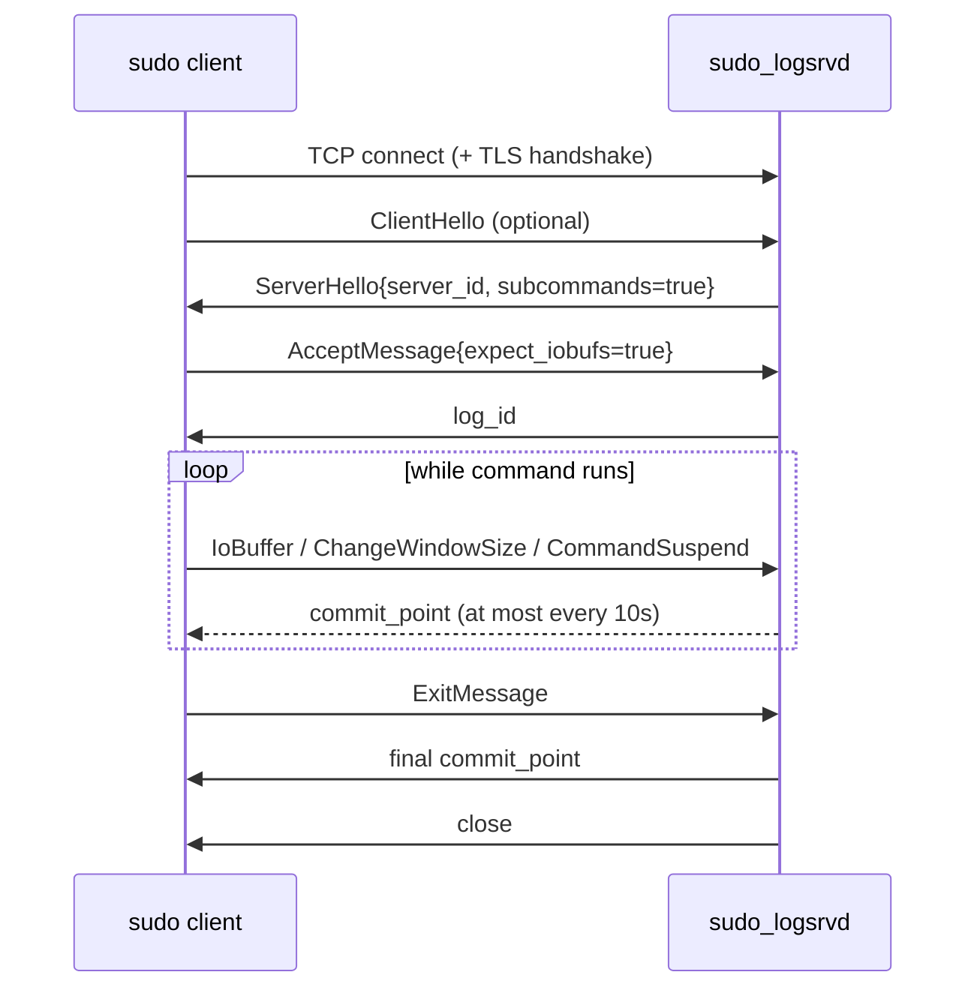

# 02. Wire Protocol & Message State Machine

> **Reference:** sudo 1.9.18 — `36f7128256a93571ec378daa5c209d6883036d31` (2026-07-19)
> **C sources:** `lib/logsrv/log_server.proto`, `logsrvd/logsrvd.c`, `logsrvd/logsrvd.h`,
> `logsrvd/logsrv_util.h`, `logsrvd/logsrv_util.c`, `logsrvd/logsrvd_local.c`,
> `logsrvd/logsrvd_relay.c`, `logsrvd/logsrvd_journal.c`, `logsrvd/iolog_writer.c`,
> `logsrvd/sendlog.c`, `plugins/sudoers/log_client.c`, `plugins/sudoers/log_client.h`,
> `plugins/sudoers/iolog.c`, `docs/sudo_logsrv.proto.man.in`
> **Requirement prefix:** `PROTO-`
> **Refresh:** see [README.md](README.md)

## Overview

The sudo log server protocol is a bidirectional, asynchronous, length-prefixed stream of
Protocol Buffers messages over a single TCP connection (optionally wrapped in TLS). There
are exactly two top-level message types: `ClientMessage`, a `oneof` of thirteen
sub-messages sent by the client, and `ServerMessage`, a `oneof` of five sub-messages sent
by the server (`lib/logsrv/log_server.proto:7-23`, `:120-128`). Because protobuf has no
self-delimiting framing, each message on the wire is preceded by its packed size as a
32-bit unsigned integer in network byte order (`docs/sudo_logsrv.proto.man.in:35-41`).

Inside `sudo_logsrvd` the protocol is driven entirely by an event loop. Each accepted
connection gets a `struct connection_closure` (`logsrvd/logsrvd.h:89-127`) holding a
persistent read event, a persistent write event, a one-shot commit timer, a single growable
read buffer, and a queue of pending write buffers. `client_msg_cb()`
(`logsrvd/logsrvd.c:1128-1285`) is the read callback: it appends bytes to the read buffer,
then drains as many complete framed messages as it can, dispatching each to
`handle_client_message()` (`logsrvd/logsrvd.c:893-959`), which unpacks the `ClientMessage`
and switches on `type_case`. `server_msg_cb()` (`logsrvd/logsrvd.c:1022-1123`) is the write
callback: it drains the write queue and, when the queue empties, decides whether the
connection is done.

Message *validation* and *sequencing* live in `logsrvd.c`; message *storage* is delegated
through a vtable, `struct client_message_switch` (`logsrvd/logsrvd.h:130-147`). There are
three implementations — `cms_local` (write to disk, `logsrvd/logsrvd_local.c:769-778`),
`cms_journal` (store-and-forward journal, `logsrvd/logsrvd_journal.c:699-708`), and
`cms_relay` (forward the raw bytes upstream, `logsrvd/logsrvd_relay.c:1283-1292`). The
`handle_*` functions are the same in all three modes, so the protocol contract documented
here does not vary with storage mode; only the small number of behaviors explicitly called
out as mode-specific (log ID content, who generates commit points) differ.

The connection state machine is a six-value enum
(`enum connection_status`, `logsrvd/logsrvd.h:56-63`): `INITIAL`, `CONNECTING`, `RUNNING`,
`EXITED`, `SHUTDOWN`, `FINISHED`. A freshly accepted connection is `INITIAL` (the closure
is `calloc`'d, `logsrvd/logsrvd.c:197`, and `INITIAL` is zero). `CONNECTING` is only used
by relay mode while the upstream TCP connect is in flight
(`logsrvd/logsrvd_relay.c:422`, `:455`). Every `handle_*` function begins with a state
check; a message that arrives in the wrong state sets
`closure->errstr = "state machine error"` and returns false, which causes an `error`
`ServerMessage` to be queued and the connection to be dropped once it is written.

The single highest-risk area for a reimplementation is `commit_point`. It is *not* a
per-stream acknowledgement and *not* a byte offset: it is one monotonically increasing
cumulative elapsed-time value per connection, equal to the running sum of the `delay`
fields of every `IoBuffer`, `ChangeWindowSize` and `CommandSuspend` the server has
successfully processed (`logsrvd/iolog_writer.c:982-999` and its callers). The production
client compares it for *exact equality* against its own independently maintained sum
(`plugins/sudoers/log_client.c:1612`) and will block in a private event loop until the two
match or a timeout expires (`plugins/sudoers/log_client.c:2169-2175`). Every requirement in
the `PROTO-030` … `PROTO-038` range exists because getting this wrong hangs `sudo` for 30
seconds at the end of every command.

## Framing

Framing is symmetric. On the send side, `fmt_server_message()`
(`logsrvd/logsrvd.c:348-384`) computes the packed size, rejects anything over
`MESSAGE_SIZE_MAX`, writes `htonl(len)` into the first four bytes of a buffer and packs the
message immediately after it. On the receive side, `client_msg_cb()` loops while at least
four bytes are buffered, reads the length, and requires `msg_len + 4` bytes to be present
before dispatching (`logsrvd/logsrvd.c:1229-1262`). The relay's client-side encoder
(`logsrvd/logsrvd_relay.c:189-226`) and the sudoers client's encoder use the identical
layout, and the store-and-forward journal file on disk uses the same length-prefixed
framing so a journal can be replayed straight onto the wire
(`logsrvd/logsrvd_journal.c:530-549`).

`MESSAGE_SIZE_MAX` is 2 MiB (`logsrvd/logsrv_util.h:36`) and the comparison is strictly
greater-than, so a 2097152-byte body is legal. The man page states the server "must accept
messages up to two megabytes in size" and "may return an error" beyond that
(`docs/sudo_logsrv.proto.man.in:47-49`); the C daemon always returns an error.

## Handshake



The server does not wait for a `ClientHello`. `start_protocol()`
(`logsrvd/logsrvd.c:1350-1377`) queues the `ServerHello` and enables the write event as soon
as the connection (or the TLS handshake, `logsrvd/logsrvd.c:1545-1552`) is ready, and
enables the read event with no timeout. In relay mode `start_protocol()` is deferred until
the *upstream* server has said hello (`logsrvd/logsrvd_relay.c:708-713`), so a relay's
downstream client sees the `ServerHello` only after the relay chain is up.

Both real clients read the `ServerHello` synchronously before doing anything else — the
sudoers plugin spins a private event base for it so the command cannot start until the
connection is fully established (`plugins/sudoers/log_client.c:1491-1540`) — so in practice
`ServerHello` is always the first thing on the wire from the server.

## The client's teardown handshake

This is the part a reimplementation is most likely to get subtly wrong, so it is worth
walking through in the client's own terms.

The sudoers plugin maintains `closure->elapsed`, a cumulative `struct timespec` that is
incremented by the record `delay` *before* each I/O-ish message is formatted — for I/O
buffers (`plugins/sudoers/iolog.c:1022-1023`), window-size changes
(`plugins/sudoers/iolog.c:1173-1174`) and suspend/resume events
(`plugins/sudoers/iolog.c:1269-1270`). It also maintains `closure->committed`, set from the
last `commit_point` received (`plugins/sudoers/log_client.c:1603-1604`).

When the command exits, `log_server_close()` formats the `ExitMessage`, reparents the read
and write events onto a *private* event base (the main sudo loop has already exited), and
dispatches that loop until it runs out of events
(`plugins/sudoers/log_client.c:2137-2183`). The only thing that removes the read event —
and therefore the only thing that lets that loop return — is
`client_message_completion()` reaching `FINISHED`. For an I/O-logging session, writing the
`ExitMessage` moves the client to `CLOSING` and re-arms the read event *with* a timeout
(`plugins/sudoers/log_client.c:1466-1477`). From `CLOSING`, the client transitions to
`FINISHED` only inside `handle_commit_point()`, and only when
`sudo_timespeccmp(&closure->elapsed, &closure->committed, ==)` holds
(`plugins/sudoers/log_client.c:1611-1617`).

Three consequences follow, and all three are load-bearing:

1. **A commit point received before the `ExitMessage` cannot satisfy the client.** The
   equality test is guarded by `state == CLOSING`, which is only entered after the
   `ExitMessage` has been fully written. A server that decides "nothing changed since my
   last commit point, so I will skip the final one" hangs the client.
2. **The value must match exactly.** Not `>=`, not "close enough". If the server's running
   total omits `ChangeWindowSize` or `CommandSuspend` delays, or drops a record, the
   comparison never succeeds.
3. **The failure mode is a timeout, not an error.** The read event carries
   `log_details->server_timeout` (`def_log_server_timeout`, default 30 seconds,
   `plugins/sudoers/defaults.c:614`). `sudo` stalls for that long after every command
   before giving up.

`sendlog.c`, sudo's test client, is more forgiving: it checks the equality on *every*
commit point regardless of state and exits the loop as soon as it matches
(`logsrvd/sendlog.c:1263-1271`). A reimplementation that passes `sudo_sendlog` can still
hang real `sudo`.

Note the man page disagrees with the code twice here, and the code wins:

- Step 9 of the flow of control says the server sends the final commit point "if one is
  pending" (`docs/sudo_logsrv.proto.man.in:602-605`). The C daemon arms a zero-delay commit
  timer unconditionally whenever `log_io` is set (`logsrvd/logsrvd.c:634-645`).
- The `ExitMessage` section says the client waits for the final commit point "unless the
  final commit_point has already been received"
  (`docs/sudo_logsrv.proto.man.in:269-276`). The sudoers client implements no such
  shortcut; only `sendlog` does.

## Errors, aborts, and protocol violations

There is exactly one failure funnel. Any `handle_*` function that returns false causes
`client_msg_cb()` to jump to `send_error:`, which calls `schedule_error_message()`
(`logsrvd/logsrvd.c:1253-1260`, `:1274-1280`). If the handler set `closure->errstr` that
string is used; otherwise the generic `"invalid ClientMessage"` is substituted
(`logsrvd/logsrvd.c:1254-1258`). `schedule_error_message()`
(`logsrvd/logsrvd.c:473-508`) immediately removes the read event (and, in relay mode, both
relay events), queues an `error` `ServerMessage`, arms the write event with the server
timeout, and sets `closure->error = true` — which makes `server_msg_cb()` close the
connection as soon as the write queue drains (`logsrvd/logsrvd.c:1110-1116`).

`sudo_logsrvd` never sends an `abort` message. The `abort` variant exists in the schema and
is handled by clients and by the relay's upstream reader, but no code path in the daemon
constructs one. A relay that receives `abort` from upstream converts it into a downstream
`error` (`logsrvd/logsrvd_relay.c:667-686`), which loses the "kill the command" semantics
the schema assigns to `abort`.

## Requirements

### PROTO-001 — Length-prefix framing, 32-bit big-endian

- **C source:** `logsrvd/logsrvd.c:363-377`, `logsrvd/logsrvd.c:1229-1232`, `docs/sudo_logsrv.proto.man.in:35-41`
- **Severity if divergent:** breaking

Every message in both directions is transmitted as a 4-byte unsigned big-endian length
followed by exactly that many bytes of packed protobuf. The length counts the protobuf
payload only, not the 4-byte prefix itself.

```c
msg_len = htonl((uint32_t)len);
len += sizeof(msg_len);
...
memcpy(buf->data, &msg_len, sizeof(msg_len));
server_message__pack(msg, buf->data + sizeof(msg_len));
```

The receive side mirrors this exactly: `memcpy(&msg_len, buf->data + buf->off, 4)` followed
by `ntohl()`. There is no magic number, no version field, and no per-message checksum.

### PROTO-002 — Maximum message size is 2 MiB, inclusive

- **C source:** `logsrvd/logsrv_util.h:36`, `logsrvd/logsrvd.c:1234-1238`, `logsrvd/logsrvd.c:357-361`
- **Severity if divergent:** medium

`MESSAGE_SIZE_MAX` is `(2 * 1024 * 1024)`. The server rejects an inbound frame whose
declared length is *strictly greater* than that; a frame of exactly 2097152 bytes is
accepted. The check happens on the declared length before any bytes of the body are
buffered, so an oversized declaration is caught immediately rather than after a 2 MiB read.

The server applies the same bound to its own outbound messages in `fmt_server_message()`;
if a `ServerMessage` would exceed it, the message is silently dropped (the function returns
false) rather than truncated.

### PROTO-003 — An oversized client frame yields an `error` message, then close

- **C source:** `logsrvd/logsrvd.c:1234-1238`, `logsrvd/logsrvd.c:1274-1280`
- **Severity if divergent:** medium

On `msg_len > MESSAGE_SIZE_MAX` the server sets `closure->errstr = "client message too
large"`, sends that string as an `error` `ServerMessage`, and closes the connection once
the error has been written. It does not attempt to resynchronise the stream — after an
oversized length prefix the byte stream is assumed unrecoverable.

### PROTO-004 — Multiple messages per read are drained in one pass; partial messages are buffered

- **C source:** `logsrvd/logsrvd.c:1229-1267`
- **Severity if divergent:** breaking

After each successful read the server loops, consuming every complete frame present in the
buffer before returning to the event loop. Clients pipeline aggressively (the sudoers
plugin queues messages without waiting for any response), so a single TCP segment routinely
contains several messages. When fewer than `msg_len + 4` bytes are available the loop stops,
`expand_buf()` compacts and, if necessary, grows the buffer, and the remainder is read on a
later callback. After the loop, any residual partial frame is memmoved to the front of the
buffer and `off` is reset to zero.

### PROTO-005 — Read buffer starts at 64 KiB and grows by power-of-two roundup

- **C source:** `logsrvd/logsrvd.c:218-221`, `logsrvd/logsrv_util.c:55-89`
- **Severity if divergent:** informational

The per-connection read buffer is allocated at 64 KiB and expanded on demand to
`sudo_pow2_roundup(msg_len + 4)`, preserving any partial frame already buffered. This is an
allocation strategy, not an external contract, but it does mean the C daemon never rejects
a message merely because it is larger than the current buffer.

### PROTO-006 — A zero-length or type-less ClientMessage is a protocol error

- **C source:** `logsrvd/logsrvd.c:1249-1251`, `logsrvd/logsrvd.c:950-954`
- **Severity if divergent:** low

A frame with `msg_len == 0` is legal framing and unpacks into an empty `ClientMessage` whose
`type_case` is unset (0). That falls through to the `default:` arm of
`handle_client_message()`, which warns `"unexpected type_case value %d in ClientMessage"`,
sets `closure->errstr = "unrecognized ClientMessage type"` and returns false — producing an
`error` message and a closed connection. The same applies to any `type_case` value the
server does not recognise.

### PROTO-007 — An unparseable ClientMessage closes the connection with a generic error

- **C source:** `logsrvd/logsrvd.c:904-908`, `logsrvd/logsrvd.c:1253-1259`
- **Severity if divergent:** low

If `client_message__unpack()` fails, `handle_client_message()` returns false without setting
`errstr`. The caller then substitutes `"invalid ClientMessage"` and takes the standard error
path. Note this means malformed protobuf and an unrecognised message type produce different
strings on the wire.

### PROTO-008 — ServerHello is sent unsolicited as the first server message

- **C source:** `logsrvd/logsrvd.c:1350-1377`, `logsrvd/logsrvd.c:386-400`
- **Severity if divergent:** breaking

As soon as the connection is ready — immediately after `accept()` for plaintext
(`logsrvd/logsrvd.c:1650-1659`), immediately after the TLS handshake completes for TLS
(`logsrvd/logsrvd.c:1545-1552`) — the server queues a `ServerHello` and arms the write
event. It does not wait for a `ClientHello`. Both real clients block synchronously on
receiving the `ServerHello` before sending anything of substance, so failing to send it
stalls the client at connection setup.

### PROTO-009 — ServerHello carries a non-empty `server_id` and `subcommands = true`

- **C source:** `logsrvd/logsrvd.c:80`, `logsrvd/logsrvd.c:386-400`
- **Severity if divergent:** high

```c
hello.server_id = (char *)server_id;   /* "Sudo Audit Server " PACKAGE_VERSION */
hello.subcommands = true;
```

Both real clients reject a `ServerHello` whose `server_id` is NULL or empty
(`plugins/sudoers/log_client.c:1557-1561`, `logsrvd/sendlog.c:1138-1142`), so `server_id`
is effectively mandatory. `subcommands` is hardcoded true, advertising that the server
accepts additional `AcceptMessage`/`RejectMessage` during a session (sudo's `intercept`
mode). A server that reports `subcommands = false` must be prepared for the client to
silently not log sub-commands (`docs/sudo_logsrv.proto.man.in:513-518`).

### PROTO-010 — `redirect` and `servers` are never populated by the C daemon

- **C source:** `logsrvd/logsrvd.c:393`
- **Severity if divergent:** informational

`fmt_hello_message()` carries the comment `/* TODO: implement redirect and servers array. */`
and sets neither field. Both clients merely log them if present
(`plugins/sudoers/log_client.c:1565-1573`) — the sudoers plugin has a `/* TODO: handle
redirect */` and does *not* reconnect elsewhere. A reimplementation may therefore emit
`redirect` only with the understanding that a stock sudo client will ignore it and keep
using the current connection, contrary to the man page's claim that the server disconnects
after a redirect (`docs/sudo_logsrv.proto.man.in:481-493`).

### PROTO-011 — ClientHello is optional, valid only in `INITIAL`, and does not change state

- **C source:** `logsrvd/logsrvd.c:865-891`
- **Severity if divergent:** medium

`handle_client_hello()` rejects the message unless `closure->state == INITIAL` and requires
`client_id` to be non-empty; otherwise it logs the client ID and returns true without
touching any state. Because the state is unchanged, a client may legally send several
`ClientHello` messages in a row, and a client that sends none at all is equally legal — the
message exists mainly so the server can detect a plaintext connection on the TLS port
(`docs/sudo_logsrv.proto.man.in:561-565`). Nothing derived from `client_id` is stored.

### PROTO-012 — Six connection states; a new connection starts in `INITIAL`

- **C source:** `logsrvd/logsrvd.h:56-63`, `logsrvd/logsrvd.c:197`
- **Severity if divergent:** informational

```c
enum connection_status { INITIAL, CONNECTING, RUNNING, EXITED, SHUTDOWN, FINISHED };
```

The closure is zero-initialised, so `INITIAL` is the entry state. `CONNECTING` is used only
by relay mode while an upstream connect is outstanding
(`logsrvd/logsrvd_relay.c:422`, `:455`); a directly connected client never observes it.
`SHUTDOWN` is entered only by `server_shutdown()`. The state names are internal, but the
*transitions* below are externally observable through which messages are accepted.

### PROTO-013 — AcceptMessage is rejected in `EXITED` and `FINISHED`, allowed elsewhere

- **C source:** `logsrvd/logsrvd.c:513-545`
- **Severity if divergent:** high

```c
if (closure->state == EXITED || closure->state == FINISHED) {
    sudo_warnx(U_("unexpected state %d for %s"), closure->state, source);
    closure->errstr = _("state machine error");
    debug_return_bool(false);
}
```

Note the check is a denylist, not an allowlist: an `AcceptMessage` in `RUNNING` is legal and
is treated as a sub-command within the existing session. An `AcceptMessage` after the
`ExitMessage` is a protocol error, though in practice the server has already stopped reading
by then (see PROTO-026).

### PROTO-014 — AcceptMessage requires `submit_time` and at least one `InfoMessage`

- **C source:** `logsrvd/logsrvd.c:529-534`
- **Severity if divergent:** medium

```c
if (msg == NULL || msg->submit_time == NULL || msg->n_info_msgs == 0)
```

`submit_time` must be present but is *not* run through `valid_timespec()` — a negative or
out-of-range `tv_nsec` in `submit_time` is accepted here. `expect_iobufs` has no validity
constraint. An `AcceptMessage` with an empty `info_msgs` array is rejected with
`"invalid AcceptMessage"`.

### PROTO-015 — Only the first Accept sets `log_io` and moves `INITIAL` → `RUNNING`

- **C source:** `logsrvd/logsrvd.c:538-543`
- **Severity if divergent:** high

```c
ret = closure->cms->accept(msg, buf, len, closure);
if (ret && closure->state == INITIAL) {
    if (msg->expect_iobufs)
        closure->log_io = true;
    closure->state = RUNNING;
}
```

`log_io` is latched from the *first* `AcceptMessage` only. A sub-command `AcceptMessage`
arriving in `RUNNING` with `expect_iobufs = true` does not turn on I/O logging for a session
that started without it, and one with `expect_iobufs = false` does not turn it off. The
state advance is likewise conditional on `INITIAL`, so sub-commands leave the state at
`RUNNING`.

### PROTO-016 — A `log_id` is sent after the first Accept with `expect_iobufs`, and only then

- **C source:** `logsrvd/logsrvd_local.c:209-223`, `logsrvd/logsrvd.c:437-454`
- **Severity if divergent:** high

In local mode the `log_id` `ServerMessage` is queued from inside `store_accept_local()`
under `if (new_session && closure->log_io)`, i.e. exactly once per connection and only when
I/O logging was requested. No `log_id` is sent for an event-only Accept, for a
`RejectMessage`, for a sub-command Accept, or for a `RestartMessage`. The client stores only
the first `log_id` it receives and ignores later ones
(`plugins/sudoers/log_client.c:1638-1641`).

### PROTO-017 — Local-mode `log_id` is base64(16-byte UUID ‖ iolog path relative to iolog_base)

- **C source:** `logsrvd/logsrvd.c:402-435`, `logsrvd/logsrvd_local.c:213-216`
- **Severity if divergent:** high

```c
id_len = 16 + pathlen;
memcpy(id, uuid, 16);
memcpy(id + 16, path, pathlen);
/* ... sudo_base64_encode(id, id_len, ...) */
```

The path component is the session's `iolog_path` with `strlen(iolog_base()) + 1` bytes
stripped from the front, i.e. relative to the configured I/O log base directory with no
leading slash and no trailing NUL. The UUID is the same 16 bytes written to the session's
`uuid` file. This exact encoding is what `decode_log_id()` must be able to reverse on a
subsequent `RestartMessage` (PROTO-021), so the two must stay in agreement.

### PROTO-018 — Store-and-forward mode emits a `log_id` of base64(UUID) with an empty path

- **C source:** `logsrvd/logsrvd_journal.c:571-592`
- **Severity if divergent:** medium

In `relay store_first` mode the journal file is named by UUID, so `journal_accept()` calls
`fmt_log_id_message(uuid, "", closure)` — a 24-character base64 string encoding 16 bytes
and nothing else. Correspondingly `journal_restart()` requires the `log_id` to be exactly
`((16 + 2) / 3 * 4)` characters and to decode to exactly 16 bytes
(`logsrvd/logsrvd_journal.c:479-483`). A local-mode `log_id` (which always has a non-empty
path) and a journal-mode `log_id` are therefore not interchangeable.

### PROTO-019 — RejectMessage requires `submit_time`, a non-empty `reason`, and ≥1 InfoMessage; `INITIAL` → `FINISHED`

- **C source:** `logsrvd/logsrvd.c:550-582`
- **Severity if divergent:** high

```c
if (msg == NULL || msg->submit_time == NULL || msg->reason[0] == '\0' ||
        msg->n_info_msgs == 0)
```

Like Accept, Reject is rejected only in `EXITED`/`FINISHED`, so a `RejectMessage` in
`RUNNING` is a legal sub-command rejection and leaves the state at `RUNNING`. From `INITIAL`
the state goes straight to `FINISHED`: no `log_id`, no commit points, and the connection is
closed as soon as the write queue drains
(`logsrvd/logsrvd.c:1269-1270`, `logsrvd/logsrvd.c:1110-1116`).

### PROTO-020 — An event-only Accept (`expect_iobufs = false`) never produces a commit point

- **C source:** `logsrvd/logsrvd.c:540-541`, `logsrvd/logsrvd.c:646-649`
- **Severity if divergent:** breaking

With `log_io` false, `handle_exit()` takes the `else` branch and sets `FINISHED` directly
rather than `EXITED`, and no commit timer is ever armed. The client mirrors this: with
`log_io` false it goes straight to `FINISHED` after writing the `ExitMessage` and stops
reading (`plugins/sudoers/log_client.c:1478-1482`). Sending a commit point to an event-only
session is not merely unnecessary — `handle_commit_point()` on the client rejects it if the
client never reached `SEND_IO` (`plugins/sudoers/log_client.c:1591-1595`), which is a fatal
client-side error.

### PROTO-021 — RestartMessage is valid only in `INITIAL` and requires a non-empty `log_id` and a valid `resume_point`

- **C source:** `logsrvd/logsrvd.c:656-696`, `logsrvd/logsrvd.h:49-50`
- **Severity if divergent:** high

```c
if (msg == NULL || msg->log_id[0] == '\0' || !valid_timespec(msg->resume_point))
```

`valid_timespec()` requires non-NULL, `tv_sec >= 0`, `0 <= tv_nsec < 1000000000`. On a valid
message the server unconditionally sets `closure->log_io = true` — only I/O logs are
restartable — before calling the storage layer.

### PROTO-022 — A failed restart sends an `error` and closes; a successful one moves to `RUNNING`

- **C source:** `logsrvd/logsrvd.c:684-693`
- **Severity if divergent:** high

Unlike every other handler, `handle_restart()` does *not* return false when the storage
layer fails. It calls `schedule_error_message(closure->errstr, closure)` itself and returns
true, so the specific reason ("unable to parse log_id", "log is already complete, cannot be
restarted", "unable to restart log") reaches the client rather than being replaced by a
generic string. The connection is still closed after the error is written.

### PROTO-023 — Restart `log_id` decoding: 16-byte UUID prefix, path with no NUL and no `..`, verified against the on-disk `uuid` file

- **C source:** `logsrvd/logsrvd_local.c:442-476`, `logsrvd/logsrvd_local.c:481-516`, `logsrvd/logsrvd_local.c:539-558`
- **Severity if divergent:** high

`decode_log_id()` base64-decodes into a `PATH_MAX + 16` buffer, requires the decoded length
to be strictly greater than 16, copies the first 16 bytes as the UUID, rejects an embedded
NUL in the remainder, rejects any `..` component via `sudo_contains_dot_dot()`, and joins
the path onto `iolog_base`. The directory is then opened `O_RDONLY|O_DIRECTORY|O_NOFOLLOW`
and its `uuid` file (which must be exactly 36 bytes) is parsed and compared byte-for-byte
against the UUID from the `log_id`. A mismatch aborts the restart. This is the protocol's
only authentication of a client's claim to an existing log.

### PROTO-024 — A restart of a completed log is refused; completion is signalled by a read-only `timing` file

- **C source:** `logsrvd/logsrvd_local.c:560-570`, `logsrvd/logsrvd_local.c:426-432`
- **Severity if divergent:** medium

`store_exit_local()` clears `S_IWUSR|S_IWGRP|S_IWOTH` from the `timing` file when a session
finishes. `store_restart_local()` `fstatat()`s `timing` and refuses the restart with
`"log is already complete, cannot be restarted"` if `S_IWUSR` is clear. A reimplementation
that does not mark completion this way will silently allow a finished log to be reopened and
overwritten.

### PROTO-025 — `resume_point` must land exactly on a timing-record boundary

- **C source:** `logsrvd/logsrv_util.c:124-187`, `logsrvd/logsrvd_local.c:583-586`
- **Severity if divergent:** high

`iolog_seekto()` replays the timing file accumulating `elapsed_time`, and stops only when
the accumulated value is *equal* to the target:

```c
if (sudo_timespeccmp(elapsed_time, target, >=)) {
    if (sudo_timespeccmp(elapsed_time, target, ==))
        break;
    /* Mismatch between resume point and stored log. */
    goto bad;
}
```

Overshooting, or hitting EOF first, fails the restart. A `resume_point` of `{0,0}` is a
special case: the function returns success immediately without seeking
(`logsrvd/logsrv_util.c:133-137`), resuming from the start of the log with
`elapsed_time` still zero. This behavior is what the man page means by "if the server
receives a `RestartMessage` containing a `resume_point` it has not previously seen, an error
will be returned" (`docs/sudo_logsrv.proto.man.in:309-314`).

### PROTO-026 — A successful restart seeds the connection's elapsed time from the log

- **C source:** `logsrvd/logsrvd_local.c:584-585`, `logsrvd/logsrv_util.c:157`
- **Severity if divergent:** breaking

`iolog_seekto()` is passed `&closure->elapsed_time` and adds every replayed record's delay
into it. Consequently the resumed connection's commit points are absolute times measured
from the *original* start of the log, not from the resume point. The client's own `elapsed`
counter is likewise absolute — `sendlog` accumulates delays for records it skips over
(`logsrvd/sendlog.c:1021-1039`) — so a server that restarts the elapsed clock at zero will
never produce a matching final commit point.

### PROTO-027 — IoBuffer is valid only in `RUNNING` with `log_io`, and must be non-empty with a valid delay

- **C source:** `logsrvd/logsrvd.c:736-782`
- **Severity if divergent:** high

Three separate checks, each with its own error string: state must be `RUNNING`
(`"state machine error"`); `closure->log_io` must be set (`"protocol error"`, warned as
`"unexpected IoBuffer"`); and `iobuf != NULL && iobuf->data.len != 0 &&
valid_timespec(iobuf->delay)` (`"invalid IoBuffer"`). A zero-length `IoBuffer` is a protocol
violation, not a no-op. The five stream variants (`ttyin`, `ttyout`, `stdin`, `stdout`,
`stderr`) map to `IOFD_TTYIN`, `IOFD_TTYOUT`, `IOFD_STDIN`, `IOFD_STDOUT`, `IOFD_STDERR`
respectively (`logsrvd/logsrvd.c:926-940`) and are otherwise handled identically.

### PROTO-028 — ChangeWindowSize is valid only in `RUNNING` with `log_io` and a valid delay

- **C source:** `logsrvd/logsrvd.c:784-818`
- **Severity if divergent:** medium

Same three-stage validation as `IoBuffer` (the `log_io` warning text still reads
`"unexpected IoBuffer"`). `rows` and `cols` are not range-checked. Critically, this message
contributes its `delay` to the connection's elapsed time exactly as an `IoBuffer` does — see
PROTO-030.

### PROTO-029 — CommandSuspend requires a valid delay and one of exactly five signal names

- **C source:** `logsrvd/logsrvd.c:820-863`
- **Severity if divergent:** medium

```c
if (strcmp(msg->signal, "STOP") != 0 && strcmp(msg->signal, "TSTP") != 0 &&
        strcmp(msg->signal, "CONT") != 0 &&
        strcmp(msg->signal, "TTIN") != 0 &&
        strcmp(msg->signal, "TTOU") != 0)
```

The allowed set is exactly `STOP`, `TSTP`, `CONT`, `TTIN`, `TTOU` — without the `SIG`
prefix, case-sensitive. Anything else is `"invalid CommandSuspend"`. The man page mentions
only `STOP`, `TSTP`, `CONT` (`docs/sudo_logsrv.proto.man.in:430-435`); the code accepts two
more.

### PROTO-030 — Elapsed time accumulates delays from IoBuffer, ChangeWindowSize *and* CommandSuspend

- **C source:** `logsrvd/iolog_writer.c:982-999`, `logsrvd/logsrvd_local.c:688`, `logsrvd/logsrvd_local.c:725`, `logsrvd/logsrvd_local.c:760`, `plugins/sudoers/iolog.c:1022-1023`, `plugins/sudoers/iolog.c:1173-1174`, `plugins/sudoers/iolog.c:1269-1270`
- **Severity if divergent:** breaking

`update_elapsed_time()` is called from all three of `store_iobuf_local()`,
`store_winsize_local()` and `store_suspend_local()` (and from the journal equivalents,
`logsrvd/logsrvd_journal.c:666`, `:680`, `:694`). It adds `tv_sec` and `tv_nsec` separately
and then normalises nanoseconds by repeated subtraction of 1e9. The client maintains the
identical sum across the identical three message families. Omitting window-size or
suspend delays from the server's total is the single easiest way to hang a real `sudo`
session — any command run in a resized terminal, or suspended with `^Z`, will never see a
matching final commit point.

### PROTO-031 — `commit_point` is one global cumulative value per connection, not per stream

- **C source:** `logsrvd/logsrvd.c:1326-1343`, `logsrvd/logsrvd.h:94`
- **Severity if divergent:** breaking

```c
commit_point.tv_sec = closure->elapsed_time.tv_sec;
commit_point.tv_nsec = (int32_t)closure->elapsed_time.tv_nsec;
```

There is exactly one `struct timespec elapsed_time` in the connection closure. The
`ServerMessage` carries no stream identifier and no byte count. A commit point is
interpreted by the client as "everything you sent up to cumulative elapsed time T has been
committed"; per-stream accounting has no representation in this protocol.

### PROTO-032 — `commit_point` carries elapsed time since command start, not wall clock

- **C source:** `logsrvd/iolog_writer.c:982-999`, `docs/sudo_logsrv.proto.man.in:368-373, docs/sudo_logsrv.proto.man.in:520-531`
- **Severity if divergent:** breaking

The value is a pure sum of client-supplied `delay` deltas, which the client computes from a
monotonic clock where available. The server never consults its own clock when building a
commit point. Substituting a wall-clock timestamp, or the server's own measure of session
duration, will never match the client's counter.

### PROTO-033 — Periodic commit cadence: a one-shot 10-second timer, re-armed by I/O activity

- **C source:** `logsrvd/logsrvd.h:44`, `logsrvd/logsrvd.c:718-734`, `logsrvd/logsrvd.c:234-237`
- **Severity if divergent:** medium

```c
if (!ISSET(closure->commit_ev->flags, SUDO_EVQ_INSERTED)) {
    struct timespec tv = { ACK_FREQUENCY, 0 };   /* ACK_FREQUENCY == 10 */
    sudo_ev_add(closure->evbase, closure->commit_ev, &tv, false);
}
```

`enable_commit()` is called after every successfully stored `IoBuffer`,
`ChangeWindowSize` and `CommandSuspend`. The commit event is a non-persistent
`SUDO_EV_TIMEOUT` event, so it fires once, ten seconds after being armed, and is then
re-armed by the next I/O message. The practical effect: the first commit point of a session
arrives roughly 10 seconds after the first I/O record, and thereafter at most one commit
point per 10 seconds, only while the session is active. A completely idle session produces
no commit points at all. Commit points are *not* sent per message.

### PROTO-034 — I/O logs are flushed to disk before each commit point when flushing is disabled

- **C source:** `logsrvd/logsrvd.c:1333-1335`
- **Severity if divergent:** high

```c
if (!iolog_get_flush())
    iolog_flush_all(closure);
```

When the I/O log layer is not flushing after every write, the commit callback flushes all
open log files before reporting the commit point. This is the semantic content of the
message: the value is an assertion of durability, not merely of receipt. A reimplementation
that reports progress it has not yet flushed weakens the protocol's only data-loss guarantee.

### PROTO-035 — On ExitMessage with `log_io`, a final commit point is scheduled unconditionally and immediately

- **C source:** `logsrvd/logsrvd.c:634-645`
- **Severity if divergent:** breaking

```c
if (closure->log_io) {
    closure->state = EXITED;
    /* Relay host will send the final commit point. */
    if (closure->relay_closure == NULL) {
        struct timespec tv = { 0, 0 };
        sudo_ev_add(closure->evbase, closure->commit_ev, &tv, false);
    }
}
```

The zero-valued timeout makes the commit callback run on the next turn of the event loop.
There is no test for whether the elapsed time changed since the previous commit point, and
no test for whether one is "pending" — the final commit point is always sent. Re-arming a
timer that is already inserted moves it to the new (zero) timeout, so a pending 10-second
timer does not delay it.

### PROTO-036 — Sending the final commit point transitions `EXITED` → `FINISHED`

- **C source:** `logsrvd/logsrvd.c:1290-1320`
- **Severity if divergent:** breaking

`schedule_commit_point()` queues the message, arms the write event with the server timeout,
and then unconditionally does:

```c
if (closure->state == EXITED)
    closure->state = FINISHED;
```

The transition happens when the message is *queued*, not when it is written, and it happens
even if `write_ev` is NULL (journal replay). `server_msg_cb()` then closes the connection as
soon as the write queue drains and it observes `state == FINISHED`
(`logsrvd/logsrvd.c:1110-1116`). The observable sequence on the wire is therefore: final
commit point, then FIN (preceded by a TLS close_notify when TLS is in use).

### PROTO-037 — The client requires the final commit point to equal its own cumulative elapsed time exactly

- **C source:** `plugins/sudoers/log_client.c:1611-1617`, `plugins/sudoers/log_client.c:1466-1477`, `plugins/sudoers/log_client.c:2169-2175`
- **Severity if divergent:** breaking

```c
if (closure->state == CLOSING) {
    if (sudo_timespeccmp(&closure->elapsed, &closure->committed, ==)) {
        closure->state = FINISHED;
        closure->read_ev->del(closure->read_ev);
    }
}
```

`CLOSING` is only entered after the `ExitMessage` has been fully written, so a commit point
that arrived earlier — even one carrying the correct final value — cannot end the wait. The
client sits in a private event loop until this condition holds or the read event times out
after `log_server_timeout` seconds (default 30, `plugins/sudoers/defaults.c:614`). Any
mismatch, missing message, or "optimised away" final commit point costs the user a 30-second
stall at the end of every `sudo` command.

### PROTO-038 — `sudo_sendlog` accepts a matching commit point in any state; real `sudo` does not

- **C source:** `logsrvd/sendlog.c:1263-1271`, `plugins/sudoers/log_client.c:1611-1617`
- **Severity if divergent:** informational

`sendlog` compares `elapsed` against `committed` on every commit point regardless of state
and terminates the connection as soon as they match. This makes it a strictly weaker
conformance test than the production client: a server that skips the final commit point
because a mid-stream one already carried the right value will pass `sudo_sendlog` and hang
real `sudo`. Do not treat `sudo_sendlog` success as evidence of Exit-handshake conformance.

### PROTO-039 — After an ExitMessage the server stops reading from the client

- **C source:** `logsrvd/logsrvd.c:651`
- **Severity if divergent:** medium

`sudo_ev_del(closure->evbase, closure->read_ev)` runs unconditionally at the end of
`handle_exit()`, on both the success and failure paths and regardless of `log_io`. Any bytes
the client sends after its `ExitMessage` are never parsed. Both real clients stop writing at
that point, so this is normally unobservable, but it does mean the server will not notice a
post-Exit protocol violation and will not act on a post-Exit `AlertMessage`.

### PROTO-040 — ExitMessage is valid only in `RUNNING`; `run_time` is optional; `signal` is charset-restricted

- **C source:** `logsrvd/logsrvd.c:584-654`
- **Severity if divergent:** medium

State must be exactly `RUNNING`. `msg->run_time` may be absent — the comment notes this
happens when replaying old pre-JSON I/O logs through `sudo_sendlog`
(`logsrvd/logsrvd.c:599-603`), and `store_exit_local()` only copies it when non-NULL
(`logsrvd/logsrvd_local.c:390-393`). If `signal` is non-empty it must be at most 10
characters drawn from `ABCDEFGHIJKLMNOPQRSTUVWXYZ+-0123456789`:

```c
size_t siglen = strlen(msg->signal);
if (siglen > 10 || strspn(msg->signal,
        "ABCDEFGHIJKLMNOPQRSTUVWXYZ+-0123456789") != siglen)
```

`exit_value`, `dumped_core` and `error` are not validated. The `error` string is currently
discarded by the local store (`logsrvd/logsrvd_local.c:389`, `/* TODO: store the "error"
string if present. */`).

### PROTO-041 — AlertMessage has no state restriction

- **C source:** `logsrvd/logsrvd.c:698-716`
- **Severity if divergent:** low

Alone among the handlers, `handle_alert()` performs no state check. It requires
`alert_time != NULL` and a non-empty `reason`; `info_msgs` is optional
(`logsrvd/logsrvd_local.c:611-619` builds an event log only when the array is non-empty).
An alert therefore may arrive before any Accept, between I/O buffers, or in any other state
the server is still reading in. It generates no reply and does not advance the state
machine.

### PROTO-042 — An out-of-order message produces `"state machine error"` and closes the connection

- **C source:** `logsrvd/logsrvd.c:523-527`, `:560-564`, `:593-597`, `:665-669`, `:744-748`, `:792-796`, `:828-832`, `:873-877`, `logsrvd/logsrvd.c:1274-1280`
- **Severity if divergent:** medium

Every state-guard failure sets `closure->errstr = "state machine error"` and returns false.
The uniform consequence is: read event removed, one `error` `ServerMessage` queued carrying
that string, connection closed once it is written. The server does not attempt to recover,
does not skip the offending message, and does not send an `abort`.

### PROTO-043 — Errors are sent at most once, and reads stop the moment one is scheduled

- **C source:** `logsrvd/logsrvd.c:473-508`
- **Severity if divergent:** medium

`schedule_error_message()` deletes the read event *before* checking whether it can actually
send anything, so reads always stop. It then bails out without queueing if `errstr` is NULL,
if `closure->error` is already set, or if there is no write event (journal replay). Finally
it sets `closure->error = true` on every path. The result: exactly one `error` message per
connection, and `closure->error` also forces the connection closed when the write queue
drains (`logsrvd/logsrvd.c:1113-1115`).

### PROTO-044 — `sudo_logsrvd` never sends an `abort` message

- **C source:** `logsrvd/logsrvd.c:456-466` (only `error` is constructed); no `SERVER_MESSAGE__TYPE_ABORT` producer exists in `logsrvd/`
- **Severity if divergent:** informational

The `abort` variant is defined in the schema and handled by clients
(`plugins/sudoers/log_client.c:1712-1715`, `logsrvd/sendlog.c:1279-1282`) and by the relay's
upstream reader (`logsrvd/logsrvd_relay.c:723-725`), but no code in the daemon produces one.
It exists so a third-party server can implement "kill this command" policy
(`docs/sudo_logsrv.proto.man.in:544-548`). Clients treat `error` and `abort` identically at
the protocol level — both are fatal and set the client to `ERROR` — the difference is that
`abort` is documented to mean the command should be terminated.

### PROTO-045 — A relay converts an upstream `abort` into a downstream `error`

- **C source:** `logsrvd/logsrvd_relay.c:667-686`, `logsrvd/logsrvd_relay.c:638-661`
- **Severity if divergent:** medium

`handle_server_abort()` in the relay calls `schedule_error_message()`, exactly as
`handle_server_error()` does, substituting `"unknown error"` for an empty string in both
cases. The `abort` type is not preserved across a relay hop, so upstream kill-the-command
policy degrades to a plain error at the downstream client.

### PROTO-046 — In relay mode the server generates no commit points of its own; it forwards upstream's

- **C source:** `logsrvd/logsrvd.c:638-645`, `logsrvd/logsrvd.c:724`, `logsrvd/logsrvd_relay.c:562-585`
- **Severity if divergent:** breaking

`enable_commit()` is a no-op when `relay_closure != NULL`, and `handle_exit()` explicitly
skips arming the final commit timer with the comment `/* Relay host will send the final
commit point. */`. Upstream commit points arrive in the relay's `handle_commit_point()`,
which requires `state >= RUNNING` and then calls the shared `schedule_commit_point()` — so
the value is passed through verbatim and drives the same `EXITED` → `FINISHED` transition.
A relay that generated its own commit points would report progress the upstream store has
not made.

### PROTO-047 — A relay forwards client messages as the original bytes, not a re-encoding

- **C source:** `logsrvd/logsrvd_relay.c:142-183`, `logsrvd/logsrvd_relay.c:1115-1262`
- **Severity if divergent:** medium

Every `cms_relay` handler calls `relay_enqueue_write(buf, len, closure)` with the `buf`/`len`
pair that `client_msg_cb()` passed down — the exact wire payload — and re-prefixes it with a
freshly computed length. Nothing is unpacked and re-packed. Unknown protobuf fields, field
ordering, and non-canonical encodings therefore survive a relay hop intact. The same is true
of the journal: `journal_write()` stores the original framed bytes
(`logsrvd/logsrvd_journal.c:530-549`).

### PROTO-048 — A relay passes `log_id` through unmodified

- **C source:** `logsrvd/logsrvd_relay.c:591-632`
- **Severity if divergent:** low

The relay validates that the upstream `log_id` is non-empty and re-emits it verbatim to the
downstream client, with a `TODO` noting that it should really append the relay host so a
restart can be routed to the right upstream. When replaying a journal there is no downstream
client (`write_ev == NULL`) and the `log_id` is dropped silently.

### PROTO-049 — EOF from the client closes the connection; it is only "expected" in `FINISHED`

- **C source:** `logsrvd/logsrvd.c:1216-1222`
- **Severity if divergent:** low

A zero-length read closes the connection. If the state is anything other than `FINISHED` the
server logs `"unexpected EOF"` at warning level first. There is no attempt to salvage a
partially received session; whatever has already been written to the I/O log stays on disk
(and its `timing` file remains writable, so the session can be resumed later via
`RestartMessage`).

### PROTO-050 — Writes carry the server timeout; reads have none

- **C source:** `logsrvd/logsrvd.c:1372-1374`, `logsrvd/logsrvd.c:498-499`, `logsrvd/logsrvd.c:1308-1309`, `logsrvd/logsrvd.c:1042-1045`, `logsrvd/logsrvd_conf.c:1653`
- **Severity if divergent:** medium

`start_protocol()` adds the read event with a NULL timeout, with the comment
`/* No read timeout, client messages may happen at arbitrary times. */` — an idle client is
never disconnected by the protocol layer. Every write-event arming passes
`logsrvd_conf_server_timeout()` (default 30 s, `DEFAULT_SOCKET_TIMEOUT_SEC`,
`logsrvd/logsrvd.h:41`); a write timeout logs `"timed out writing to client"` and closes the
connection immediately, discarding any queued messages.

### PROTO-051 — On shutdown, I/O-logging connections get one last commit point and a 10-second grace period

- **C source:** `logsrvd/logsrvd.c:975-1017`, `logsrvd/logsrvd.h:47`
- **Severity if divergent:** medium

`server_shutdown()` sets every connection's state to `SHUTDOWN`, removes its read event,
and then: relayed connections go through `relay_shutdown()`; connections with `log_io` get a
zero-delay commit event so the client receives a final commit point; all others are closed
immediately. A global `SHUTDOWN_TIMEO` (10 s) timer then breaks the event loop even if
clients are unresponsive. Note that a `SHUTDOWN`-state connection is closed as soon as its
write queue drains (`logsrvd/logsrvd.c:1113-1115`), and that because the state is `SHUTDOWN`
rather than `EXITED`, `schedule_commit_point()` does not rewrite it to `FINISHED`.

### PROTO-052 — `InfoMessage` values may be int64, string, string list, or int64 list; a NULL value is logged and skipped

- **C source:** `lib/logsrv/log_server.proto:41-55`, `logsrvd/logsrvd_local.c:67-152`
- **Severity if divergent:** low

The `value` oneof has four arms. The local JSON writer emits numbers, strings, and both list
types; a NULL `strval`, NULL `strlistval`, NULL `numlistval`, or NULL element inside a string
list is reported as `"protocol error: NULL value found in <key>"` and that entry is skipped
without failing the message. An unrecognised `value_case` is likewise warned about and
skipped. `key` is never validated.

### PROTO-053 — `TimeSpec.tv_sec` is int64 and `tv_nsec` is int32

- **C source:** `lib/logsrv/log_server.proto:26-29`, `logsrvd/logsrvd.c:1337-1338`
- **Severity if divergent:** low

The seconds field is 64-bit specifically to survive 2038
(`docs/sudo_logsrv.proto.man.in:97-100`). The nanoseconds field is 32-bit, and the server
casts its own `long tv_nsec` down to `int32_t` when building a commit point. Where
`valid_timespec()` is applied (PROTO-021, PROTO-027, PROTO-028, PROTO-029) the range is
further constrained to `tv_sec >= 0` and `0 <= tv_nsec < 1000000000`; where it is not
applied (`submit_time`, `alert_time`, `run_time`) no range check occurs at all.
