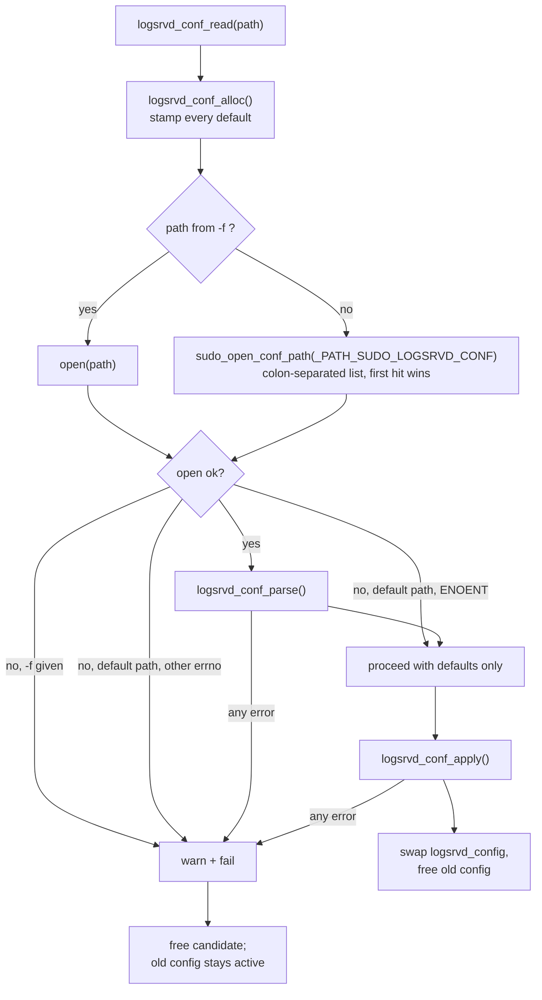

# 03. Configuration Surface & Defaults

> **Reference:** sudo 1.9.18 — `36f7128256a93571ec378daa5c209d6883036d31` (2026-07-19)
> **C sources:** `logsrvd/logsrvd_conf.c`, `logsrvd/logsrvd.c`, `logsrvd/logsrvd.h`, `logsrvd/logsrv_util.h`, `logsrvd/tls_init.c`, `logsrvd/logsrvd_queue.c`, `logsrvd/logsrvd_journal.c`, `logsrvd/logsrvd_relay.c`, `logsrvd/logsrvd_local.c`, `logsrvd/iolog_writer.c`, `lib/util/parseln.c`, `lib/util/strtobool.c`, `lib/util/strtonum.c`, `lib/util/strtomode.c`, `lib/util/logfac.c`, `lib/util/logpri.c`, `lib/util/regex.c`, `lib/util/secure_path.c`, `lib/util/mkdir_parents.c`, `lib/iolog/host_port.c`, `lib/iolog/iolog_conf.c`, `lib/iolog/iolog_filter.c`, `lib/iolog/iolog_path.c`, `lib/eventlog/eventlog_conf.c`, `include/sudo_iolog.h`, `include/sudo_util.h`, `include/sudo_eventlog.h`, `pathnames.h.in` (and the generated `pathnames.h`), `configure.ac`, `logsrvd/Makefile.in`, `docs/sudo_logsrvd.conf.man.in`, `docs/sudo_logsrvd.conf.mdoc.in`, `docs/sudo_logsrvd.man.in`
> **Requirement prefix:** `CONF-`
> **Refresh:** see [README.md](README.md)

Citations of the form `pathnames.h:NNN` refer to the `configure`-generated header in the
reference tree; the corresponding template is `pathnames.h.in`. Path defaults are
build-configurable and the values quoted here are the stock ones.

## Overview

`sudo_logsrvd` has exactly one configuration input: an INI-style text file, by default
`/etc/sudo_logsrvd.conf` (the path is a compile-time `-D_PATH_SUDO_LOGSRVD_CONF`
substituted by the build, see `logsrvd/Makefile.in:56` and `pathnames.h.in:87-92`).
Everything else the daemon does — which sockets it binds, whether it stores logs locally
or relays them, where I/O logs land, how event logs are emitted, what TLS material is
used — is derived from that one file plus five command-line options. There is no
environment-variable surface and no runtime control channel; the only runtime knob is
`SIGHUP`, which re-reads the same file.

The whole configuration lives in a single static pointer, `logsrvd_config`
(`logsrvd/logsrvd_conf.c:99-173`), pointing at a `struct logsrvd_config` with one
sub-struct per INI section: `server`, `relay`, `iolog`, `eventlog`, `syslog`, `logfile`.
The rest of the daemon never touches that struct directly; it goes through the small
family of accessor functions at `logsrvd/logsrvd_conf.c:178-347`
(`logsrvd_conf_server_timeout()`, `logsrvd_conf_iolog_dir()`, `logsrvd_conf_relay_address()`,
and so on). Because those accessors read the *current* `logsrvd_config` on every call,
a configuration reload is visible to already-established connections the next time they
consult a setting — a fact that matters when reasoning about `SIGHUP` semantics.

The control flow is deliberately transactional. `logsrvd_conf_read()`
(`logsrvd/logsrvd_conf.c:1900-1944`) always builds a **brand new** `struct logsrvd_config`
by calling `logsrvd_conf_alloc()` (`logsrvd/logsrvd_conf.c:1625-1740`), which stamps in
every default value. It then parses the file *on top of* that fresh struct with
`logsrvd_conf_parse()` (`logsrvd/logsrvd_conf.c:1217-1304`), and finally hands the result
to `logsrvd_conf_apply()` (`logsrvd/logsrvd_conf.c:1742-1893`). Only `logsrvd_conf_apply()`
mutates global state; only its final three statements swap the pointer:

```c
    logsrvd_conf_iolog_setconf(config);
    logsrvd_conf_eventlog_setconf(config);

    logsrvd_conf_free(logsrvd_config);
    logsrvd_config = config;
```

Any failure at any earlier point — an unparsable line, an unknown key, a value a callback
rejects, a certificate that will not load, a log file that will not open — causes the
whole candidate configuration to be discarded and the *previous* one to remain in force.
At startup there is no previous configuration, so failure is fatal
(`logsrvd/logsrvd.c:2275-2276` returns `EXIT_FAILURE`).

Parsing itself is table-driven. `logsrvd_config_sections[]`
(`logsrvd/logsrvd_conf.c:1207-1215`) maps a section name to an array of
`struct logsrvd_config_entry` (`logsrvd/logsrvd_conf.c:83-87`), each of which is a key
string, a setter callback, and an optional `offsetof()` into `struct logsrvd_config` used
by the generic TLS setters so that the `[server]` and `[relay]` variants of `tls_cert`
can share one function. A setter returning `false` is an error, not a warning; the caller
prints `invalid value for <key>: <value>` and aborts the parse
(`logsrvd/logsrvd_conf.c:1283-1292`). There is no "ignore bad setting and carry on" path
anywhere in this subsystem.

The distinction between "key absent" and "key present but empty" is real and
per-setting. Absent means the default installed by `logsrvd_conf_alloc()` survives.
Present-but-empty means the setter is invoked with `""`, and each setter decides: for
`pid_file` and `server_log` the empty string is a documented way to *disable* the feature
(`logsrvd/logsrvd_conf.c:642-643`, `667-668`); for booleans and numbers it is a hard
error, because `sudo_strtobool("")` and `sudo_strtonum("")` both reject it; for most
strings (`relay_dir`, `iolog_dir`, `iolog_file`, `time_format`, the TLS paths) it is
silently accepted and stored as an empty string, which then produces nonsense paths at
use time.

Finally, a handful of settings are not truly "logsrvd" settings at all — they are
forwarded into the shared `libsudo_iolog` and `libsudo_eventlog` libraries by
`logsrvd_conf_iolog_setconf()` and `logsrvd_conf_eventlog_setconf()`
(`logsrvd/logsrvd_conf.c:1361-1394`). Those libraries hold their own module-static state,
so a reload has to re-push all of them; `iolog_set_defaults()` is called first
(`lib/iolog/iolog_conf.c:49-59`) precisely so that no stale value from the previous
configuration can leak through.

## Configuration file syntax

Line reading is delegated to `sudo_parseln()` with `flags == 0`
(`logsrvd/logsrvd_conf.c:1227`, implementation at `lib/util/parseln.c:43-119`). That
gives the following behavior, which is *not* what the man page's prose about comments
fully implies:

- A `#` **anywhere** on the line starts a comment; everything from `#` to end-of-line is
  discarded (`lib/util/parseln.c:66-72`; `PARSELN_COMM_BOL` is not passed, so the
  `cp == line` special case does not apply). A cipher list or a `passprompt_regex`
  containing `#` will therefore be silently truncated.
- Line continuation: a trailing `\` that is not itself escaped joins the next physical
  line, but *only* if the line contained no comment (`lib/util/parseln.c:73-78`).
- Leading and trailing blanks (space/tab) are stripped; on a continued line only the
  leading blanks of each fragment are stripped (`lib/util/parseln.c:80-86`).
- `getdelim()` is used, so embedded NUL bytes truncate the line as C strings.

`logsrvd_conf_parse()` then applies its own rules (`logsrvd/logsrvd_conf.c:1227-1298`):
empty lines and lines whose first character is `;` are skipped; `[name]` starts a
section; anything else must contain `=`. Whitespace immediately around the `=` is
stripped with `isspace()` (`logsrvd/logsrvd_conf.c:1277-1282`). Section names and key
names are compared with `strcasecmp()`; values are used verbatim except where an
individual setter lower-cases or case-folds them.

## Default resolution order



Two defaults cannot be stamped in `logsrvd_conf_alloc()` because they depend on whether
the operator supplied *any* value: the listen address list and the passprompt regex list
both accumulate rather than replace, so their defaults are applied in
`logsrvd_conf_apply()` only if the list is still empty
(`logsrvd/logsrvd_conf.c:1750-1790`).

## Reload semantics

`SIGHUP` is caught by `signal_cb()` (`logsrvd/logsrvd.c:1995-1998`) and dispatched to
`server_reload()` (`logsrvd/logsrvd.c:1879-1900`), which does exactly three things:
re-read the configuration, reconcile the listener set, and re-read the `Debug` lines from
`sudo.conf`. Because the accessors read live state, most settings become effective
immediately; the interesting cases are the ones that do not.

| Setting group | Effective on SIGHUP? |
|---|---|
| `listen_address` | Yes — listeners added/removed by literal-string comparison (`logsrvd/logsrvd.c:1809-1874`) |
| TLS material and ciphers | Yes for **new** connections; a fresh `SSL_CTX` is built (`logsrvd/logsrvd_conf.c:1792-1828`) |
| `server_log`, `[logfile] path` | Yes — old streams are `fclose()`d, new ones opened; this is the log-rotation hook |
| `[eventlog] log_type = syslog` facility | Yes — `openlog()` re-run at apply (`logsrvd/logsrvd_conf.c:1835-1838`) |
| `timeout`, `tcp_keepalive`, relay timeouts | Yes, at the next event registration / next socket |
| `iolog_*`, `maxseq`, `log_passwords`, `passprompt_regex` | Yes — re-pushed into `libsudo_iolog` |
| `store_first` | Only for connections accepted *after* the reload (`logsrvd/logsrvd.c:205-213`) |
| `pid_file` | Path is **not** rewritten; only the unlink-at-exit path changes |
| Command-line options (`-f`, `-n`, `-R`) | No — process lifetime only |

One implementation detail worth recording because it constrains how a reimplementation
should *not* copy the C design: relay connections take a reference on the relay address
list with `address_list_addref()` (`logsrvd/logsrvd_relay.c:118-123`) with the stated
intent "so it doesn't change while connecting". The refcount protects the list *entries*,
but the `struct address_list_container` holding the TAILQ head is embedded in
`struct logsrvd_config`, and `logsrvd_conf_free()` unconditionally `free()`s the enclosing
struct after the delref (`logsrvd/logsrvd_conf.c:1593`, `1619`). A reload while a relay
connection is mid-flight therefore leaves the closure holding a pointer into freed
memory. This is a C memory-management artifact with no protocol contract; it is recorded
here only so a future reader does not try to reproduce the refcounting scheme faithfully.

## Man page vs. code

Three concrete disagreements were found between `docs/sudo_logsrvd.conf.man.in` and
`logsrvd/logsrvd_conf.c`. Each is captured as a requirement below (`CONF-024`,
`CONF-050`, `CONF-063`); the code is authoritative in all three cases.

1. `server_log = none` is documented as a supported value but is **rejected** by the
   parser; only an *empty* value disables the server log.
2. `[relay] tls_checkhost` is documented but does not exist in the relay key table; using
   it is a fatal `illegal key` error.
3. `maxseq` is documented as clamping values "larger than 2176782336"; the code also
   clamps *negative* values to the maximum rather than rejecting them.

---

## Requirements

### CONF-001 — Configuration file is INI-style with six recognized sections

- **C source:** `logsrvd/logsrvd_conf.c:1207-1215, 1236-1263`
- **Severity if divergent:** medium

The server MUST recognize exactly six section names — `server`, `relay`, `iolog`,
`eventlog`, `syslog`, `logfile` — introduced by a line of the form `[name]`. Section
names are matched with `strcasecmp()`, so `[SERVER]` and `[Server]` are accepted. A
section header must have `]` present; text after `]` other than whitespace is an error
(`garbage after ']'`); an unmatched `[` is an error; a name that matches none of the six
is an error (`invalid config section`). All three abort the entire configuration load.

Note that no whitespace is permitted *inside* the brackets: `section_name` is taken as
everything between `[` and `]` verbatim, so `[ server ]` compares as `" server "` and
fails as an invalid section.

### CONF-002 — Key/value lines require `=`, and a section must be open

- **C source:** `logsrvd/logsrvd_conf.c:1265-1297`
- **Severity if divergent:** medium

Every non-blank, non-comment, non-section line MUST contain an `=` character, otherwise
the load fails with `invalid configuration line`. The `=` test happens *before* the
"is a section open?" test, so a malformed line appearing before any section header
reports `invalid configuration line` rather than `expected section name`. A well-formed
`key = value` line appearing before any section header fails with `expected section name`.

Key names are matched against the section's entry table with `strcasecmp()`; a key not in
the table fails with `[<section>] illegal key: <key>`.

### CONF-003 — Whitespace around the key and value is stripped

- **C source:** `logsrvd/logsrvd_conf.c:1277-1282`; `lib/util/parseln.c:80-86`
- **Severity if divergent:** low

Leading and trailing blanks are removed from the whole line by `sudo_parseln()`; the
parser then advances the value pointer past leading `isspace()` characters after `=` and
NUL-terminates the key after walking back over trailing `isspace()` characters before `=`.
`key=value`, `key = value`, and `  key\t=\tvalue  ` are therefore equivalent. Whitespace
*inside* a value is preserved.

### CONF-004 — `#` anywhere begins a comment; `;` only at start of line

- **C source:** `logsrvd/logsrvd_conf.c:1227, 1232`; `lib/util/parseln.c:66-72`
- **Severity if divergent:** medium

`sudo_parseln()` is called with `flags == 0`, so a `#` at **any** column truncates the
line at that point. A line whose first (post-strip) character is `;` is skipped entirely
by the parser, but a `;` elsewhere in a line is an ordinary character. Consequence: a
value that legitimately contains `#` (a regex, a cipher string, a path) cannot be
expressed in this file.

### CONF-005 — Backslash line continuation

- **C source:** `lib/util/parseln.c:73-78, 52-114`
- **Severity if divergent:** low

A line ending in a single `\` (not preceded by another `\`) is joined with the following
line; the `\` is removed and the leading blanks of the continuation are stripped, but the
trailing blanks of the first fragment are **not** stripped (the trim is skipped when
`continued` is true). A line that contained a `#` comment is never treated as continued,
even if the pre-comment text ended in `\`.

### CONF-006 — Boolean value grammar

- **C source:** `lib/util/strtobool.c:29-72`
- **Severity if divergent:** medium

Every boolean setting (`tcp_keepalive`, `store_first`, `iolog_compress`, `iolog_flush`,
`log_passwords`, `log_exit`, `tls_verify`, `tls_checkhost`, `tls_checkpeer`) MUST accept
exactly: `0`, `1`, `yes`, `true`, `on`, `off`, `no`, `false` — case-insensitively for the
word forms. Anything else, including the empty string and values like `2`, `y`, `enable`,
returns `-1` from `sudo_strtobool()` and causes the setter to fail, which aborts the whole
configuration load.

### CONF-007 — Integer value grammar and range checking

- **C source:** `lib/util/strtonum.c:163-180, 40-162`
- **Severity if divergent:** medium

Numeric settings are parsed with `sudo_strtonum(str, min, max, &errstr)`. Leading
whitespace and an optional `+`/`-` sign are accepted; the entire remainder must be
decimal digits with nothing trailing, otherwise the result is `invalid value` (`EINVAL`).
Out-of-range values yield `value too small`/`value too large` with `errno == ERANGE`. An
empty string is `invalid value`. Except for `maxseq` (see `CONF-063`), any non-`NULL`
`errstr` causes the setter to fail and the configuration load to abort — there is no
clamping.

Per-setting ranges: `[server] timeout` and `[relay] timeout`/`connect_timeout`/
`retry_interval` are `[0, TIME_T_MAX]`; `[syslog] maxlen` is `[1, UINT_MAX]`;
`[iolog] maxseq` is `[0, 2176782336]`.

### CONF-008 — Octal mode grammar for `iolog_mode`

- **C source:** `logsrvd/logsrvd_conf.c:471-485`; `lib/util/strtomode.c:36-60`
- **Severity if divergent:** medium

`iolog_mode` is parsed with `strtol(cp, &ep, 8)`: always base 8, whether or not a leading
`0` is present, so `600` and `0600` are identical. The whole string must be consumed
(`*ep == '\0'`), so `0600 ` (already trimmed), `rw-------`, or `8` are rejected. The
result must be in `[0, ACCESSPERMS]` i.e. `[0, 0777]`; `04600` (setuid) is `value too
large`. Failure prints `unable to parse iolog mode %s` and aborts the load.

### CONF-009 — Any rejected value aborts the entire configuration load

- **C source:** `logsrvd/logsrvd_conf.c:1283-1297, 1929-1937`
- **Severity if divergent:** breaking

If any setter returns `false`, `logsrvd_conf_parse()` prints
`invalid value for <key>: <value>` and returns `false`; `logsrvd_conf_read()` then frees
the candidate configuration without applying it and returns `false`. There is no partial
application: a single bad line means *none* of the file's settings take effect. At startup
`main()` treats this as fatal and exits with `EXIT_FAILURE`
(`logsrvd/logsrvd.c:2275-2276`); on `SIGHUP` the previously active configuration remains
in force unchanged (`logsrvd/logsrvd.c:1885-1897`).

### CONF-010 — Defaults are established before parsing; an absent key keeps its default

- **C source:** `logsrvd/logsrvd_conf.c:1625-1740, 1910`
- **Severity if divergent:** high

`logsrvd_conf_alloc()` runs first and populates every field of a freshly `calloc()`ed
`struct logsrvd_config` with its default. Parsing overwrites fields; it never merges with
the previously active configuration. Consequently, deleting a key from the file and
sending `SIGHUP` restores that key's *compiled-in default*, not its previous runtime
value.

### CONF-011 — Present-but-empty values are setting-specific

- **C source:** `logsrvd/logsrvd_conf.c:642-643, 667-668, 859-874, 1073-1076`
- **Severity if divergent:** medium

An empty value is passed to the setter as `""`. The server MUST treat it as follows:

- `pid_file =` → pid file disabled (stored as `NULL`).
- `server_log =` → server log disabled (`SERVER_LOG_NONE`).
- `[logfile] path =` → rejected (`not a fully qualified path`), load aborts.
- Any boolean or numeric key → rejected, load aborts.
- `relay_dir =`, `iolog_dir =`, `iolog_file =`, `time_format =`, and the TLS path/cipher
  keys → accepted and stored as an empty string with no validation.
- `listen_address =` / `relay_host =` → `getaddrinfo()` is called with an empty host
  name, which fails on typical systems and aborts the load.

### CONF-012 — Duplicate keys: last wins, except for the three list-valued keys

- **C source:** `logsrvd/logsrvd_conf.c:356-357, 391-392, 507-519, 522-599, 654-655, 685-687, 870-871, 1082-1083, 1099-1100`
- **Severity if divergent:** medium

Scalar setters free the previous value and install the new one, so repeating a key means
the last occurrence wins. Three keys instead **append**:

- `[server] listen_address` — each occurrence appends one or more `struct server_address`
  (one per `getaddrinfo()` result).
- `[relay] relay_host` — same, appended to the relay list.
- `[iolog] passprompt_regex` — each occurrence appends a compiled regex to the filter
  handle.

### CONF-013 — Configuration file location and search path

- **C source:** `logsrvd/logsrvd_conf.c:1900-1931`; `lib/util/secure_path.c:167-200`; `logsrvd/Makefile.in:56`; `pathnames.h.in:87-92`
- **Severity if divergent:** low

With `-f <file>`, exactly that path is opened; a path longer than `PATH_MAX` sets
`ENAMETOOLONG`. Without `-f`, `sudo_open_conf_path()` treats `_PATH_SUDO_LOGSRVD_CONF` as
a **colon-separated list** of candidate paths and opens the first that exists; candidates
are only skipped on `ENOENT`, any other errno stops the search. The stock value is
`/etc/sudo_logsrvd.conf` (single entry).

### CONF-014 — A missing default configuration file is not an error; a missing `-f` file is

- **C source:** `logsrvd/logsrvd_conf.c:1921-1931`
- **Severity if divergent:** medium

If the file cannot be opened, the server MUST distinguish the two cases:

```c
    if (fp == NULL) {
	if (path != NULL || errno != ENOENT) {
	    sudo_warn("%s", conf_file);
	    goto done;
	}
    }
```

That is: an explicit `-f` path that cannot be opened is fatal for *any* reason, including
`ENOENT`; the default path is fatal only for errors other than `ENOENT`. A wholly absent
`/etc/sudo_logsrvd.conf` therefore starts the daemon on pure defaults.

### CONF-015 — Command-line option set

- **C source:** `logsrvd/logsrvd.c:2198-2206, 2246-2272, 2164-2196`
- **Severity if divergent:** low

`sudo_logsrvd` MUST accept exactly `-f file` / `--file=file`, `-h` / `--help`,
`-n` / `--no-fork`, `-R percentage` / `--random-drop=percentage`, and
`-V` / `--version`. `short_opts` is `"f:hnR:V"`. Unknown options print
`usage: sudo_logsrvd [-n] [-f conf_file] [-R percentage]` to stderr and exit
`EXIT_FAILURE`. `-h` prints help to stdout and exits `EXIT_SUCCESS`; `-V` prints
`sudo_logsrvd version <PACKAGE_VERSION>` and returns 0. Options are parsed *before* the
configuration file is read, and non-option arguments are ignored.

### CONF-016 — `-R` random drop percentage

- **C source:** `logsrvd/logsrvd.c:2257-2264, 91, 766-772`
- **Severity if divergent:** low

`-R` takes a percentage parsed with `strtod()`; any trailing garbage or `errno != 0` is
fatal (`invalid random drop value: %s`). The value is divided by 100 and stored in the
static `random_drop`. When `random_drop > 0.0`, each received message has that
probability of the connection being dropped. This is a debugging aid for exercising
client restart logic and has no configuration-file equivalent.

### CONF-017 — `-n` suppresses forking, the pid file, and effective stderr redirection

- **C source:** `logsrvd/logsrvd.c:2112-2162, 2299-2304`
- **Severity if divergent:** low

Without `-n`, `daemonize()` forks, the parent `_exit()`s, the child calls `setsid()`,
writes the pid file, and redirects stdin/stdout/stderr to `/dev/null`. With `-n`, none of
that happens: no fork, **no pid file is ever written**, and stdout/stderr are preserved if
they are open. In both cases `chdir("/")` is performed and
`logsrvd_warn_stderr(false)` is called afterwards
(`logsrvd/logsrvd_conf.c:1957-1961`), which stops the syslog/logfile conversation
functions from *also* echoing to stderr. The pid file is unlinked at exit only when not
in `-n` mode.

### CONF-018 — `SIGHUP` performs a full, transactional reload

- **C source:** `logsrvd/logsrvd.c:1879-1900, 1995-1998`; `logsrvd/logsrvd_conf.c:1881-1892`
- **Severity if divergent:** medium

On `SIGHUP` the server MUST re-read the same configuration file it was started with
(`conf_file`, i.e. the `-f` argument or the default path), build a complete new
configuration, and swap it in atomically. If the read or apply fails, the running
configuration is left untouched and the listener set is not disturbed. On success, the
server additionally re-reads `sudo.conf`'s `Debug` lines and re-registers the debug
instance. Active client connections are not torn down.

### CONF-019 — Listener reconciliation on reload is by literal address string

- **C source:** `logsrvd/logsrvd.c:1809-1874`
- **Severity if divergent:** medium

`server_setup()` compares the *verbatim* `listen_address` strings (`addr->sa_str`) of the
new configuration against those of the existing listeners. A listener whose string is
absent from the new configuration is closed; a string present in both reuses the existing
socket without rebinding; a new string causes a fresh `bind()`/`listen()`. Because the
comparison is textual, changing DNS such that an unchanged `listen_address` string now
resolves elsewhere does **not** rebind. If the reconciliation ends with zero listeners,
`server_reload()` calls `sudo_fatalx("unable to setup listen socket")` and the daemon
exits.

### CONF-020 — Log files are reopened on every apply, enabling rotation

- **C source:** `logsrvd/logsrvd_conf.c:1834-1879, 1576-1579, 1613-1617`
- **Severity if divergent:** low

Each applied configuration opens its own `FILE *` for the event log (`[logfile] path`,
when `log_type = logfile`) and for the server log (`server_log = /path`). The previous
configuration's streams are `fclose()`d when it is freed. A `SIGHUP` therefore closes and
reopens both files, which is the documented log-rotation mechanism
(`docs/sudo_logsrvd.man.in:127-132`).

### CONF-021 — `pid_file` is written only at daemonize time

- **C source:** `logsrvd/logsrvd.c:2041-2077, 2133-2136, 2303-2304`
- **Severity if divergent:** low

The pid file is created exactly once, immediately after `setsid()` in the non-`-n` path.
Changing `pid_file` and sending `SIGHUP` does not move or rewrite it; only the path
unlinked at clean shutdown changes, so the original file is orphaned. The file is created
with `openat(dfd, base, O_WRONLY|O_CREAT|O_NOFOLLOW, 0644)` under a temporary umask of
`S_IWGRP|S_IWOTH`, with missing parent directories created mode `S_IRWXU|S_IXGRP|S_IXOTH`
owned by root. `O_NOFOLLOW` means a symlink at that path is refused, matching the man
page's "if `pid_file` refers to a symbolic link, it will be ignored".

### CONF-022 — `[server] listen_address` syntax

- **C source:** `logsrvd/logsrvd_conf.c:522-605`; `lib/iolog/host_port.c:42-101`; `logsrvd/logsrv_util.h:32-33`
- **Severity if divergent:** breaking

The value is `host[:port][(tls)]` where `host` is a host name, an IPv4 literal, a
bracketed IPv6 literal (`[::1]`), or the wildcard `*`. The default port is `30343` for
plaintext and `30344` when the `(tls)` flag is present. `port` may be a numeric port or a
service name; it is resolved by `getaddrinfo()` with `AI_PASSIVE`, `AF_UNSPEC`,
`SOCK_STREAM`. Every address returned by `getaddrinfo()` becomes a separate listener, so
one `listen_address = *:30343` typically produces both an IPv4 and an IPv6 socket.
Multiple `listen_address` lines are allowed and accumulate. A resolution failure aborts
the configuration load.

Parsing details that matter for exact compatibility: for a non-bracketed host the port is
split at the **last** `:`; the flag suffix is matched with
`strcasecmp(flags, "(tls)")`, so `(TLS)` is accepted, and **any other** parenthesized
suffix is silently stripped and treated as *not* TLS; an explicitly empty port
(`host:`) is an error.

### CONF-023 — Default `listen_address` depends on TLS certificate availability

- **C source:** `logsrvd/logsrvd_conf.c:1662-1689, 1756-1790`
- **Severity if divergent:** breaking

If the configuration file specifies no `listen_address` at all, the server MUST choose
the default as follows:

1. If OpenSSL support is compiled in **and** `config->server.tls_cert_path` is non-`NULL`
   — which is true when `tls_cert` was set explicitly, or when
   `/etc/ssl/sudo/certs/logsrvd_cert.pem` exists and is readable at startup
   (`access(..., R_OK) == 0`) — the sole default listener is
   `*:30344(tls)`.
2. Otherwise the sole default listener is `*:30343` (plaintext).

The two are mutually exclusive: with a certificate present, no plaintext listener is
created by default. Conversely, if the operator lists at least one `(tls)` listener but no
`tls_cert`, the default certificate path `/etc/ssl/sudo/certs/logsrvd_cert.pem` is
substituted at apply time even if it does not exist
(`logsrvd/logsrvd_conf.c:1765-1783`), and TLS context creation then fails if it cannot be
loaded.

### CONF-024 — Wildcard `*` is accepted for `listen_address` but rejected for `relay_host`

- **C source:** `logsrvd/logsrvd_conf.c:542-546, 601-605, 821-825`
- **Severity if divergent:** low

`append_address()` takes an `allow_wildcard` flag: `true` for `listen_address`, `false`
for `relay_host`. A host of exactly `*` becomes a `NULL` host passed to `getaddrinfo()`
(bind to all interfaces) in the listener case, and is an immediate failure in the relay
case.

### CONF-025 — `[server] timeout`

- **C source:** `logsrvd/logsrvd_conf.c:607-621, 252-260, 1653`
- **Severity if divergent:** breaking

Integer seconds in `[0, TIME_T_MAX]`, default **30**. Only `tv_sec` is set; sub-second
resolution is not expressible. A value of `0` disables the timeout:
`logsrvd_conf_server_timeout()` returns `NULL` when the timespec is all-zero, and callers
pass that `NULL` to `sudo_ev_add()`, meaning "no timeout". This timeout governs how long
the server waits for the client on both read and write events
(`logsrvd/logsrvd.c:499, 1175, 1309, 1507, 1525, 1644`;
`logsrvd/logsrvd_local.c:219`; `logsrvd/logsrvd_journal.c:588`).

### CONF-026 — `[server] tcp_keepalive`

- **C source:** `logsrvd/logsrvd_conf.c:623-634, 1654`; `logsrvd/logsrvd.c:1744-1750`
- **Severity if divergent:** low

Boolean, default **true**. When true, `SO_KEEPALIVE` is set on each accepted client
socket; a `setsockopt()` failure is warned about but not fatal.

### CONF-027 — `[server] pid_file`

- **C source:** `logsrvd/logsrvd_conf.c:636-658, 1656-1660`; `pathnames.h:100-102`
- **Severity if divergent:** low

Default `/run/sudo/sudo_logsrvd.pid` (build-configurable `@rundir@`). A non-empty value
MUST begin with `/`; a relative path is rejected with `not a fully qualified path` and
aborts the load. An empty value disables the pid file entirely.

### CONF-028 — `[server] server_log`

- **C source:** `logsrvd/logsrvd_conf.c:660-690, 1655, 1856-1879`
- **Severity if divergent:** low

Default **`syslog`**. Accepted values are: the empty string (disable), the literal
`stderr`, the literal `syslog`, or an absolute path beginning with `/`. The comparisons
for `stderr` and `syslog` use `strcmp()` and are therefore **case-sensitive**, unlike
section and key names.

**Divergence from the man page:** `docs/sudo_logsrvd.conf.man.in:144-160` lists `none` as
a supported value, but the code has no branch for it — `server_log = none` falls through
to `debug_return_bool(false)` and aborts the configuration load. Only the empty value
disables the server log.

The chosen value selects a `sudo_warn` conversation function at apply time:
`logsrvd_conv_syslog` (logs to `server_facility`), `logsrvd_conv_logfile` (writes to the
opened file), `logsrvd_conv_none` (discard), or `NULL` for `stderr` (libsudo's default
behavior). All three non-`stderr` functions additionally echo to stderr while
`logsrvd_warn_enable_stderr` is true, i.e. before `daemonize()` runs
(`logsrvd/logsrvd_conf.c:175, 1423-1426, 1449-1452, 1525-1528`). Because a daemonized
process has stderr on `/dev/null`, `server_log = stderr` is only useful together with
`-n`.

The server log file is opened `O_WRONLY|O_APPEND|O_CREAT|O_NOFOLLOW` with mode `0600`
under a temporary umask of `S_IRWXG|S_IRWXO` (`logsrvd/logsrvd_conf.c:1306-1330`); a
symlink at that path is refused and the failure aborts the configuration apply.

### CONF-029 — `[server] tls_key` default is unconditional

- **C source:** `logsrvd/logsrvd_conf.c:63, 693-705, 1681-1685`
- **Severity if divergent:** low

Default `/etc/ssl/sudo/private/logsrvd_key.pem`. Unlike `tls_cert` and `tls_cacert`, this
default is installed **without** checking whether the file exists. It is only consulted
when a TLS context is actually created. If `tls_cert` is set but the resolved key file
cannot be loaded or does not match the certificate, TLS context creation fails and the
configuration apply fails (`logsrvd/tls_init.c:328-338`).

### CONF-030 — `[server] tls_cert` default is conditional on file existence

- **C source:** `logsrvd/logsrvd_conf.c:62, 721-733, 1674-1680, 1758-1783`
- **Severity if divergent:** breaking

Default `/etc/ssl/sudo/certs/logsrvd_cert.pem`, but **only if**
`access(path, R_OK) == 0` at the time the configuration is allocated; otherwise
`tls_cert_path` stays `NULL`. This conditional default is what drives `CONF-023`: the
mere presence of a readable default certificate flips the daemon's default listener from
plaintext `*:30343` to TLS `*:30344(tls)`. The same default path is force-substituted
later if an explicit `(tls)` listener exists without a `tls_cert` setting.

### CONF-031 — `[server] tls_cacert` default is conditional on file existence

- **C source:** `logsrvd/logsrvd_conf.c:61, 707-719, 1667-1673`; `logsrvd/tls_init.c:294-319`
- **Severity if divergent:** medium

Default `/etc/ssl/sudo/cacert.pem` if it is readable at allocation time, otherwise
`NULL`. When non-`NULL`, it is loaded with `SSL_load_client_CA_file()` **and**
`SSL_CTX_load_verify_locations()`; a load failure is fatal to the configuration apply.
When `NULL`, `SSL_CTX_set_default_verify_paths()` is used, i.e. the system CA store.

### CONF-032 — `[server] tls_dhparams`

- **C source:** `logsrvd/logsrvd_conf.c:735-747`; `logsrvd/tls_init.c:235-255, 355-367`
- **Severity if divergent:** low

No default (`NULL` = use OpenSSL defaults). The setter performs no validation. At TLS
context creation, failure to open or parse the DH parameter file is **not** fatal — the
code logs a debug message and continues with OpenSSL defaults. This is the only TLS file
setting whose failure is tolerated.

### CONF-033 — `[server] tls_ciphers_v12` and `tls_ciphers_v13`

- **C source:** `logsrvd/logsrvd_conf.c:749-775`; `logsrvd/tls_init.c:46-47, 117-181`
- **Severity if divergent:** medium

No default is stored in the configuration struct (`NULL`); the effective defaults are
applied inside `init_tls_ciphersuites()`: `HIGH:!aNULL` for TLS 1.2 and
`TLS_AES_256_GCM_SHA384` for TLS 1.3. If a configured cipher string is rejected by
OpenSSL, the server warns and **falls back to the default list** rather than failing; only
if the *default* list is also rejected does the apply fail. The minimum protocol version
is pinned to TLS 1.2 (`logsrvd/tls_init.c:282-292`).

### CONF-034 — `[server] tls_verify`

- **C source:** `logsrvd/logsrvd_conf.c:777-789, 1686`; `logsrvd/tls_init.c:340-347, 53-115`
- **Severity if divergent:** medium

Boolean, default **true**. Controls whether the server validates *its own* certificate
chain at configuration time via `verify_cert_chain()`. When true and the chain does not
verify (with `X509_V_FLAG_X509_STRICT` set on the store), TLS context creation fails and
the whole configuration apply fails — a self-signed server certificate therefore requires
`tls_verify = false`. It has no effect on client certificates.

### CONF-035 — `[server] tls_checkpeer`

- **C source:** `logsrvd/logsrvd_conf.c:805-817, 1688, 275-279`; `logsrvd/logsrvd.c:1450-1461`
- **Severity if divergent:** high

Boolean, default **false**. When true, the server sets
`SSL_VERIFY_PEER|SSL_VERIFY_FAIL_IF_NO_PEER_CERT` on the server `SSL_CTX`, so clients
without a valid certificate cannot complete the handshake. When false, no client
certificate verification callback is installed at all. Note that the verify mode is only
ever *set*, never cleared — this is safe only because a fresh `SSL_CTX` is built on every
configuration apply.

### CONF-036 — `[server] tls_checkhost`

- **C source:** `logsrvd/logsrvd_conf.c:791-803, 1687, 269-273`; `logsrvd/logsrvd.c:1452-1460, 1614`
- **Severity if divergent:** medium

Boolean, default **true**. Selects which verification callback is installed *when
`tls_checkpeer` is also true*: `verify_peer_identity` (requires the client's IP address or
reverse-resolved host name to appear in the certificate's SAN, or match the CN if no SAN
is present) versus `verify_peer_identity_nohost`. With `tls_checkpeer = false` the setting
has no observable effect.

### CONF-037 — `(tls)` is rejected when OpenSSL support is not compiled in

- **C source:** `logsrvd/logsrvd_conf.c:548-553, 1135-1145, 1157-1166`
- **Severity if divergent:** informational

In a build without `HAVE_OPENSSL`, an address with the `(tls)` flag fails with
`TLS not supported`, and none of the `tls_*` keys exist in either the `[server]` or
`[relay]` key table — using one is an `illegal key` error. A reimplementation that always
supports TLS is a superset and will not be observed as divergent by a client.

### CONF-038 — `[relay] relay_host` selects relay mode

- **C source:** `logsrvd/logsrvd_conf.c:821-825, 1637-1638, 283-287`; `logsrvd/logsrvd.c:1546, 1652`; `logsrvd/logsrvd_queue.c:89, 216`
- **Severity if divergent:** breaking

Default: **empty list**, i.e. local storage mode. Syntax is identical to
`listen_address` except that the wildcard `*` is rejected (`CONF-024`). Multiple
`relay_host` lines accumulate and are tried in order — "the first available relay host
will be used". A non-empty relay list is the sole switch that puts the daemon into relay
mode; every relay-related code path is guarded by
`!TAILQ_EMPTY(logsrvd_conf_relay_address())`.

### CONF-039 — `[relay] timeout`

- **C source:** `logsrvd/logsrvd_conf.c:827-841, 307-315, 1639`; `logsrvd/logsrvd_relay.c:624`
- **Severity if divergent:** medium

Integer seconds in `[0, TIME_T_MAX]`, default **30**, `0` disables. Governs how long the
server waits for the upstream relay to respond *after* the connection is established. Like
`[server] timeout`, the getter returns `NULL` for zero.

### CONF-040 — `[relay] connect_timeout`

- **C source:** `logsrvd/logsrvd_conf.c:843-857, 317-325, 1640`; `logsrvd/logsrvd_relay.c:293, 413`
- **Severity if divergent:** medium

Integer seconds in `[0, TIME_T_MAX]`, default **30**, `0` disables. Bounds the
`connect()` phase to a relay host only.

### CONF-041 — `[relay] retry_interval`

- **C source:** `logsrvd/logsrvd_conf.c:876-890, 327-331, 1642`; `logsrvd/logsrvd_queue.c:144-167, 194-196`
- **Severity if divergent:** medium

Integer seconds in `[0, TIME_T_MAX]`, default **30**. Used as a flat (non-exponential)
timer between attempts to drain the outgoing journal queue. A value of `0` is accepted and
produces an immediate-retry timer, not "disabled". Note the startup queue scan arms the
timer with `0` regardless of this setting (`logsrvd/logsrvd_queue.c:257`).

### CONF-042 — `[relay] relay_dir` and its `incoming`/`outgoing` subdirectories

- **C source:** `logsrvd/logsrvd_conf.c:859-874, 1643-1644, 289-293`; `pathnames.h:143-145`; `logsrvd/logsrvd_journal.c:112-118, 491-493`; `logsrvd/logsrvd_queue.c:219-223`
- **Severity if divergent:** high

Default `/var/log/sudo_logsrvd`. The setter performs **no** validation — it is not
required to be absolute, and an empty value is accepted. The daemon composes two fixed
subdirectories underneath it: `<relay_dir>/incoming/<uuid>` for journals being written and
`<relay_dir>/outgoing/<uuid>` for completed journals awaiting relay. Missing parent
directories are created on demand by `sudo_open_parent_dir()` with mode
`S_IRWXU|S_IXGRP|S_IXOTH` owned by `iolog_user`/`iolog_group`. Journal file names are the
36-character session UUID string, and journal files themselves are created
`O_CREAT|O_EXCL|O_RDWR|O_NOFOLLOW` mode `0600` under a umask derived from `iolog_mode`.

### CONF-043 — `[relay] store_first`

- **C source:** `logsrvd/logsrvd_conf.c:892-903, 295-299, 1830-1832`; `logsrvd/logsrvd.c:205-213`
- **Severity if divergent:** medium

Boolean, default **false** (relay in real time). When true, incoming sessions are written
to a local journal first and relayed only after the session completes. The setting is
**forcibly cleared at apply time if the relay list is empty**:

```c
    /* Clear store_first if not relaying. */
    if (TAILQ_EMPTY(&config->relay.relays.addrs))
	config->relay.store_first = false;
```

so `store_first = true` without any `relay_host` is silently a no-op rather than an error.
The value is read once, at connection-accept time, so changing it on `SIGHUP` affects only
subsequently accepted connections.

### CONF-044 — `[relay] tcp_keepalive`

- **C source:** `logsrvd/logsrvd_conf.c:905-916, 1641, 301-305`; `logsrvd/logsrvd_relay.c:352-356`
- **Severity if divergent:** low

Boolean, default **true**. Sets `SO_KEEPALIVE` on the outbound relay socket; failure is
warned about but not fatal. Independent of the `[server]` setting of the same name.

### CONF-045 — Relay TLS string settings fall back to the `[server]` section

- **C source:** `logsrvd/logsrvd_conf.c:65-70, 1809-1827`
- **Severity if divergent:** medium

`tls_cacert`, `tls_cert`, `tls_key`, `tls_dhparams`, `tls_ciphers_v12`, and
`tls_ciphers_v13` in `[relay]` default to `NULL`, and the relay `SSL_CTX` is built with
the `TLS_RELAY_STR` macro:

```c
# define TLS_RELAY_STR(_c, _f)	\
    ((_c)->relay._f != NULL ? (_c)->relay._f : (_c)->server._f)
```

That is, an unset relay value inherits whatever the `[server]` section resolved to —
including the *conditional* server defaults from `CONF-030`/`CONF-031`. Setting a relay
value to the empty string does **not** fall back; the empty string is non-`NULL` and is
used verbatim.

The relay `SSL_CTX` is only built if at least one `relay_host` carries the `(tls)` flag.

### CONF-046 — `[relay] tls_verify` is tri-state with `[server]` fallback

- **C source:** `logsrvd/logsrvd_conf.c:69-70, 777-789, 1646, 1821`
- **Severity if divergent:** medium

The field is initialized to `-1` ("unset") rather than a boolean. `TLS_RELAY_INT()`
resolves `-1` to the `[server] tls_verify` value (default true). Once set to `0` or `1` by
the configuration file, the relay value wins.

### CONF-047 — `[relay] tls_checkpeer` is tri-state with `[server]` fallback

- **C source:** `logsrvd/logsrvd_conf.c:805-817, 1647, 340-347`; `logsrvd/logsrvd.c:1462-1467`
- **Severity if divergent:** high

Initialized to `-1`. `logsrvd_conf_relay_tls_check_peer()` returns the relay value if it
is not `-1`, else the `[server]` value (default false):

```c
    if (logsrvd_config->relay.tls_check_peer != -1)
	return logsrvd_config->relay.tls_check_peer;
    return logsrvd_config->server.tls_check_peer;
```

When it resolves true, `SSL_VERIFY_PEER|SSL_VERIFY_FAIL_IF_NO_PEER_CERT` with
`verify_peer_identity` is installed on the relay context — note that host-name checking is
unconditional here, there is no relay `tls_checkhost` to disable it.

### CONF-048 — `[relay] tls_checkhost` is documented but does not exist

- **C source:** `logsrvd/logsrvd_conf.c:1149-1168, 121-139`; `docs/sudo_logsrvd.conf.man.in:434-443`; `docs/sudo_logsrvd.conf.mdoc.in:382`
- **Severity if divergent:** low

The `relay_conf_entries[]` table contains no `tls_checkhost` entry and
`struct logsrvd_config_relay` has no corresponding field. Both the roff and mdoc man pages
document the key. Placing `tls_checkhost` in the `[relay]` section is therefore a fatal
`[relay] illegal key: tls_checkhost` error that prevents the daemon from starting. The
code is authoritative; the man page is wrong.

### CONF-049 — `[iolog] iolog_dir` and the derived `iolog_base`

- **C source:** `logsrvd/logsrvd_conf.c:350-384, 1696-1697, 203-213`; `pathnames.h:126-128`; `logsrvd/logsrvd_local.c:213-216, 469-471`
- **Severity if divergent:** high

Default `/var/log/sudo-io`. The setter stores the value verbatim (no absolute-path check,
no emptiness check) **and** computes `iolog_base`: the longest prefix of `iolog_dir` that
contains no `%{...}` escape, truncated back to the last `/`:

```c
    for (;;) {
	base_len += strcspn(path + base_len, "%");
	if (path[base_len] == '\0')
	    break;
	if (path[base_len + 1] == '{') {
	    /* We want the base to end on a directory boundary. */
	    while (base_len > 0 && path[base_len] != '/')
		base_len--;
	    break;
	}
	base_len++;
    }
```

Only `%{` terminates the base — bare `strftime(3)` escapes such as `%Y` do **not**, so
`iolog_dir = /var/log/sudo-io/%Y` yields `iolog_base == "/var/log/sudo-io/%Y"`.

`iolog_base` is protocol-visible: the `log_id` returned to the client in a `ServerHello`
follow-up is the session UUID plus the I/O log path with `strlen(iolog_base) + 1` bytes
stripped from the front, and a `RestartMessage`'s `log_id` path is re-prefixed with
`iolog_base`. A divergent base computation produces log IDs the server cannot resolve on
restart.

### CONF-050 — `[iolog] iolog_file`

- **C source:** `logsrvd/logsrvd_conf.c:386-397, 1698-1699, 215-219`
- **Severity if divergent:** high

Default `%{seq}`. Stored verbatim with no validation; it is expanded relative to
`iolog_dir` and may itself contain `/` components. The supported `%{...}` escapes come
from `path_escapes[]` in `logsrvd/iolog_writer.c:559-568` and are exactly `seq`, `user`,
`group`, `runas_user`, `runas_group`, `hostname`, `command`; `%%` collapses to `%`, and
any other `%X` is left for `strftime(3)`
(`lib/iolog/iolog_path.c:58-120`). Detailed expansion semantics belong to
[`04-local-storage.md`](04-local-storage.md).

### CONF-051 — `[iolog] iolog_compress`

- **C source:** `logsrvd/logsrvd_conf.c:399-410, 1692`; `lib/iolog/iolog_conf.c:132-139`
- **Severity if divergent:** medium

Boolean, default **false**. Pushed into the iolog library by `iolog_set_compress()` at
apply time. When true, I/O log stream files are written with zlib.

### CONF-052 — `[iolog] iolog_flush`

- **C source:** `logsrvd/logsrvd_conf.c:425-436, 1693`; `lib/iolog/iolog_conf.c:141-148, 49-59`
- **Severity if divergent:** low

Boolean, default **true** in logsrvd (note the *library's* own default is `false`, reset by
`iolog_set_defaults()` and then overwritten by `iolog_set_flush()` — the logsrvd default
is what is observable). When true, each write is flushed to disk. Regardless of this
setting, I/O logs are always flushed before a commit point is sent to the client.

### CONF-053 — `[iolog] iolog_user`

- **C source:** `logsrvd/logsrvd_conf.c:438-453, 1700-1702`
- **Severity if divergent:** medium

No default key; the effective default owner is uid `ROOT_UID` (0 on all but a few
platforms, see `include/sudo_util.h:29-34`) and gid `ROOT_GID` (0). The value is resolved
with `getpwnam()`; **an unknown user name is fatal** (`unknown user %s`) and aborts the
configuration load. On success the uid is set, and the user's primary gid is adopted
*only if* `iolog_group` has not already been seen.

### CONF-054 — `[iolog] iolog_group` always wins over `iolog_user`'s primary group

- **C source:** `logsrvd/logsrvd_conf.c:449-450, 455-469`
- **Severity if divergent:** low

Resolved with `getgrnam()`; an unknown group name is fatal. Setting it also sets the
sticky `gid_set` flag, which suppresses the `iolog_user` primary-group adoption. Because
`cb_iolog_group()` sets the gid unconditionally and `cb_iolog_user()` sets it only when
`!gid_set`, the outcome is independent of the order in which the two keys appear in the
file: an explicit `iolog_group` always wins.

### CONF-055 — `[iolog] iolog_mode` and the derived directory mode

- **C source:** `logsrvd/logsrvd_conf.c:471-485, 1694`; `lib/iolog/iolog_conf.c:110-128`
- **Severity if divergent:** medium

Default `0600` (`S_IRUSR|S_IWUSR`). The configured value is not used directly; the iolog
library derives two modes from it:

```c
    iolog_filemode = S_IRUSR|S_IWUSR;
    iolog_filemode |= mode & (S_IRGRP|S_IWGRP|S_IROTH|S_IWOTH);
    iolog_dirmode = iolog_filemode | S_IXUSR;
    if (iolog_dirmode & (S_IRGRP|S_IWGRP))
	iolog_dirmode |= S_IXGRP;
    if (iolog_dirmode & (S_IROTH|S_IWOTH))
	iolog_dirmode |= S_IXOTH;
```

That is: owner read+write are always forced on; only the group/other **read and write**
bits of the configured mode are honored; all execute bits in the configured value are
discarded for files and re-derived for directories. `iolog_mode = 0750` therefore yields
file mode `0640` and directory mode `0750`. The same derivation is repeated inline for
relay journal directories (`logsrvd/logsrvd_journal.c:98-104`).

### CONF-056 — `[iolog] log_passwords`

- **C source:** `logsrvd/logsrvd_conf.c:412-423, 1703, 221-225`; `logsrvd/logsrvd_local.c:664-666`
- **Severity if divergent:** high

Boolean, default **false**. The polarity is inverted relative to intuition: `false` means
password filtering is **enabled**. When false, each terminal-output buffer is run through
`iolog_pwfilt_run()` with the compiled `passprompt_regex` list, and matching input is
masked. When true, no filtering is performed and plaintext passwords may be recorded in
`ttyin`.

### CONF-057 — `[iolog] passprompt_regex`

- **C source:** `logsrvd/logsrvd_conf.c:507-519, 1750-1754`; `include/sudo_iolog.h:65`; `lib/iolog/iolog_filter.c:112-144`; `lib/util/regex.c:143-188`
- **Severity if divergent:** medium

Default `[Pp]assword[: ]*`, applied in `logsrvd_conf_apply()` **only if the configuration
file supplied none** — the first `passprompt_regex` line replaces the default entirely
rather than adding to it, and subsequent lines append. Each pattern is compiled with
`REG_EXTENDED|REG_NOSUB`. A pattern longer than **1024 characters** is rejected
(`regular expression too large`). A leading `(?i)` — optionally after a leading `^` —
enables `REG_ICASE` and is stripped from the pattern. `check_pattern()` additionally
rejects doubled repetition operators (`REG_BADRPT`) that some `regcomp(3)`
implementations would accept. Any compilation failure aborts the configuration load.

### CONF-058 — `[eventlog] log_type`

- **C source:** `logsrvd/logsrvd_conf.c:919-934, 1706, 1834-1850`
- **Severity if divergent:** medium

Default **`syslog`**. Accepts exactly the case-sensitive literals `none`, `syslog`, and
`logfile`, mapping to `EVLOG_NONE`, `EVLOG_SYSLOG`, `EVLOG_FILE`. At apply time,
`syslog` calls `openlog("sudo", 0, <facility>)` and `logfile` opens
`[logfile] path`; a failure to open the event log file aborts the apply.

### CONF-059 — `[eventlog] log_format`

- **C source:** `logsrvd/logsrvd_conf.c:936-954, 1707, 1338-1343`
- **Severity if divergent:** medium

Default **`sudo`**. Accepts `json`, `json_compact`, `json_pretty`, `sudo`
(case-sensitive). `json` is currently an alias for `EVLOG_JSON_PRETTY`; the source carries
an explicit FFR note that it will become an alias for `json_compact` in a future release,
so a reimplementation should not hard-code the equivalence in a way that is hard to flip.

The format also changes how the event log file is opened: `EVLOG_JSON_PRETTY` uses
`O_RDWR|O_CREAT|O_NOFOLLOW` (the whole file is one JSON object that must be rewritten),
every other format uses `O_WRONLY|O_APPEND|O_CREAT|O_NOFOLLOW`.

### CONF-060 — `[eventlog] log_exit`

- **C source:** `logsrvd/logsrvd_conf.c:956-967, 1708, 178-182`; `logsrvd/logsrvd_local.c:410`
- **Severity if divergent:** low

Boolean, default **false**. When true, an additional event log entry is emitted when a
command exits or is killed by a signal.

### CONF-061 — `[syslog] maxlen`

- **C source:** `logsrvd/logsrvd_conf.c:970-984, 1711`; `include/sudo_eventlog.h:62-63`
- **Severity if divergent:** low

Integer in `[1, UINT_MAX]`, default **960** (matching `MAXSYSLOGLEN`). `sudo`-format
syslog messages longer than this are split, with continuation parts carrying
`(command continued)`. JSON-format entries are never split and are unaffected. Note the
minimum is 1, not 0 — `maxlen = 0` is a fatal `value too small`.

### CONF-062 — `[syslog] facility` and `[syslog] server_facility`

- **C source:** `logsrvd/logsrvd_conf.c:986-1016, 1712-1716`; `lib/util/logfac.c:41-72`; `configure.ac:204, 2369-2371`
- **Severity if divergent:** low

`facility` is the syslog facility for **event** logs; its default is the build-time
`LOGFAC`, which `configure` sets to `authpriv` when the platform declares `LOG_AUTHPRIV`
and to `auth` otherwise (overridable with `--with-logfac`). `server_facility` is the facility for the
daemon's own warning/error messages and defaults to `daemon` (`LOG_DAEMON`, hard-coded,
not build-configurable). Both are matched with a case-**sensitive** `strcmp()` against the
table `authpriv` (where supported), `auth`, `daemon`, `user`, `local0`…`local7`. An
unrecognized name prints `unknown syslog facility %s` and aborts the load.

### CONF-063 — `[syslog] accept_priority`, `reject_priority`, `alert_priority`

- **C source:** `logsrvd/logsrvd_conf.c:1018-1064, 1717-1728`; `lib/util/logpri.c:41-67`; `configure.ac:205-206, 621, 635`
- **Severity if divergent:** low

Defaults are the build-time `PRI_SUCCESS` (`notice`, `--with-goodpri`) for
`accept_priority` and `PRI_FAILURE` (`alert`, `--with-badpri`) for both
`reject_priority` and `alert_priority`. Accepted values,
matched case-sensitively, are `alert`, `crit`, `debug`, `emerg`, `err`, `info`, `notice`,
`warning`, and `none`. `none` maps to the sentinel `-1`, which disables logging of that
event class. An unrecognized name prints `unknown syslog priority %s` and aborts the load.

### CONF-064 — `[logfile] path`

- **C source:** `logsrvd/logsrvd_conf.c:1067-1086, 1733-1734`; `pathnames.h:151-153`
- **Severity if divergent:** medium

Default `/var/log/sudo.log`. The value MUST begin with `/`; anything else, including the
empty string, is rejected with `not a fully qualified path` and aborts the load. This is
the only path setting other than `pid_file` that enforces absoluteness. The file is only
opened when `[eventlog] log_type = logfile`, with `O_NOFOLLOW` and mode `0600` under a
umask of `S_IRWXG|S_IRWXO`.

### CONF-065 — `[logfile] time_format`

- **C source:** `logsrvd/logsrvd_conf.c:1088-1103, 1731-1732`
- **Severity if divergent:** low

Default `%h %e %T`, producing e.g. `Oct  3 07:15:24` in the C locale. The value is stored
verbatim with no validation and passed to `strftime(3)` when formatting file-based event
log entries; an empty value is accepted and yields empty timestamps.

### CONF-066 — `maxseq` clamps out-of-range values instead of rejecting them

- **C source:** `logsrvd/logsrvd_conf.c:487-505, 1695`; `include/sudo_iolog.h:29`; `lib/iolog/iolog_conf.c:64-75`
- **Severity if divergent:** medium

Default and maximum are both `SESSID_MAX` = **2176782336** (base-36 `ZZZZZZ`). The setter
is the one place in this subsystem where a range error is not fatal:

```c
    value = (unsigned int)sudo_strtonum(str, 0, SESSID_MAX, &errstr);
    if (errstr != NULL) {
        if (errno != ERANGE) {
	    sudo_warnx(U_("invalid value for %s: %s"), "maxseq", errstr);
            debug_return_bool(false);
        }
        /* Out of range, clamp to SESSID_MAX as documented. */
        value = SESSID_MAX;
    }
```

Because `sudo_strtonum()` reports both "too large" and "too small" with `errno == ERANGE`,
a **negative** value such as `maxseq = -1` is silently clamped to `2176782336` rather than
rejected. The man page documents only the too-large clamp
(`docs/sudo_logsrvd.conf.man.in:693-698`). Non-numeric values are still fatal.
`iolog_set_maxseq()` re-clamps defensively at the library boundary.

### CONF-067 — Configuration values are pushed into the shared iolog/eventlog libraries at apply time

- **C source:** `logsrvd/logsrvd_conf.c:1361-1394, 1886-1887`; `lib/iolog/iolog_conf.c:49-59`; `lib/eventlog/eventlog_conf.c:58-84`
- **Severity if divergent:** informational

`logsrvd_conf_apply()` finishes by calling `logsrvd_conf_iolog_setconf()` — which first
calls `iolog_set_defaults()` to erase all previous library state, then re-pushes
`compress`, `flush`, `owner`, `mode`, `maxseq` — and `logsrvd_conf_eventlog_setconf()`,
which pushes `log_type`, `log_format`, the three syslog priorities, `maxlen`,
`[logfile] path`, `[logfile] time_format`, and stub open/close callbacks (the event log
file having already been opened by logsrvd itself). These two calls are deliberately the
last fallible-free operations, so that library state and `logsrvd_config` can never
disagree. This is an internal structuring concern with no external contract, recorded so
that the "reset then re-push" ordering is not mistaken for a behavior.

### CONF-068 — A failed apply can still leave the syslog facility changed

- **C source:** `logsrvd/logsrvd_conf.c:1834-1879, 1889-1890`
- **Severity if divergent:** informational

`logsrvd_conf_apply()` calls `openlog("sudo", 0, config->syslog.facility)` for
`EVLOG_SYSLOG` *before* the server-log branch, which can still fail (a `server_log` file
that cannot be opened). In that case the candidate configuration is discarded and the old
one stays active, but the process-global syslog facility has already been switched to the
rejected configuration's value. This is a small ordering artifact rather than a contract;
it is recorded so a reimplementation that performs all validation up front is not marked
divergent for being stricter.
