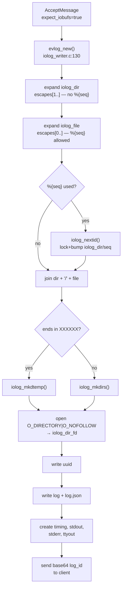
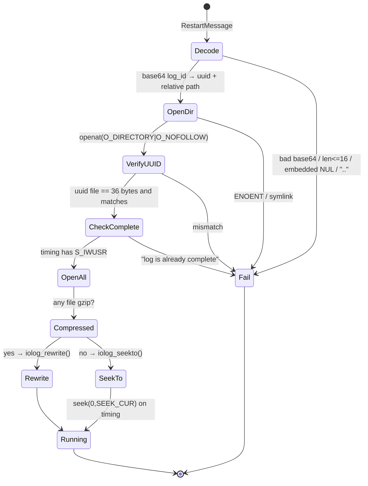

# 04. Local I/O Log Storage Format

> **Reference:** sudo 1.9.18 — `36f7128256a93571ec378daa5c209d6883036d31` (2026-07-19)
> **C sources:** `logsrvd/logsrvd_local.c`, `logsrvd/iolog_writer.c`, `logsrvd/logsrv_util.c`, `logsrvd/logsrvd.c`, `logsrvd/logsrvd_conf.c`, `lib/iolog/iolog_path.c`, `lib/iolog/iolog_nextid.c`, `lib/iolog/iolog_mkdirs.c`, `lib/iolog/iolog_mkpath.c`, `lib/iolog/iolog_mkdtemp.c`, `lib/iolog/iolog_open.c`, `lib/iolog/iolog_openat.c`, `lib/iolog/iolog_write.c`, `lib/iolog/iolog_read.c`, `lib/iolog/iolog_gets.c`, `lib/iolog/iolog_seek.c`, `lib/iolog/iolog_close.c`, `lib/iolog/iolog_flush.c`, `lib/iolog/iolog_eof.c`, `lib/iolog/iolog_conf.c`, `lib/iolog/iolog_util.c`, `lib/iolog/iolog_timing.c`, `lib/iolog/iolog_loginfo.c`, `lib/iolog/iolog_legacy.c`, `lib/iolog/iolog_json.c`, `lib/iolog/iolog_filter.c`, `lib/iolog/iolog_swapids.c`, `lib/eventlog/eventlog.c`, `lib/util/json.c`, `lib/util/b64_encode.c`, `lib/util/dotdot.c`, `lib/util/mkdir_parents.c`, `lib/util/locking.c`, `include/sudo_iolog.h`, `include/sudo_eventlog.h`, `docs/sudo_logsrvd.conf.man.in`
> **Requirement prefix:** `IOLOG-`
> **Refresh:** see [README.md](README.md)

## Overview

When `sudo_logsrvd` is configured for local storage (the default — i.e. no `relay_host`
and no `store_first`), every incoming `ClientMessage` is dispatched through the
`cms_local` message switch defined at `logsrvd/logsrvd_local.c:769-778`. That switch is
the entire local-storage subsystem's entry surface: `store_accept_local`,
`store_reject_local`, `store_exit_local`, `store_restart_local`, `store_alert_local`,
`store_iobuf_local`, `store_suspend_local`, `store_winsize_local`.

The subsystem has two distinct outputs. The first is the **event log** — a single
server-wide file (default `/var/log/sudo.log`) or syslog stream, written by
`lib/eventlog/eventlog.c`, that records accept/reject/exit/alert events in either sudo's
traditional one-line-per-event text format or in JSON. The second, and the substantive
one for a reimplementation, is the **I/O log session directory** — a per-session
directory tree that `sudoreplay(8)` can replay. Everything about the session directory
is produced by `logsrvd/iolog_writer.c` plus the `lib/iolog/` support library, and is
byte-for-byte identical to what the `sudoers` plugin produces when logging I/O locally.
That shared format is why `sudoreplay` works against both.

Control flow for a new session: an `AcceptMessage` with `expect_iobufs=true` reaches
`store_accept_local` (`logsrvd/logsrvd_local.c:157-232`), which builds a `struct eventlog`
from the message's `InfoMessage` array via `evlog_new`
(`logsrvd/iolog_writer.c:130-441`), then calls `iolog_init`
(`logsrvd/iolog_writer.c:743-773`). `iolog_init` expands the configured `iolog_dir` and
`iolog_file` templates into a concrete path, creates the directory tree, pins an
`O_DIRECTORY` file descriptor on the session directory for all subsequent `openat(2)`
calls, writes the `uuid`, `log` and `log.json` metadata files, and pre-creates the
`timing`, `stdout`, `stderr` and `ttyout` stream files. `store_accept_local` then emits
the accept event to the event log and sends the client a base64 `log_id` that encodes
the session UUID plus the session directory's path relative to the configured base.

Thereafter each `IoBuffer` message appends raw bytes to the matching stream file and one
line to the `timing` file (`store_iobuf_local`, `logsrvd/logsrvd_local.c:637-697`);
`ChangeWindowSize` and `CommandSuspend` append a timing line only. On `ExitMessage`,
`store_exit_local` (`logsrvd/logsrvd_local.c:381-436`) appends run time and exit status
to `log.json` by rewriting its trailing `"\n}\n"`, then clears the write bits on the
`timing` file. That mode change is the on-disk marker that the session is complete —
`store_restart_local` reads it back to refuse resuming a finished log.

A `RestartMessage` takes a different path (`logsrvd/logsrvd_local.c:518-600`): the
base64 `log_id` is decoded back into a UUID and a path, the path's `uuid` file is
verified against the decoded UUID, the completeness gate is checked, and then the
existing log files are reopened `r+` and the `timing` file is replayed forward until the
accumulated delay exactly equals the client's requested resume point. For uncompressed
logs the streams are simply seeked to the corresponding byte offsets and writing resumes
there. For compressed logs — which cannot be randomly accessed — `iolog_rewrite`
(`logsrvd/iolog_writer.c:830-975`) copies the prefix of every file up to the resume point
into a temporary `restart.XXXXXX` directory and renames the copies into place.

Two configuration knobs shape almost everything: `iolog_mode` (default `0600`) drives
both file and directory permissions, and `iolog_user`/`iolog_group` (default root/root)
drive ownership. All I/O log file and directory creation goes through
`iolog_openat`/`iolog_mkdirs`, which temporarily relax the process umask, `O_NOFOLLOW`
every open, and — on `EACCES` — retry with the effective UID/GID swapped to the I/O log
owner, a concession to root-squashing NFS exports.

## Session directory layout

For the default configuration (`iolog_dir = /var/log/sudo-io`, `iolog_file = %{seq}`) the
first session lands in `/var/log/sudo-io/00/00/01` and contains:

```
/var/log/sudo-io/
    seq                     base-36 sequence counter, 7 bytes: "000001\n"
    00/00/01/
        uuid                36-byte UUID string, no trailing newline
        log                 legacy 3-line plain-text summary
        log.json            pretty-printed JSON metadata (+ exit info appended later)
        timing              one line per I/O event
        stdout              raw bytes
        stderr              raw bytes
        ttyout              raw bytes
        stdin               raw bytes  (created on first stdin IoBuffer)
        ttyin               raw bytes  (created on first ttyin IoBuffer)
```

`seq` lives in the *expanded* `iolog_dir`, not in the session directory
(`logsrvd/iolog_writer.c:456-459` passes `closure->iolog_dir`, which is the expanded
`iolog_dir` buffer, to `iolog_nextid`). If `iolog_dir` itself contains escapes, each
distinct expansion gets its own independent `seq` file.

`stdin` and `ttyin` are absent from a session in which the client never sent data on
those descriptors, because `iolog_init` pre-creates only `timing`, `stdout`, `stderr` and
`ttyout` (`logsrvd/iolog_writer.c:765-769`) and the rest are created lazily by
`store_iobuf_local` (`logsrvd/logsrvd_local.c:649-652`).

## Path expansion

`create_iolog_path` (`logsrvd/iolog_writer.c:574-645`) expands `iolog_dir` and
`iolog_file` separately, rejects `..` in either result, joins them with a single `/`,
creates the tree, and stores the result in `evlog->iolog_path`. `evlog->iolog_file` is set
to point *into* `iolog_path` just past the expanded directory
(`logsrvd/iolog_writer.c:630`) — this substring is what the event log reports as `TSID=`.

The escape machinery is `expand_iolog_path` (`lib/iolog/iolog_path.c:43-125`). It scans
for `%{name}`, looks the name up in the caller-supplied escape table, and calls the
table's `copy_fn`. Anything else beginning with `%` (other than `%%`) sets a flag that
causes the whole expanded string to be run through `strftime(3)` at the end. This means
`iolog_dir`/`iolog_file` support the full host `strftime` conversion set in addition to
the seven `%{...}` escapes.

Note the escape *table* differs between logsrvd and the sudoers plugin. logsrvd's table
is `path_escapes[]` at `logsrvd/iolog_writer.c:559-568` and holds exactly seven entries.
The sudoers plugin has a larger set; a server-side reimplementation must implement
logsrvd's set, not sudoers'.



## Timing file

The timing file is the index that makes an I/O log replayable. Each line is one event:

| Event | Value | Line format |
|---|---|---|
| `IO_EVENT_STDIN` | 0 | `0 <delay> <nbytes>` |
| `IO_EVENT_STDOUT` | 1 | `1 <delay> <nbytes>` |
| `IO_EVENT_STDERR` | 2 | `2 <delay> <nbytes>` |
| `IO_EVENT_TTYIN` | 3 | `3 <delay> <nbytes>` |
| `IO_EVENT_TTYOUT` | 4 | `4 <delay> <nbytes>` |
| `IO_EVENT_WINSIZE` | 5 | `5 <delay> <lines> <cols>` |
| `IO_EVENT_TTYOUT_1_8_7` | 6 | never written; rejected on read |
| `IO_EVENT_SUSPEND` | 7 | `7 <delay> <signame>` |

The numeric values are fixed by `include/sudo_iolog.h:38-46`, whose comment states
"Changing existing values will result in incompatible I/O log files." Values 0–4 are
deliberately identical to the `IOFD_*` array indices (`include/sudo_iolog.h:54-60`), which
is why `store_iobuf_local` can write `iofd` straight into the timing line.

`<delay>` is the *incremental* delay since the previous event, taken verbatim from the
client's `TimeSpec`, and is always formatted C-locale with exactly nine fractional
digits. The reader (`iolog_parse_delay`, `lib/iolog/iolog_timing.c:86-165`) is more
lenient than the writer: it accepts any number of fractional digits, accepts a
locale-specific radix character, and accepts a bare integer with no fractional part.

## log.json

`log.json` is emitted by `iolog_write_info_file_json`
(`lib/iolog/iolog_loginfo.c:150-218`) using the pretty-printing JSON writer in
`lib/util/json.c` initialised with an indent of 4 and `minimal=false`. The container's
buffer is then wrapped: `fprintf(fp, "{%s\n}\n", buf)`. Because `json_new_line` prefixes
every element with a newline plus the current indent (`lib/util/json.c:67-88`), the file
is exactly:

```json
{
    "timestamp": {
        "seconds": 1699999999,
        "nanoseconds": 123456789
    },
    "submituser": "millert",
    "command": "/usr/bin/id",
    "runuser": "root",
    "runcwd": "/home/millert",
    "ttyname": "/dev/ttyp0",
    "submithost": "example.com",
    "submitcwd": "/home/millert",
    "runuid": 0,
    "columns": 80,
    "lines": 24,
    "runargv": [
        "id"
    ]
}
```

Field order is fixed by `eventlog_store_json` (`lib/eventlog/eventlog.c:692-846`) and is
deliberate — the comment at lines 704-708 notes the most important values are written
first so a truncated record is still partially useful. Optional fields are simply omitted
when the corresponding `struct eventlog` member is `NULL`; `columns` and `lines` are
always present because `evlog_new` defaults them to 80/24
(`logsrvd/iolog_writer.c:167-168`).

## Restart and resume



The critical property is that resume is **positional, not truncating**, for uncompressed
logs. `iolog_seekto` (`logsrvd/logsrv_util.c:124-187`) walks the timing file forward,
accumulating `delay` into `elapsed_time` and seeking each data stream forward by that
record's `nbytes`, until `elapsed_time` equals the target *exactly*. Overshoot is a hard
error. The files are left open at those offsets and new writes overwrite forward from
there; nothing past the resume point is removed. Only the compressed path
(`iolog_rewrite`) physically truncates, and it does so by copying prefixes into fresh
files.

## Requirements

### IOLOG-001 — Session path is `expand(iolog_dir)` + `/` + `expand(iolog_file)`

- **C source:** `logsrvd/iolog_writer.c:574-645`
- **Severity if divergent:** high

The server MUST expand the configured `iolog_dir` and `iolog_file` templates
independently, then join them with exactly one `/` separator to form the session
directory path. `snprintf(pathbuf, sizeof(pathbuf), "%s/%s", expanded_dir, expanded_file)`
at `logsrvd/iolog_writer.c:610-611`. If the joined path does not fit in `PATH_MAX`, the
server fails the session with `ENAMETOOLONG`. The joined path is stored in
`evlog->iolog_path`, and `evlog->iolog_file` is set to
`evlog->iolog_path + strlen(expanded_dir) + 1` (line 630) — a pointer into the same
buffer, which is the value later reported as `TSID=` in the event log.

Defaults are `iolog_dir = /var/log/sudo-io` and `iolog_file = %{seq}`
(`logsrvd/logsrvd_conf.c:1696-1699`; `/var/log/sudo-io` comes from `configure.ac:191`).

### IOLOG-002 — Exactly seven `%{...}` escapes are supported by logsrvd

- **C source:** `logsrvd/iolog_writer.c:559-568`
- **Severity if divergent:** high

The escape table the server offers for `iolog_dir` and `iolog_file` is, verbatim:

```c
static const struct iolog_path_escape path_escapes[] = {
    { "seq", fill_seq },
    { "user", fill_user },
    { "group", fill_group },
    { "runas_user", fill_runas_user },
    { "runas_group", fill_runas_group },
    { "hostname", fill_hostname },
    { "command", fill_command },
    { NULL, NULL }
};
```

Their expansions, from the `fill_*` functions at `logsrvd/iolog_writer.c:448-556`:

| Escape | Source field | Notes |
|---|---|---|
| `%{seq}` | `evlog->sessid` | `XX/XX/XX` — see IOLOG-012; **`iolog_file` only**, see IOLOG-003 |
| `%{user}` | `evlog->submituser` | the `submituser` InfoMessage |
| `%{group}` | `evlog->submitgroup` | the `submitgroup` InfoMessage; defaults to `"unknown"` |
| `%{runas_user}` | `evlog->runuser` | the `runuser` InfoMessage |
| `%{runas_group}` | `evlog->rungroup` | the `rungroup` InfoMessage; **may be unset** |
| `%{hostname}` | `evlog->submithost` | the `submithost` InfoMessage, used verbatim |
| `%{command}` | `basename(evlog->command)` | see IOLOG-005 |

An unrecognised `%{name}` is **not** an error: `expand_iolog_path` falls through the
escape-table loop with `esc->name == NULL` and copies the literal `%` character, then
continues scanning from `{` (`lib/iolog/iolog_path.c:70-91`).

Two disagreements with `docs/sudo_logsrvd.conf.man.in:540-556` are worth recording. The
man page describes `%{user}` as "the invoking user's login name" and `%{hostname}` as
"the local host name without the domain name"; in the server both are whatever string
the *client* supplied in the AcceptMessage, with no local resolution and no domain
stripping. `%{group}` is documented as "the name of the invoking user's real group-ID"
but is likewise the client-supplied `submitgroup` string.

### IOLOG-003 — `%{seq}` is not available in `iolog_dir`

- **C source:** `logsrvd/iolog_writer.c:586-599`
- **Severity if divergent:** medium

The server MUST NOT expand `%{seq}` inside `iolog_dir`. `create_iolog_path` passes
`&path_escapes[1]` when expanding `iolog_dir` and `&path_escapes[0]` when expanding
`iolog_file`; index 0 is the `seq` entry, so the directory expansion starts the table one
element in and never sees it. A literal `%{seq}` in `iolog_dir` therefore survives into
the path as the literal text `%{seq}` (per IOLOG-002's unknown-escape rule) rather than
becoming a sequence number.

This is required for correctness, not merely a quirk: `fill_seq` calls
`iolog_nextid(closure->iolog_dir, ...)`, and `closure->iolog_dir` is the *already
expanded* directory buffer, so allowing `%{seq}` in `iolog_dir` would be circular.

`docs/sudo_logsrvd.conf.man.in:529-537` documents the `%{seq}` escape under the
`iolog_dir` key and does not state the restriction; the code is authoritative.

### IOLOG-004 — Escape substitutions replace `/` with `_`

- **C source:** `lib/iolog/iolog_path.c:130-151`, `logsrvd/iolog_writer.c:482,496,510,525,539,555`
- **Severity if divergent:** high

Every `%{...}` escape whose value comes from client-supplied data (`user`, `group`,
`runas_user`, `runas_group`, `hostname`, `command`) MUST be copied through
`strlcpy_no_slash`, which is `strlcpy(3)` with each `/` rewritten to `_`. A client that
submits `submituser = "../../etc"` cannot inject path separators through an escape. Note
that `strlcpy_no_slash` returns the *would-be* length, so `expand_iolog_path` detects
truncation (`lib/iolog/iolog_path.c:73-74`) and fails the whole expansion rather than
silently truncating.

`%{seq}` is exempt — `fill_seq` deliberately emits `/` separators (IOLOG-012).

### IOLOG-005 — `%{command}` expands to the command's base name

- **C source:** `logsrvd/iolog_writer.c:542-556`
- **Severity if divergent:** medium

`fill_command` MUST apply `sudo_basename()` to `evlog->command` before copying, so
`/usr/bin/id` yields `id`. If `evlog->command` is unset the function returns `strsize`,
which `expand_iolog_path` treats as overflow and fails the expansion.

### IOLOG-006 — Remaining `%` sequences are passed to `strftime(3)`; `%%` collapses to `%`

- **C source:** `lib/iolog/iolog_path.c:58-120`
- **Severity if divergent:** medium

While scanning, `%%` MUST be collapsed to a single `%` (line 80-82). Any other `%`
followed by something that is not `{` sets `strfit = true` (line 83-86). If `strfit` is
set after the scan completes, the entire accumulated buffer MUST be run through
`strftime(3)` against the *current local time* (`time()` + `localtime_r()`, lines
104-105) and the result replaces the buffer. A zero return from `strftime` or a result
that does not fit is a hard failure.

Consequence: the timestamp used for `strftime` escapes is the server's wall clock at path
construction time, **not** the client's `submit_time`.

Consequence of the ordering: `%{...}` substitution happens *before* `strftime`, so a
client-supplied value that itself contains a `%` conversion will be interpreted by
`strftime`. The `/`→`_` rewrite (IOLOG-004) does not neutralise `%`.

### IOLOG-007 — Leading duplicate slashes collapse; trailing slashes are trimmed

- **C source:** `lib/iolog/iolog_path.c:53-97`
- **Severity if divergent:** low

Before scanning, the server MUST advance past leading duplicate slashes so that at most
one leading `/` survives (`while (inpath[0] == '/' && inpath[1] == '/') inpath++;`). After
scanning, it MUST strip all trailing `/` characters before NUL-terminating
(`while (dst > path && dst[-1] == '/') dst--;`). Interior duplicate slashes are **not**
collapsed.

### IOLOG-008 — Both expanded components are rejected if they contain a `..` path element

- **C source:** `logsrvd/iolog_writer.c:592-608`, `lib/util/dotdot.c:34-51`
- **Severity if divergent:** high

After expanding `iolog_dir`, and again after expanding `iolog_file`, the server MUST
reject the session if `sudo_contains_dot_dot()` returns true. That predicate matches a
literal `..` that is both preceded by start-of-string or `/` **and** followed by `/` or
end-of-string; `a..b`, `...`, and `foo/..bar` do not match.

### IOLOG-009 — A path ending in `XXXXXX` is created with `mkdtemp(3)` semantics

- **C source:** `lib/iolog/iolog_mkpath.c:39-60`, `lib/iolog/iolog_mkdtemp.c:43-95`
- **Severity if divergent:** medium

`iolog_mkpath` MUST test whether the joined path is at least 6 characters long and ends
with the exact string `XXXXXX`; if so it creates the final component with `mkdtempat()`
(unique per invocation, never colliding with an existing session) instead of `mkdirat()`.
The temporary directory is created with mode 0700 by `mkdtemp` and then `fchmodat`'d to
`iolog_dirmode`; a failure to chmod is warned about but not fatal
(`lib/iolog/iolog_mkdtemp.c:78-83`). `iolog_mkdtemp` always swaps to the I/O log
UID/GID for the `mkdtempat` call because `mkdtemp` cannot be retried
(lines 71-73).

Note the check is `strcmp(&path[len-6], "XXXXXX") == 0`, i.e. it looks only at the last
six characters; `docs/sudo_logsrvd.conf.man.in:587-590` says "six or more Xs", which is
consistent in effect since a longer run also ends in six Xs.

### IOLOG-010 — The `seq` file is a 7-byte, zero-padded, uppercase base-36 counter

- **C source:** `lib/iolog/iolog_nextid.c:47-146`
- **Severity if divergent:** high

`iolog_nextid` MUST maintain a file named `seq` directly inside the expanded `iolog_dir`
whose entire content is exactly 7 bytes: six base-36 digits from the alphabet
`0123456789ABCDEFGHIJKLMNOPQRSTUVWXYZ`, most significant first, followed by `\n`. The
read/modify/write cycle is:

1. Create the directory tree with `iolog_mkdirs()` if needed (lines 65-73).
2. Open `iolog_dir/seq` `O_RDWR|O_CREAT|O_NOFOLLOW` via `iolog_openat` (line 85).
3. Take an exclusive lock (IOLOG-011).
4. `fchown` to `iolog_uid`/`iolog_gid`; failure is logged, not fatal (lines 96-100).
5. Read up to 31 bytes, strip a trailing `\n`, parse with `strtoul(buf, &ep, 36)`.
6. If the buffer is not fully consumed, is empty, or the parsed value is `>= maxseq`,
   reset `id` to 0 (lines 112-116). **The counter wraps to 1, it does not error.**
7. `id++`, format the six digits, append `\n`.
8. `pwrite(fd, buf, 7, 0)` — an absolute-offset write of exactly 7 bytes, so a shorter
   previous value cannot leave trailing garbage beyond byte 7 (line 135).

`maxseq` defaults to `SESSID_MAX == 2176782336` (`include/sudo_iolog.h:29`,
`logsrvd/logsrvd_conf.c:1695`) which is `36^6`, i.e. one past `ZZZZZZ`; values above it
are clamped (`lib/iolog/iolog_conf.c:66-76`, `logsrvd/logsrvd_conf.c:494-502`).

An empty `seq` file (`nread == 0`) leaves `id = 0`, so the first allocated session ID is
`000001`.

### IOLOG-011 — The `seq` file is serialised with a blocking POSIX record lock (`lockf`)

- **C source:** `lib/iolog/iolog_nextid.c:91-95`, `lib/util/locking.c:41-97`
- **Severity if divergent:** medium

The server MUST take a **blocking** whole-file lock on the `seq` descriptor before
reading it and hold it until the descriptor is closed. `sudo_lock_file(fd, SUDO_LOCK)`
resolves to `lockf(fd, F_LOCK, 0)` on systems with `lockf` (the normal case), and to a
`fcntl(F_SETLKW)` `struct flock` otherwise (`lib/util/locking.c:98-`). Both are POSIX
advisory *record* locks.

This matters for interoperability: `flock(2)` locks and `lockf`/`fcntl` locks are
independent lock spaces on Linux, so an implementation that uses `flock` will not
mutually exclude against `sudo_logsrvd` or the `sudoers` plugin sharing the same
`iolog_dir`, and duplicate sequence numbers become possible.

### IOLOG-012 — `%{seq}` expands to a three-level `XX/XX/XX` hierarchy

- **C source:** `logsrvd/iolog_writer.c:448-469`
- **Severity if divergent:** high

`fill_seq` MUST format the six-character session ID as three two-character directory
components separated by `/`:

```c
len = snprintf(str, strsize, "%c%c/%c%c/%c%c", sessid[0],
    sessid[1], sessid[2], sessid[3], sessid[4], sessid[5]);
```

So session ID `0100A5` yields the relative path `01/00/A5`. With the default
`iolog_file = %{seq}` the session directory is `iolog_dir/01/00/A5` and the intermediate
`01` and `01/00` directories are created by the path-creation step (IOLOG-014).

### IOLOG-013 — A sequence number is allocated at most once per session, lazily

- **C source:** `logsrvd/iolog_writer.c:452-459`
- **Severity if divergent:** medium

`fill_seq` MUST call `iolog_nextid` only when `evlog->sessid[0] == '\0'`, caching the
result in the `struct eventlog`. A template that uses `%{seq}` more than once therefore
gets the same value in every position, and a template that does not use `%{seq}` at all
never touches (or creates) the `seq` file.

### IOLOG-014 — Directory creation: parents plus final component, with owner and mode fixups

- **C source:** `lib/iolog/iolog_mkdirs.c:43-140`, `lib/util/mkdir_parents.c:73-173`
- **Severity if divergent:** medium

`iolog_mkdirs` MUST:

- First try to open the target path itself `O_RDONLY|O_NONBLOCK|O_DIRECTORY|O_NOFOLLOW`.
  If that succeeds and the target is a directory, the function *repairs* it in place:
  `fchown` to `iolog_uid`/`iolog_gid` if the ownership differs, and `fchmod` to
  `iolog_dirmode` if `(st_mode & ALLPERMS)` differs (lines 67-82). Neither failure is
  fatal. If the existing target is not a directory, fail with `ENOTDIR`.
- Otherwise set `umask(ACCESSPERMS & ~(iolog_filemode|iolog_dirmode))` for the duration
  (line 93), create every missing parent component with `sudo_open_parent_dir()` —
  which walks components one at a time using `openat`/`mkdirat`, chowns each directory it
  creates, and verifies each is still a directory after creation — then `mkdirat` the
  final component with `iolog_dirmode` and `fchownat(..., AT_SYMLINK_NOFOLLOW)` it
  (lines 98-127). `EEXIST` on the final `mkdirat` is treated as success.

`EACCES` at either the initial open or the parent-directory walk triggers a retry with
the effective IDs swapped to the I/O log owner (IOLOG-018).

### IOLOG-015 — File and directory modes are derived from `iolog_mode`

- **C source:** `lib/iolog/iolog_conf.c:110-129`, `logsrvd/logsrvd_conf.c:1694`
- **Severity if divergent:** medium

`iolog_set_mode` MUST compute the two effective modes as:

```c
iolog_filemode = S_IRUSR|S_IWUSR;
iolog_filemode |= mode & (S_IRGRP|S_IWGRP|S_IROTH|S_IWOTH);
iolog_dirmode = iolog_filemode | S_IXUSR;
if (iolog_dirmode & (S_IRGRP|S_IWGRP)) iolog_dirmode |= S_IXGRP;
if (iolog_dirmode & (S_IROTH|S_IWOTH)) iolog_dirmode |= S_IXOTH;
```

That is: owner read+write is always forced on; only the group/other read and write bits
of the configured mode are honoured; execute and setuid/setgid/sticky bits in the
configured value are discarded; directories get the execute bit for each class that has
any read or write access. The default `iolog_mode` is `0600`, giving file mode `0600` and
directory mode `0700`.

### IOLOG-016 — Every created file and directory is chowned to `iolog_user`/`iolog_group`

- **C source:** `logsrvd/iolog_writer.c:723-728`, `lib/iolog/iolog_open.c:95-101`, `lib/iolog/iolog_loginfo.c:114-118,190-194`, `lib/iolog/iolog_nextid.c:96-100`, `lib/iolog/iolog_mkdirs.c:69-75,122-126`
- **Severity if divergent:** low

The server MUST attempt `fchown(fd, iolog_get_uid(), iolog_get_gid())` on every I/O log
file it creates (`uuid`, `log`, `log.json`, `seq`, and every stream/timing file opened in
`"w"` mode) and on every directory it creates. Defaults are UID 0 / GID 0
(`logsrvd/logsrvd_conf.c:1700-1702`, `lib/iolog/iolog_conf.c:40-41`). Setting
`iolog_user` also sets the GID from that user's primary group unless `iolog_group` was
set explicitly (`logsrvd/logsrvd_conf.c:448-451`, `lib/iolog/iolog_conf.c:81-91`).

A `fchown` failure is logged at debug level and is **never** fatal.

### IOLOG-017 — File creation temporarily relaxes the process umask

- **C source:** `lib/iolog/iolog_openat.c:44-85`
- **Severity if divergent:** low

`iolog_openat` MUST, when `O_CREAT` is among the flags, set
`umask(ACCESSPERMS & ~(iolog_filemode|iolog_dirmode))` before the `openat` and restore the
previous umask afterwards, so that the requested `iolog_filemode` is not masked away.
When `O_CREAT` is absent the umask is left alone.

### IOLOG-018 — All I/O log opens use `O_NOFOLLOW`, with `EACCES` fallbacks

- **C source:** `lib/iolog/iolog_openat.c:57-81`, `logsrvd/iolog_writer.c:633-634`, `logsrvd/logsrvd_local.c:301,492,547-548`
- **Severity if divergent:** medium

Every open of a file or directory inside the I/O log tree MUST include `O_NOFOLLOW`, so a
symlink placed at the final path component causes the open to fail rather than redirect.
On `EACCES`, `iolog_openat` performs two escalating retries:

1. If the file exists and is missing any of the write bits present in `iolog_filemode`,
   `fchmodat` it to `iolog_filemode` and retry the open (lines 58-68). This is what lets
   a re-used session directory be rewritten even though a previous run left `timing`
   read-only.
2. Still `EACCES`: swap effective UID/GID to the I/O log owner via `iolog_swapids(false)`,
   retry, and swap back (lines 69-81). This exists for root-squashing NFS.

The `uuid` file is opened by `iolog_openat` with `O_NOFOLLOW`
(`logsrvd/iolog_writer.c:717`) but read back on restart with a bare
`openat(dfd, "uuid", O_RDONLY|O_NOFOLLOW)` (`logsrvd/logsrvd_local.c:492`).

### IOLOG-019 — On accept, seven files are created; `stdin`/`ttyin` are lazy

- **C source:** `logsrvd/iolog_writer.c:743-773`, `logsrvd/logsrvd_local.c:648-652`
- **Severity if divergent:** high

`iolog_init` MUST, in this order: create the path, write `uuid`, write `log` and
`log.json`, then create `timing`, `stdout`, `stderr` and `ttyout` — all four via
`iolog_create`, which opens mode `"w"` (`O_CREAT|O_TRUNC|O_WRONLY`). `stdin` and `ttyin`
are created only when the first `IoBuffer` for that descriptor arrives, because
`store_iobuf_local` checks `closure->iolog_files[iofd].enabled` and calls `iolog_create`
on demand.

A failure in any of these steps aborts the session with the client-visible error
`"error creating I/O log"` (`logsrvd/logsrvd_local.c:181-184`).

### IOLOG-020 — The `uuid` file holds exactly 36 bytes with no terminator

- **C source:** `logsrvd/iolog_writer.c:702-741`, `logsrvd/logsrvd_local.c:481-516`
- **Severity if divergent:** breaking

`iolog_store_uuid` MUST generate a fresh 16-byte UUID, render it as the canonical
36-character hyphenated string, and write exactly `sizeof(uuid_str) - 1 == 36` bytes to a
file named `uuid` in the session directory — no trailing newline and no NUL. This UUID is
distinct from `evlog->uuid_str`, the event-log UUID generated in `evlog_new`
(`logsrvd/iolog_writer.c:147-152`).

The exact length is load-bearing: `verify_iolog_uuid` `fstat`s the file and rejects it
unless `sb.st_size == 36` (`logsrvd/logsrvd_local.c:495-496`). A 37-byte file with a
newline makes every restart of that session fail.

### IOLOG-021 — The legacy `log` file has a fixed three-line colon-delimited format

- **C source:** `lib/iolog/iolog_loginfo.c:98-144`
- **Severity if divergent:** medium

`iolog_write_info_file_legacy` MUST write, uncompressed:

```c
fprintf(fp, "%lld:%s:%s:%s:%s:%d:%d\n%s\n",
    (long long)evlog->event_time.tv_sec,
    evlog->submituser ? evlog->submituser : "unknown",
    evlog->runuser ? evlog->runuser : RUNAS_DEFAULT,
    evlog->rungroup ? evlog->rungroup : "",
    evlog->ttyname ? evlog->ttyname : "unknown",
    evlog->lines, evlog->columns,
    evlog->cwd ? evlog->cwd : "unknown");
```

followed by `evlog->command` (or `"unknown"`), then `runargv[1..]` each prefixed with a
single space, then `\n`. Note that `runargv[0]` is deliberately skipped — the full command
path from the `command` info key takes its place.

Line 1 is `submit_time_seconds:submituser:runuser:rungroup:ttyname:lines:columns`, where
`rungroup` is the empty string when unset and `RUNAS_DEFAULT` is `root`
(`configure.ac:216`). Line 2 is the submit CWD. Line 3 is the command line. No field is
escaped, so a `:` inside a user or tty name will corrupt the record for readers — the
matching parser at `lib/iolog/iolog_legacy.c:57-157` splits strictly on the first five
colons.

`evlog->lines`/`evlog->columns` default to 24/80 when the client sends no `lines`/`columns`
info keys (`logsrvd/iolog_writer.c:167-168`).

### IOLOG-022 — `log.json` is pretty-printed with 4-space indent and wrapped as `{…\n}\n`

- **C source:** `lib/iolog/iolog_loginfo.c:160,197`, `lib/util/json.c:67-88,177-203,223-266,313-394`
- **Severity if divergent:** medium

The JSON container MUST be initialised as `sudo_json_init(&jsonc, 4, false, false, false)`
— indent 4, non-minimal — and the finished buffer written as `fprintf(fp, "{%s\n}\n", buf)`.
Because the writer emits `"\n" + indent spaces` *before* every element and starts at
indent level 4, the resulting file begins `{\n    "timestamp": {` and ends `\n}\n`.

Concretely: object/array keys are followed by `": "` (space after colon), nested objects
increase indent by 4, closing braces get their own line at the reduced indent, and array
elements each get their own line. Strings escape `"`, `\`, `\b`, `\f`, `\n`, `\r`, `\t`
specially and all other control characters as `\u00XX` with lowercase hex
(`lib/util/json.c:117-175`). Numbers are printed `%lld`; UID/GID values (`JSON_ID`) are
printed `%u`.

The trailing `\n}\n` is not cosmetic — IOLOG-026 depends on the file ending in exactly
those three bytes.

### IOLOG-023 — `log.json` field set and order are fixed

- **C source:** `lib/iolog/iolog_loginfo.c:163-181`, `lib/eventlog/eventlog.c:692-846`
- **Severity if divergent:** medium

The initial `log.json` MUST contain, in this order: `timestamp` (object, always), then
from `eventlog_store_json`: `submituser` (always — the function fails outright if it is
`NULL`), `command`, `runuser`, `rungroup`, `runchroot`, `runcwd`, `source`, `ttyname`,
`submithost`, `submitcwd`, `rungid`, `runuid`, `columns` (always), `lines` (always),
`runargv` (array), `runenv` (array), `submitenv` (array).

Each optional scalar is omitted when the corresponding `struct eventlog` member is `NULL`.
`rungid` is emitted only when `rungroup != NULL` **and** `rungid != (gid_t)-1`
(`lib/eventlog/eventlog.c:778`); `runuid` only when `runuid != (uid_t)-1` (line 785).
Note the key is `submitcwd` but the struct member is `evlog->cwd` (line 771-775).

`eventlog_store_json` explicitly does **not** write `event_time` or `iolog_path`; the
caller supplies the timestamp (IOLOG-024) and the path is implicit in the file's location
(comment at `lib/eventlog/eventlog.c:704-708`).

### IOLOG-024 — The `timestamp` object holds the client's submit time in seconds+nanoseconds

- **C source:** `lib/iolog/iolog_loginfo.c:163-178`
- **Severity if divergent:** medium

`log.json`'s first member MUST be an object named `timestamp` containing exactly two
numeric members, `seconds` and `nanoseconds`, taken from `evlog->event_time` — which
`evlog_new` sets from the AcceptMessage's `submit_time`
(`logsrvd/iolog_writer.c:161-164`). Unlike the event-log's timestamps, this object does
**not** include the `iso8601` or `localtime` string forms that `json_add_timestamp`
would add (`lib/eventlog/eventlog.c:647-675`), because `iolog_write_info_file_json`
builds it by hand.

### IOLOG-025 — `log.json` is written once at accept time and not updated during the session

- **C source:** `logsrvd/iolog_writer.c:756-759`, `logsrvd/logsrvd_local.c:637-697`
- **Severity if divergent:** low

The server MUST write `log.json` exactly once, during `iolog_init`. No `IoBuffer`,
`ChangeWindowSize` or `CommandSuspend` message causes `log.json` to be rewritten or
appended to. The only subsequent modification is the exit-info append (IOLOG-026).

### IOLOG-026 — Exit info is appended to `log.json` by overwriting its final three bytes

- **C source:** `logsrvd/logsrvd_local.c:287-379,417-424`
- **Severity if divergent:** medium

On `ExitMessage`, when `closure->log_io` is set, the server MUST append the run time and
exit status to `log.json` using this exact procedure:

1. Open `log.json` `O_RDWR|O_NOFOLLOW` (no `O_CREAT`) relative to the session directory
   fd. `ENOENT` is **not** an error — the function returns success and does nothing
   (lines 301-309).
2. Build a fresh JSON fragment with the same indent-4 pretty writer containing, in order:
   `run_time` (an object of `seconds`/`nanoseconds`, only if `run_time` is non-zero),
   `signal` (string) and `dumped_core` (bool) only if a signal name is present, and
   `exit_value` (number, always).
3. `lseek(fd, -3, SEEK_END)` to sit on the trailing `"\n}\n"`.
4. `writev` three iovecs: the single byte `","`, the JSON fragment, and `"\n}\n"`.
5. If the `writev` fails, seek back to the saved offset and rewrite `"\n}\n"` to restore
   the file (lines 365-368).

The fragment produced by the pretty writer starts with `"\n    "`, so the final file is
well-formed JSON with the exit members at the top level. `exit_value` is written even
when it is the `-1` sentinel that `evlog_new` installs
(`logsrvd/iolog_writer.c:171`) — the ExitMessage's value overwrites it at
`logsrvd/logsrvd_local.c:394`.

### IOLOG-027 — Completion is marked by clearing the write bits on `timing`

- **C source:** `logsrvd/logsrvd_local.c:426-432`
- **Severity if divergent:** breaking

After the exit info is stored, the server MUST `fchmodat` the `timing` file to
`iolog_mode` with `S_IWUSR|S_IWGRP|S_IWOTH` cleared:

```c
mode = logsrvd_conf_iolog_mode();
CLR(mode, S_IWUSR|S_IWGRP|S_IWOTH);
if (fchmodat(closure->iolog_dir_fd, "timing", mode, 0) == -1)
```

With the default `iolog_mode = 0600` this leaves `timing` at mode `0400`. A chmod failure
is warned about but does not fail the session. This mode change is the *only* on-disk
signal that a session finished cleanly, and `store_restart_local` reads it back
(IOLOG-044); an implementation that leaves `timing` writable will let clients resume
already-completed logs, and one that clears the bits early will make legitimate restarts
impossible.

(The warning text at line 430-431 passes its two `%s` arguments in the wrong order,
printing `chmod 0400 timing//var/log/sudo-io`. Cosmetic.)

### IOLOG-028 — I/O timing records are `"%d %lld.%09d %zu\n"`

- **C source:** `logsrvd/logsrvd_local.c:654-662`
- **Severity if divergent:** breaking

For each `IoBuffer`, the server MUST append to `timing` a line formatted exactly as:

```c
len = snprintf(tbuf, sizeof(tbuf), "%d %lld.%09d %zu\n",
    iofd, (long long)iobuf->delay->tv_sec, (int)iobuf->delay->tv_nsec,
    data.len);
```

That is: the numeric event type, a space, the delay's whole seconds, a literal `.`, the
delay's nanoseconds zero-padded to exactly nine digits, a space, the byte count of the
data written, and a newline. The formatting buffer is 1024 bytes and an overflow is a
hard error.

The byte count is the **pre-filter** `data.len`; the password filter never changes the
length (IOLOG-040).

### IOLOG-029 — Timing event type numbers are fixed

- **C source:** `include/sudo_iolog.h:38-46,54-60`
- **Severity if divergent:** breaking

The server MUST use these values in the first field of a timing record: 0 = stdin,
1 = stdout, 2 = stderr, 3 = ttyin, 4 = ttyout, 5 = window size, 7 = suspend. Value 6 is
reserved for a sudo 1.8.7 encoding and is explicitly rejected by the parser
(`lib/iolog/iolog_timing.c:190-193`); the parser also rejects any value `>= IO_EVENT_COUNT`
(8) (lines 194-195). The `IOFD_*` indices used to select stream files are numerically
identical for 0-4, which `store_iobuf_local` relies on
(see the `FIXME` comment at `logsrvd/logsrvd_local.c:655`).

### IOLOG-030 — Window-size records are `"%d %lld.%09d %d %d\n"` with event 5

- **C source:** `logsrvd/logsrvd_local.c:699-732`
- **Severity if divergent:** high

For each `ChangeWindowSize`, the server MUST append to `timing` only — never to a stream
file — a line of the form event `5`, delay, rows, cols:

```c
len = snprintf(tbuf, sizeof(tbuf), "%d %lld.%09d %d %d\n", IO_EVENT_WINSIZE,
    (long long)msg->delay->tv_sec, (int)msg->delay->tv_nsec,
    msg->rows, msg->cols);
```

The reader parses these as `lines` then `cols` (`lib/iolog/iolog_timing.c:210-226`), so
the field order on the wire (`rows`, `cols`) maps to (`lines`, `cols`) on disk.

### IOLOG-031 — Suspend records are `"%d %lld.%09d %s\n"` with event 7 and a bare signal name

- **C source:** `logsrvd/logsrvd_local.c:734-767`
- **Severity if divergent:** high

For each `CommandSuspend`, the server MUST append to `timing` only a line of the form
event `7`, delay, and the signal string taken verbatim from `msg->signal`. The client
sends the name without the `SIG` prefix; the reader passes the field to `str2sig()`,
which accepts a bare name or a decimal number (`lib/iolog/iolog_timing.c:205-209`). The
server performs no validation of the string before writing it, so an invalid name is
written and only fails at replay time.

### IOLOG-032 — Delays are per-record increments; the server accumulates elapsed time separately

- **C source:** `logsrvd/logsrvd_local.c:688,725,760`, `logsrvd/iolog_writer.c:981-999`
- **Severity if divergent:** breaking

The delay written to a timing record MUST be the client's per-message `delay` value
unmodified. After writing each record the server MUST fold that delay into
`closure->elapsed_time` via `update_elapsed_time`, which adds seconds and nanoseconds and
normalises the nanosecond field by repeated subtraction of 1000000000. `elapsed_time` is
what the server reports back to the client as the commit point, and what
`iolog_seekto`/`iolog_rewrite` reconstruct when resuming.

### IOLOG-033 — Data is written to the stream file before the timing record

- **C source:** `logsrvd/logsrvd_local.c:672-686`
- **Severity if divergent:** medium

`store_iobuf_local` MUST write the (possibly filtered) payload to the stream file first,
and only then append the timing line. A crash between the two leaves a stream file with
bytes not accounted for by any timing record; the reverse ordering would leave a timing
record pointing at bytes that do not exist, which is the more damaging failure for
`sudoreplay` and for resume.

### IOLOG-034 — The `timing` file is exclusively locked while open for writing

- **C source:** `lib/iolog/iolog_open.c:74-93`
- **Severity if divergent:** medium

`iolog_open` MUST take a **non-blocking** exclusive lock (`SUDO_TLOCK` →
`lockf(fd, F_TLOCK, 0)`) on the `timing` file whenever it is opened with mode `"w"` or a
mode containing `"+"`, and MUST fail the open if the lock cannot be acquired:

```c
if (iofd == IOFD_TIMING && (mode[0] == 'w' || mode[1] == '+'))
    lockit = true;
```

This is what prevents two connections from concurrently appending to the same session
directory — for example, a second `RestartMessage` for a session that is already being
written. No other I/O log file is locked.

### IOLOG-035 — Timing lines must be newline-terminated and shorter than `LINE_MAX`

- **C source:** `lib/iolog/iolog_timing.c:248-286`
- **Severity if divergent:** low

When reading timing records (restart, and `sudoreplay`), each record MUST fit in a
`LINE_MAX` buffer and MUST contain a `\n`; a line without one is reported as
`"invalid timing file line"` (truncated to 128 characters in the message) and aborts the
read. Since the writer's fields are bounded, this only becomes observable if an
implementation writes overlong signal names or omits the newline.

### IOLOG-036 — Stream files contain raw, unframed bytes

- **C source:** `logsrvd/logsrvd_local.c:672-678`, `lib/iolog/iolog_write.c:39-100`
- **Severity if divergent:** breaking

`stdin`, `stdout`, `stderr`, `ttyin` and `ttyout` MUST contain the concatenated payload
bytes exactly as received, with no length prefixes, delimiters, timestamps or
transformation. The only permitted modification is the password mask (IOLOG-040), which
is length-preserving. Record boundaries live exclusively in `timing`.

`iolog_write` rejects lengths above `UINT_MAX`/`SSIZE_MAX` with `EINVAL`
(`lib/iolog/iolog_write.c:46-51`).

### IOLOG-037 — gzip compression applies to the six `IOFD_*` files only

- **C source:** `lib/iolog/iolog_open.c:95-121`, `lib/iolog/iolog_write.c:53-77`, `lib/iolog/iolog_loginfo.c:106,183`, `logsrvd/iolog_writer.c:717`
- **Severity if divergent:** high

When `iolog_compress` is true (default false, `logsrvd/logsrvd_conf.c:1692`), the six
files opened through `iolog_open` — `stdin`, `stdout`, `stderr`, `ttyin`, `ttyout`,
`timing` — MUST be written as gzip streams via `gzdopen`/`gzwrite`. The `uuid`, `log`,
`log.json` and `seq` files are **never** compressed: they are opened directly with
`iolog_openat` + `fdopen` and bypass the compression layer entirely (the comments at
`lib/iolog/iolog_loginfo.c:96-97` and `146-149` say so explicitly).

Compression is decided per file at open time. When *reading* (mode `"r"`/`"r+"`),
`iolog_open` sniffs the first two bytes for the gzip magic `\x1f\x8b`
(`lib/iolog/iolog_open.c:38,102-108`) rather than trusting configuration — so a session
written compressed can be resumed after `iolog_compress` is turned off, and vice versa.
Because zlib cannot do random access, the mode string has its `+` stripped for compressed
files (lines 109-114) and the caller must check the `compressed` flag; this is exactly
what drives the restart-rewrite path (IOLOG-046).

### IOLOG-038 — `iolog_flush` controls per-write flushing; commit points always flush

- **C source:** `lib/iolog/iolog_write.c:67-95`, `logsrvd/logsrvd.c:1333-1335`, `logsrvd/iolog_writer.c:682-700`
- **Severity if divergent:** low

When `iolog_flush` is true (the **default**, `logsrvd/logsrvd_conf.c:1693`), every
`iolog_write` MUST be followed by `fflush` (or `gzflush(Z_SYNC_FLUSH)` for compressed
files). When it is false, the server MUST instead flush every enabled I/O log file via
`iolog_flush_all` immediately before sending a commit point to the client:

```c
/* Flush I/O logs before sending commit point if needed. */
if (!iolog_get_flush())
    iolog_flush_all(closure);
```

The guarantee a client can rely on is therefore: everything covered by a commit point has
been handed to the OS.

### IOLOG-039 — The password filter applies only to `ttyin`/`ttyout`

- **C source:** `lib/iolog/iolog_filter.c:173-243`, `logsrvd/logsrvd_local.c:664-670`
- **Severity if divergent:** medium

When `log_passwords` is false (the **default**, `logsrvd/logsrvd_conf.c:1703`), the server
MUST run each `IoBuffer` through `iolog_pwfilt_run` before writing it. That function
switches only on `IO_EVENT_TTYOUT` and `IO_EVENT_TTYIN`; buffers for `stdin`, `stdout` and
`stderr` fall through the switch untouched. The comment at `lib/iolog/iolog_filter.c:182-187`
gives the rationale: echo can only be disabled when a tty is present, and filtering the
input log for a prompt that appeared on stdout would be pointless.

### IOLOG-040 — Masking semantics: prompt on ttyout arms it, ttyin is starred to the next CR/LF

- **C source:** `lib/iolog/iolog_filter.c:188-240`
- **Severity if divergent:** medium

The filter is a two-state machine over a single `is_filtered` flag:

- On a **ttyout** buffer: first clear `is_filtered` unconditionally (any new output ends
  masking). Then NUL-terminate a copy of the buffer and `regexec` each configured pattern
  against it; the first match sets `is_filtered`. Matching is on the raw buffer with no
  ANSI-escape stripping and no cross-buffer carry-over — a prompt split across two
  buffers, or one interleaved with cursor-control sequences, will not match.
- On a **ttyin** buffer while `is_filtered`: scan for the first `\r` or `\n`; if found,
  clear `is_filtered` and let `i` be its index, otherwise `i == len`. If `i != 0`, allocate
  a replacement buffer of the *same length*, fill the first `i` bytes with `'*'`, and copy
  bytes `i..len` verbatim. If `i == 0` (the buffer begins with the newline) no replacement
  is made and the original bytes are written.

The replacement is always length-preserving, so the timing record's byte count (computed
before filtering, IOLOG-028) remains correct. `store_iobuf_local` swaps `data.data` to
the new buffer only when the filter returned one (`logsrvd/logsrvd_local.c:668-669`).

### IOLOG-041 — Default passprompt regex, and the filter's state is process-global

- **C source:** `include/sudo_iolog.h:65`, `logsrvd/logsrvd_conf.c:507-519,1751-1754`, `logsrvd/logsrvd_local.c:665`
- **Severity if divergent:** informational

If no `passprompt_regex` appears in the configuration, the server MUST install the single
default pattern `"[Pp]assword[: ]*"` (`PASSPROMPT_REGEX`). Multiple `passprompt_regex`
lines accumulate into a list, all of which are tried.

Implementation detail worth *not* copying: the filter handle returned by
`logsrvd_conf_iolog_passprompt_regex()` is a single process-wide object owned by the
configuration, and `is_filtered` lives inside it. Concurrent sessions therefore share one
masking state — a ttyout buffer on connection A can disarm masking that connection B had
armed. A reimplementation with per-session filter state is strictly more correct and
produces logs that differ from the C server only in adversarial/concurrent cases.

### IOLOG-042 — `log_id` is base64 of the 16-byte UUID concatenated with the relative path

- **C source:** `logsrvd/logsrvd.c:402-435`, `logsrvd/logsrvd_local.c:209-223,442-476`, `logsrvd/logsrvd_conf.c:350-384`, `lib/util/b64_encode.c:25-62`
- **Severity if divergent:** breaking

For a new I/O-logging session, the server MUST send the client a `log_id` built as:

```
log_id = base64( uuid[16] || relative_path )
```

where `uuid` is the 16 raw bytes written to the session's `uuid` file, and
`relative_path` is `evlog->iolog_path + strlen(iolog_base) + 1` — the session directory
path with the escape-free prefix of `iolog_dir` and its separating `/` removed, and with
no NUL terminator included in the encoded bytes
(`logsrvd/logsrvd_local.c:214-215`, `logsrvd/logsrvd.c:411-418`).

`iolog_base` is computed once at configuration time by `cb_iolog_dir`
(`logsrvd/logsrvd_conf.c:360-378`): scan `iolog_dir` for the first `%{`, then back up to
the preceding `/`; the base is the prefix up to (not including) that slash. For
`iolog_dir = /var/log/sudo-io` the base is the whole string; for
`/var/log/sudo-io/%{user}` the base is `/var/log/sudo-io`. It never has a trailing slash.

Encoding is standard base64 with the alphabet
`ABCDEFGHIJKLMNOPQRSTUVWXYZabcdefghijklmnopqrstuvwxyz0123456789+/` and `=` padding to a
multiple of four.

Decoding on restart (`decode_log_id`, `logsrvd/logsrvd_local.c:442-476`) MUST reject the
value if: base64 decoding fails; the decoded length is `<= 16`; the path portion contains
an embedded NUL; or `sudo_contains_dot_dot()` matches the path. The absolute path is then
`iolog_base + "/" + path`.

### IOLOG-043 — Restart verifies the decoded UUID against the session's `uuid` file

- **C source:** `logsrvd/logsrvd_local.c:481-516,554-558`
- **Severity if divergent:** breaking

Before touching any log data, `store_restart_local` MUST open `uuid` in the resolved
session directory (`O_RDONLY|O_NOFOLLOW`), require `st_size == 36`, read exactly 36 bytes,
parse them with `sudo_uuid_from_string`, and `memcmp` the result against the 16 bytes
decoded from the `log_id`. Any mismatch aborts the restart. This is what stops a client
from resuming an arbitrary session directory by guessing its path.

### IOLOG-044 — A completed log cannot be restarted

- **C source:** `logsrvd/logsrvd_local.c:560-570`
- **Severity if divergent:** high

`store_restart_local` MUST `fstatat` the `timing` file and refuse the restart if
`S_IWUSR` is clear, reporting `"log is already complete, cannot be restarted"` to the
client. A missing `timing` file is likewise fatal. This check must happen *before*
`iolog_open_all`, because `iolog_openat`'s `EACCES` recovery (IOLOG-018) would otherwise
silently chmod the read-only `timing` file back to writable and let the resume proceed.

### IOLOG-045 — Uncompressed resume seeks; it does not truncate; the resume point must match exactly

- **C source:** `logsrvd/logsrvd_local.c:572-595`, `logsrvd/logsrv_util.c:95-187`
- **Severity if divergent:** high

For an uncompressed log the server MUST:

1. Open all six files `"r+"` via `iolog_open_all`, iterating `IOFD_MAX-1 → 0` so that
   `timing` is opened and locked first; a missing file other than `timing` is tolerated
   (`ENOENT` leaves `enabled = false`), a missing `timing` is fatal
   (`logsrvd/logsrv_util.c:102-117`).
2. If the requested resume point is `[0,0]`, resume at the start of every file with no
   scanning (`logsrvd/logsrv_util.c:133-137`).
3. Otherwise replay the `timing` file forward, adding each record's delay to
   `elapsed_time` and, for events `< IOFD_TIMING`, seeking that stream forward by
   `nbytes` with `SEEK_CUR`. A record naming a stream whose file is not present is fatal.
4. Stop when `elapsed_time == target`. If `elapsed_time > target` — i.e. the target falls
   *inside* a record — fail with `"unable to find resume point"`. EOF before reaching the
   target is likewise fatal.
5. Issue `iolog_seek(&timing, 0, SEEK_CUR)` before writing, because ISO C requires a seek
   or flush between reading and writing the same `FILE*`
   (`logsrvd/logsrvd_local.c:588-592`).

No file is truncated. Writes resume at the seeked offsets and overwrite forward; any
bytes in a stream file beyond the resume point that the resumed session does not
overwrite remain in the file. The same is true of the `timing` file.

### IOLOG-046 — Compressed logs are resumed by rewriting prefixes through a temporary directory

- **C source:** `logsrvd/logsrvd_local.c:577-581`, `logsrvd/iolog_writer.c:778-975`
- **Severity if divergent:** medium

If *any* of the six files is detected as gzip-compressed, the server MUST take the
`iolog_rewrite` path instead of seeking (the loop at `logsrvd/logsrvd_local.c:578-581`
returns on the first compressed file). `iolog_rewrite`:

1. Replays the `timing` file forward exactly as `iolog_seekto` does, but accumulating a
   per-stream byte total in `iolog_file_sizes[]` rather than seeking
   (`logsrvd/iolog_writer.c:848-873`). The same exact-match requirement applies.
2. Records `iolog_file_sizes[IOFD_TIMING]` as the current (uncompressed) offset in the
   timing file, then rewinds it (lines 874-876).
3. Creates `"<iolog_path>/restart.XXXXXX"` with `iolog_mkdtemp`, opens it `O_DIRECTORY`,
   and creates a fresh `"w"`-mode copy of every enabled file inside it (lines 878-909).
4. Copies exactly `iolog_file_sizes[iofd]` bytes of each file into its copy, in 64 KiB
   chunks (lines 778-804, 911-921).
5. Renames each copy over the original with `iolog_rename`, which retries the `rename`
   with the effective IDs swapped on `EACCES` (lines 809-827, 923-949).
6. Closes the originals and adopts the new handles (lines 951-957).
7. On any failure, unlinks the partial copies; in all cases closes the temp dir fd and
   `rmdir`s it (lines 961-973).

Unlike the uncompressed path, this **does** truncate: everything after the resume point is
discarded.

### IOLOG-047 — Restart does not rewrite `log`/`log.json`, but does finalize them on exit

- **C source:** `logsrvd/logsrvd_local.c:518-600,417-433`, `logsrvd/logsrvd.c:681-682`
- **Severity if divergent:** medium

`store_restart_local` allocates a bare `struct eventlog` with only `iolog_path` populated
(`logsrvd/logsrvd_local.c:530-536`) and never calls `evlog_new`, `iolog_write_info_file`
or `eventlog_accept`. The existing `log` and `log.json` are left exactly as the original
connection wrote them, and no accept event is emitted for the resumed connection.

`handle_restart` nevertheless sets `closure->log_io = true`
(`logsrvd/logsrvd.c:681-682`), so the subsequent `ExitMessage` still performs the
`log.json` exit append (IOLOG-026) and the `timing` chmod (IOLOG-027) on the resumed
session.

One consequence worth noting: because the restart `evlog` has `submituser == NULL`, an
`eventlog_exit` on a restarted session (only reached when `log_exit = true`, which
defaults to false at `logsrvd/logsrvd_conf.c:1708`) formats a log line with a NULL
`submituser` at `lib/eventlog/eventlog.c:1217-1218`.

### IOLOG-048 — An aborted session leaves its files in place, writable and unfinalized

- **C source:** `logsrvd/logsrvd.c:96-185`, `logsrvd/iolog_writer.c:662-680`
- **Severity if divergent:** medium

If the connection drops, times out, or errors before an `ExitMessage`, the server MUST
NOT delete or rename anything. `connection_closure_free` calls `iolog_close_all`, which
closes every enabled I/O log file (flushing compressed streams via `gzflush` +
`gzclose`, `lib/iolog/iolog_close.c:45-72`) and closes the session directory fd. The
consequences on disk are:

- `log` and `log.json` exist and are complete except that `log.json` has no `run_time`,
  `signal`, `dumped_core` or `exit_value` members.
- `timing` retains its write bits, so the session remains eligible for restart
  (IOLOG-044).
- The stream files contain everything that was written and flushed.
- The `timing` file's `lockf` lock is released implicitly when the descriptor closes.

There is no cleanup pass for stale session directories.

### IOLOG-049 — Re-used session directories are truncated per-file, not cleaned

- **C source:** `lib/iolog/iolog_open.c:60-61,141-146`, `logsrvd/iolog_writer.c:647-660`
- **Severity if divergent:** low

Opening a stream file in `"w"` mode uses `O_CREAT|O_TRUNC`, so re-using a directory (for
example after `seq` wraps at `maxseq`, or with a fixed `iolog_file`) truncates each file
the new session actually opens. `iolog_open` also contains a branch that `unlinkat`s the
file when the descriptor is *not* enabled and the mode is `"w"` — but logsrvd never
reaches it, because `iolog_create` always sets `enabled = true` before calling
`iolog_open` (`logsrvd/iolog_writer.c:657-659`).

Therefore: a re-used directory whose previous session logged `ttyin`, but whose new
session does not, keeps the old `ttyin` file. The new `timing` file will not reference it,
so replay is unaffected, but the stale data survives on disk.

### IOLOG-050 — Sub-commands in a session reuse the parent's `iolog_path` and record an offset

- **C source:** `logsrvd/logsrvd_local.c:187-202,253-271`, `lib/eventlog/eventlog.c:116-126,959-972`
- **Severity if divergent:** low

A second `AcceptMessage` (or a `RejectMessage`) on a connection that already has an
`evlog` and has `log_io` set MUST NOT create a new session directory. Instead the new
`evlog` inherits `iolog_path` by `strdup`, re-derives `iolog_file` as the same offset into
the copied buffer, and sets `iolog_offset = new.event_time - first.event_time`:

```c
free(evlog->iolog_path);
evlog->iolog_path = strdup(closure->evlog->iolog_path);
...
sudo_timespecsub(&evlog->event_time, &closure->evlog->event_time,
    &evlog->iolog_offset);
```

The offset surfaces in the event log as a `TSID=<id>@<offset>` suffix with at most two
fractional digits (`lib/eventlog/eventlog.c:116-126`) and, in JSON event logs, as an
`iolog_offset` object (`lib/eventlog/eventlog.c:965-971`). Nothing about the on-disk
session directory changes.

### IOLOG-051 — Required AcceptMessage info keys, and the defaults applied to the rest

- **C source:** `logsrvd/iolog_writer.c:174-434`
- **Severity if divergent:** breaking

`evlog_new` MUST reject the message — and hence fail the session with
`"error parsing AcceptMessage"` — unless all four of `submituser`, `submithost`,
`runuser` and `command` are present and of string type
(`logsrvd/iolog_writer.c:387-407`). For the remaining fields it MUST apply these
defaults before returning (lines 166-171, 409-434):

| Field | Default |
|---|---|
| `lines` | 24 |
| `columns` | 80 |
| `runuid` / `rungid` | `(uid_t)-1` / `(gid_t)-1` (suppresses the JSON member) |
| `exit_value` | -1 |
| `cwd` (→ `submitcwd`) | `"unknown"` |
| `runcwd` | the value of `cwd` |
| `submitgroup` | `"unknown"` |
| `ttyname` | `"unknown"` |

Numeric keys are range-checked: `columns` and `lines` must be in `(0, INT_MAX]`, `runuid`
and `rungid` in `[0, UINT_MAX]`; an out-of-range value is warned about and the default is
retained rather than being an error (lines 184-191, 207-215, 260-291). A key whose
`value_case` does not match the expected type is warned about and skipped, not fatal
(`type_matches`, lines 52-74).
