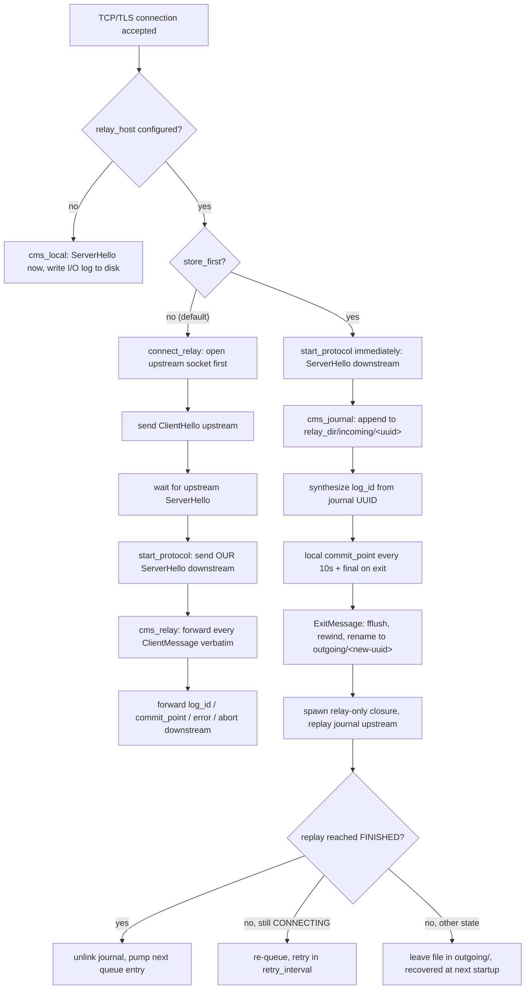

# 05. Relay Mode & Store-and-Forward

> **Reference:** sudo 1.9.18 — `36f7128256a93571ec378daa5c209d6883036d31` (2026-07-19)
> **C sources:** `logsrvd/logsrvd_relay.c`, `logsrvd/logsrvd_journal.c`, `logsrvd/logsrvd_queue.c`, `logsrvd/tls_client.c`, `logsrvd/logsrvd.h`, `logsrvd/logsrvd.c` (closure lifecycle, dispatch, commit points, shutdown), `logsrvd/logsrvd_conf.c` (relay settings and defaults), `logsrvd/logsrv_util.h`, `lib/util/mkdir_parents.c`, `lib/util/locking.c`, `lib/util/uuid.c`, `lib/util/b64_encode.c`, `lib/util/event.c`, `docs/sudo_logsrvd.man.in`, `docs/sudo_logsrvd.conf.man.in`
> **Requirement prefix:** `RELAY-`
> **Refresh:** see [README.md](README.md)

## Overview

Relay mode turns `sudo_logsrvd` from a *sink* into a *forwarder*. When at least one
`relay_host` is configured in the `[relay]` section, the daemon stops writing event logs
and I/O logs locally and instead pushes every `ClientMessage` it receives to an upstream
server that speaks the same `sudo_logsrv.proto` protocol. The upstream may be another
`sudo_logsrvd`, or anything else implementing the protocol. Nothing about the downstream
protocol changes: a real sudo client cannot tell from the wire that it is talking to a
relay rather than a terminal server, except in the timing of the first `ServerHello` and
in the fact that `log_id` and `commit_point` values originate somewhere else.

The whole thing is built on one abstraction that already exists in the daemon: the
`struct client_message_switch` vtable (`logsrvd/logsrvd.h:130-147`). Every inbound
`ClientMessage` is validated by a generic `handle_*()` function in `logsrvd/logsrvd.c`
and then dispatched to `closure->cms->{accept,reject,exit,restart,alert,iobuf,suspend,winsize}`.
There are exactly three vtables — `cms_local` (write to disk),
`cms_journal` (`logsrvd/logsrvd_journal.c:699-708`, write to a journal file), and
`cms_relay` (`logsrvd/logsrvd_relay.c:1283-1292`, forward upstream). Relay mode is
nothing more than choosing one of the latter two at connection-allocation time
(`logsrvd/logsrvd.c:206-214`) and, for `cms_relay`, hanging a `struct relay_closure`
(`logsrvd/logsrvd.h:68-84`) off the connection that owns the upstream socket, its own
read/write events, and its own buffers.

There are **two distinct relay paths**, and which one is taken is decided entirely by the
`store_first` configuration flag — never dynamically, never as a fallback:

* **Real-time (streaming) relay** — `store_first = false`, the default. The daemon opens
  the upstream connection *before* it says hello to the client, and from then on acts as
  a nearly transparent proxy: `ClientMessage` payloads are forwarded byte-for-byte
  upstream, and `commit_point` / `log_id` / `error` / `abort` `ServerMessage`s are
  forwarded back downstream. Nothing touches the disk. If the upstream is unreachable the
  session simply fails — there is no spooling.

* **Store-and-forward** — `store_first = true`. The daemon answers the client itself,
  writes every `ClientMessage` verbatim into a per-session *journal* file under
  `relay_dir/incoming/<uuid>`, and generates its own `log_id` and `commit_point`s. Only
  when the session ends (`ExitMessage`) is the journal moved to `relay_dir/outgoing/` and
  replayed to the upstream over a fresh connection. If that fails, the journal stays on
  disk and is retried.

The store-and-forward replay reuses the *same* code as an ordinary client connection: a
"relay-only" `connection_closure` is allocated whose read event is attached to the
**journal file descriptor** rather than a socket (`logsrvd/logsrvd_queue.c:119`,
`logsrvd/logsrvd.c:281`). The generic `client_msg_cb()` then reads length-prefixed
`ClientMessage`s out of the file exactly as it would off a socket, and `cms_relay`
forwards them. Such a closure has `sock == -1`, no write event and no commit-point timer
(`logsrvd/logsrvd.c:201`, `logsrvd/logsrvd.c:228-238`), which is how the relay code
detects "there is no client to answer" — see `handle_log_id()`
(`logsrvd/logsrvd_relay.c:603-605`) and `schedule_commit_point()`
(`logsrvd/logsrvd.c:1296`).

The retry machinery is deliberately minimal. `logsrvd/logsrvd_queue.c` keeps an in-memory
FIFO of journal paths, drains **one at a time**, and re-arms a single shared timer with a
**fixed** `retry_interval` (default 30 s). There is no exponential backoff, no jitter, no
maximum attempt count and no dead-letter handling. Durability across restarts comes from
the filesystem, not from the queue: at startup `logsrvd_queue_scan()`
(`logsrvd/logsrvd_queue.c:205-265`) re-populates the queue by listing
`relay_dir/outgoing/`.

Finally, note what relay mode does **not** do. It does not merge, batch or rewrite
messages. It does not synthesize a `log_id` in real-time mode. It does not consult the
upstream's `ServerHello` for capabilities — the `ServerHello` it sends downstream is its
own. It does not implement the `redirect` / `servers` fields of `ServerHello`
(`logsrvd/logsrvd_relay.c:553` is a bare `/* TODO: handle redirect */`). And it does not
append relay identity to the `log_id`, which means a client that reconnects with a
`RestartMessage` may be routed to a *different* relay than the one holding its partial
log (`logsrvd/logsrvd_relay.c:614-618`).

## Mode selection

The decision is made twice, in two places that must agree: at closure allocation
(which vtable) and at protocol start (whether to connect upstream first).

`connection_closure_alloc()` (`logsrvd/logsrvd.c:206-214`):

```c
if (relay_only) {
    closure->cms = &cms_relay;
} else if (logsrvd_conf_relay_store_first()) {
    closure->store_first = true;
    closure->cms = &cms_journal;
} else {
    closure->cms = &cms_local;
}
```

Note that the plain (non-`store_first`) relay case falls into the `cms_local` branch here
and is *overwritten* later by `connect_relay()` (`logsrvd/logsrvd_relay.c:520`). The
`cms_local` assignment is never exercised in that window because the read event is not
enabled until `start_protocol()`, which only runs after the upstream `ServerHello`.

`new_connection()` (`logsrvd/logsrvd.c:1651-1659`) and the TLS equivalent
`tls_handshake_cb()` (`logsrvd/logsrvd.c:1545-1552`) both use:

```c
if (!TAILQ_EMPTY(logsrvd_conf_relay_address()) && !closure->store_first) {
    if (!connect_relay(closure))
        goto bad;
} else {
    if (!start_protocol(closure))
        goto bad;
}
```

`store_first` is forcibly cleared at configuration load if no relay host is configured
(`logsrvd/logsrvd_conf.c:1830-1832`), so `cms_journal` is unreachable without relays.



## Upstream connection establishment

`connect_relay()` (`logsrvd/logsrvd_relay.c:498-522`) allocates the `relay_closure`,
takes a reference on the configured relay address list so a `SIGHUP` reload cannot free
it mid-connect (`logsrvd/logsrvd_relay.c:120-123`), and then loops over
`connect_relay_next()` until something sticks:

```c
while ((res = connect_relay_next(closure)) == -1) {
    if (errno == ENOENT || errno == EINPROGRESS) {
        /* Out of relays or connecting asynchronously. */
        break;
    }
}
```

`connect_relay_next()` (`logsrvd/logsrvd_relay.c:326-437`) advances a cursor through the
relay list (`relay_closure->relay_addr`), creates a `SOCK_STREAM` socket, optionally sets
`SO_KEEPALIVE`, switches the socket to `O_NONBLOCK`, and calls `connect(2)`. Three
outcomes:

* `connect()` returns 0 — connected synchronously. The previous socket (if any) is shut
  down and closed, and either the TLS handshake starts or `start_relay()` runs
  immediately. `closure->state` stays `INITIAL`.
* `connect()` returns `-1`/`EINPROGRESS` — a one-shot write event `connect_ev` is armed
  with `relay.connect_timeout` and `closure->state` is set to `CONNECTING`
  (`logsrvd/logsrvd_relay.c:406-423`).
* any other error — the socket is closed and `-1` is returned with that `errno`, and the
  caller's loop moves to the next relay.

`connect_cb()` (`logsrvd/logsrvd_relay.c:439-495`) completes the asynchronous case. A
timeout is reported as `ETIMEDOUT`; otherwise `SO_ERROR` is read with `getsockopt()`. On
success the state is reset to `INITIAL` and TLS (or `start_relay()`) proceeds; on failure
the same "try the next relay" loop runs, and when the list is exhausted
(`errno == ENOENT`) the client is sent
`error = "unable to connect to relay host"`.

The relay list is in configuration order, one entry per *resolved address*, so a
`relay_host` naming a dual-stack host produces several entries. The man page's "the first
available relay host will be used" (`docs/sudo_logsrvd.conf.man.in:383-384`) is literally
what the cursor does — there is no load balancing, no round-robin and no stickiness
across connections.

### TLS to the upstream

If the selected relay address carries the `(tls)` flag,
`connect_relay_tls()` (`logsrvd/logsrvd_relay.c:289-318`) fills in a
`struct tls_client_closure`, points it at the shared relay `SSL_CTX` built once at
configuration time (`logsrvd/logsrvd_conf.c:1809-1827`), and arms a write event running
`tls_connect_cb()` (`logsrvd/tls_client.c:105-192`). That callback drives `SSL_connect()`
to completion, flipping the event between `SUDO_EV_READ` and `SUDO_EV_WRITE` per
`SSL_ERROR_WANT_*`, re-arming with `relay.connect_timeout` each time. On success it frees
the handshake event and calls `start_relay()` via `tls_client_start_fn()`; on any failure
it calls `tls_connect_error_fn()` (`logsrvd/logsrvd_relay.c:268-286`), which falls through
to the next relay host exactly like a TCP failure.

Peer verification for the upstream direction is installed in `set_tls_verify_peer()`
(`logsrvd/logsrvd.c:1463-1468`) when `relay.tls_checkpeer` is true — note the relay
direction *always* uses the hostname-checking callback, unlike the server direction which
has a separate `tls_checkhost` knob. `logsrvd_conf_relay_tls_check_peer()`
(`logsrvd/logsrvd_conf.c:340-346`) inherits from the `[server]` section when the relay
key is unset. Certificate identity is matched against
`relay_closure->relay_name` — the configured host name and the textual IP address filled
in by `inet_ntop()` at `logsrvd/logsrvd_relay.c:383-386`. Details of the TLS context
itself belong to `06-tls-and-security.md`.

## Real-time relay: message flow

`start_relay()` (`logsrvd/logsrvd_relay.c:1090-1110`) allocates the persistent relay read
and write events on the upstream socket and immediately queues a `ClientHello` whose
`client_id` is the literal `"Sudo Logsrvd " PACKAGE_VERSION`
(`logsrvd/logsrvd_relay.c:238`). This is the relay's *own* hello — the downstream
client's `ClientHello` is validated by `handle_client_hello()`
(`logsrvd/logsrvd.c:865-891`) and then discarded, because `struct client_message_switch`
has no `hello` slot.

When the upstream `ServerHello` arrives, `handle_server_hello()`
(`logsrvd/logsrvd_relay.c:528-556`) checks the state is `INITIAL` and that `server_id` is
non-empty, logs it, and returns. `handle_server_message()` then calls `start_protocol()`
(`logsrvd/logsrvd_relay.c:708-713`), which is the moment the *downstream* client finally
receives a `ServerHello` — one built by `fmt_hello_message()`
(`logsrvd/logsrvd.c:386-400`) with this daemon's own `server_id` and
`subcommands = true`, not the upstream's. `start_protocol()` also drops the stashed relay
address list reference (`logsrvd/logsrvd.c:1356-1361`).

From then on every `cms_relay` handler is a one-liner around `relay_enqueue_write()`
(`logsrvd/logsrvd_relay.c:142-183`), which copies the **original packed payload bytes**
(`buf`, `len` — the same pointer `client_msg_cb()` handed to
`handle_client_message()`) behind a freshly computed 4-byte big-endian length and appends
it to the relay write queue. The message is never re-serialized, so unknown protobuf
fields, field ordering and non-canonical encodings all survive the hop intact.

Inbound `ServerMessage`s are demultiplexed by `handle_server_message()`
(`logsrvd/logsrvd_relay.c:692-736`):

| Upstream `ServerMessage` | Relay behavior |
|---|---|
| `hello` | validated, **not** forwarded; triggers `start_protocol()` downstream |
| `commit_point` | forwarded verbatim via `schedule_commit_point()` |
| `log_id` | forwarded verbatim as a new downstream `ServerMessage` |
| `error` | forwarded verbatim; relay read/write events deleted first |
| `abort` | forwarded verbatim; relay events left in place |
| anything else | protocol error → `"unrecognized ServerMessage type"` downstream |

Nothing is written to the event log or an I/O log in this mode. The `iolog_files` array
in the closure stays untouched and `closure->evlog` stays `NULL`.

### commit_point and log_id in relay mode

This is the part most likely to be got wrong in a reimplementation, so it is worth
stating plainly: **in real-time relay mode the daemon originates neither value.**

`enable_commit()` (`logsrvd/logsrvd.c:719-734`) — the function that arms the 10-second
`ACK_FREQUENCY` acknowledgement timer after each I/O message — begins with
`if (closure->relay_closure == NULL)`. With a relay attached the timer is never armed, so
`server_commit_cb()` never runs and no locally generated `commit_point` is ever sent.
Likewise `handle_exit()` (`logsrvd/logsrvd.c:634-645`) special-cases the relay:

```c
if (closure->log_io) {
    /* Command exited, client waiting for final commit point. */
    closure->state = EXITED;

    /* Relay host will send the final commit point. */
    if (closure->relay_closure == NULL) {
        struct timespec tv = { 0, 0 };
        ...
    }
}
```

So after the `ExitMessage` the connection sits in `EXITED` waiting for the upstream to
produce the final `commit_point`. When one arrives, `handle_commit_point()`
(`logsrvd/logsrvd_relay.c:562-585`) hands it to the shared `schedule_commit_point()`
(`logsrvd/logsrvd.c:1290-1320`), which forwards it and — because the state is `EXITED` —
promotes the state to `FINISHED`. The *first* commit point received while `EXITED` ends
the session, whatever timestamp it carries.

`handle_log_id()` (`logsrvd/logsrvd_relay.c:591-632`) forwards the upstream's `log_id`
string unchanged, with an explicit TODO acknowledging that the relay identity ought to be
appended so restarts can be routed back to the same relay. The daemon's own
`gen_log_id()` (`logsrvd/logsrvd.c:402-435`), which base64-encodes a 16-byte UUID plus a
relative path, is not used on this path at all.

## Store-and-forward: the journal

### Naming and directory layout

`journal_mkuuid()` (`logsrvd/logsrvd_journal.c:89-145`) is the only thing that creates
journal files. It generates a type-4 UUID (`lib/util/uuid.c:44-66`), renders it as the
canonical lowercase 36-character `8-4-4-4-12` string (`lib/util/uuid.c:70-96`), and builds
`"%s/%s/%s"` from `relay_dir`, a `parent_dir` argument of either `"incoming"` or
`"outgoing"`, and that string. Missing parent directories are created by
`sudo_open_parent_dir()` (`lib/util/mkdir_parents.c:73-173`) with mode `0711` masked by an
umask derived from `iolog_mode`; with the default `iolog_mode = 0600`
(`logsrvd/logsrvd_conf.c:1694`) that yields `0700` directories owned by `iolog_user`
/ `iolog_group`. The file itself is opened
`O_CREAT|O_EXCL|O_RDWR|O_NOFOLLOW` with mode `0600` and the loop retries with a new UUID
on `EEXIST`.

```
relay_dir/                      default /var/log/sudo_logsrvd
├── incoming/
│   └── 6a1c…-…-…               open session; log_id points here
└── outgoing/
    └── b93f…-…-…               completed session, awaiting relay
```

The `incoming` → `outgoing` transition in `journal_finish()`
(`logsrvd/logsrvd_journal.c:186-233`) does **not** preserve the UUID: a brand new
`outgoing/<uuid>` name is reserved with `journal_mkuuid("outgoing", …)`, the placeholder
fd is closed, and the incoming path is `rename(2)`d over it. Because `"incoming"` and
`"outgoing"` are the same length the in-memory path string is patched in place
(`logsrvd/logsrvd_journal.c:216-230`). Consequence: the `log_id` the client holds only
ever resolves to a file in `incoming/`, which is exactly right, because a completed
session is not restartable anyway.

### File format

The journal is byte-identical in framing to the wire protocol: a sequence of records,
each a 4-byte big-endian `uint32` payload length followed by that many bytes of packed
`ClientMessage` (`journal_write()`, `logsrvd/logsrvd_journal.c:530-549`). It has no
header, no magic number, no version field, no trailer and no checksum. It is written with
buffered `stdio` on a `FILE *` opened `"r+"` (`logsrvd/logsrvd_journal.c:78`) and is
flushed only by `journal_finish()` or by `fclose()` in `connection_closure_free()`
(`logsrvd/logsrvd.c:176-177`). There is no `fsync(2)` anywhere.

The recorded stream is the subset of client messages that `cms_journal` handles:
`AcceptMessage`, `RejectMessage`, `ExitMessage`, `AlertMessage`, the five `IoBuffer`
variants, `ChangeWindowSize` and `CommandSuspend`. Notably **absent**:

* `ClientHello` — never journalled, because the vtable has no hello slot. (Curiously
  `journal_seek()` still has a `CLIENT_MESSAGE__TYPE_HELLO_MSG` case at
  `logsrvd/logsrvd_journal.c:319-322`, defensive against journals written by something
  else.)
* `RestartMessage` — `journal_restart()` seeks but never writes, so a session that was
  restarted mid-flight replays upstream as one seamless stream.

This matters for the replay: the relay-only closure sends its *own* `ClientHello` first
(`start_relay()`), then the journal contents, so the upstream sees a perfectly ordinary
session.

### Locking

Every journal fd is locked with `sudo_lock_file(fd, SUDO_TLOCK)` — a non-blocking
exclusive `lockf(F_TLOCK)` / `fcntl(F_SETLK, F_WRLCK)` over the whole file
(`lib/util/locking.c:40-95`). It is taken in `journal_create()`
(`logsrvd/logsrvd_journal.c:162-168`), in `journal_restart()`
(`logsrvd/logsrvd_journal.c:505-510`) and in `outgoing_queue_cb()`
(`logsrvd/logsrvd_queue.c:106-110`), and released implicitly when the fd is closed. A
`RestartMessage` for a journal still held open by a live connection therefore fails with
`"unable to lock journal file"`, and a queue entry whose file is locked by another
process is skipped (`continue`) rather than errored.

### The client-facing side of store_first

Because the journal is local, the daemon can answer the client itself and does:

* `ServerHello` is sent immediately at connection time — no upstream round trip.
* `journal_accept()` (`logsrvd/logsrvd_journal.c:554-595`) sends a `log_id` **if and only
  if** `expect_iobufs` is set. The id is `base64(16 raw UUID bytes)` — the journal file's
  UUID parsed back out of its own path — with an *empty* path component, i.e. exactly 24
  base64 characters ending in `==` (`fmt_log_id_message(uuid, "", closure)`,
  `logsrvd/logsrvd_journal.c:585`; encoder at `lib/util/b64_encode.c:28-61`). Compare
  local mode, where the same helper is called with the relative I/O log path appended.
* A sub-command `AcceptMessage` arriving mid-session (`journal_path != NULL`) is simply
  appended; no new journal and no new `log_id` (`logsrvd/logsrvd_journal.c:560-563`).
* `enable_commit()` *is* effective here (`relay_closure == NULL`), so the client gets a
  `commit_point` every `ACK_FREQUENCY` = 10 seconds
  (`logsrvd/logsrvd.h:44`, `logsrvd/logsrvd.c:726`) computed from `closure->elapsed_time`,
  which `cms_journal` maintains via `update_elapsed_time()` in `journal_iobuf`,
  `journal_suspend` and `journal_winsize`.
* `ExitMessage` produces an immediate final `commit_point` and moves the state to
  `FINISHED`.

Those acknowledgements are emitted against buffered, unsynced local state, before the
upstream has seen anything. That is the deliberate trade `store_first` makes: the client
is released quickly and the network hop is decoupled.

### Restart against a journal

`journal_restart()` (`logsrvd/logsrvd_journal.c:469-528`) is the `cms_journal` restart
handler:

1. The `log_id` must be exactly `(16 + 2) / 3 * 4` = 24 characters and must base64-decode
   to precisely 16 bytes; otherwise `"unable to parse log_id"`.
2. Those 16 bytes are rendered back to the canonical UUID string and the path
   `relay_dir/incoming/<uuid>` is opened `O_RDWR|O_NOFOLLOW` and locked.
3. `journal_seek()` (`logsrvd/logsrvd_journal.c:239-462`) walks records from the start,
   accumulating `delay` fields into `closure->elapsed_time`, until the accumulated value
   is `>=` the `resume_point`. It succeeds **only on an exact match**; overshoot yields
   `"invalid journal file, unable to restart"` and hitting EOF yields
   `"unexpected EOF reading journal file"`.
4. On success the state becomes `RUNNING` and subsequent `journal_write()`s land at the
   seek position, overwriting whatever followed it.

Two consequences worth noting. First, the file is never truncated, so if the replayed
tail is shorter than what it overwrites, trailing bytes from the previous attempt remain
and will be replayed to the upstream as garbage records. Second, a `resume_point` of
`{0,0}` matches immediately after the first record (the `AcceptMessage`, whose delay is
absent), which is the correct "resend everything" behavior.

## The outgoing queue and retry policy

`logsrvd/logsrvd_queue.c` maintains `outgoing_journal_queue`, a `TAILQ` of
`{journal_path}` structs, plus exactly one shared timer event `outgoing_queue_event`.

`logsrvd_queue_enable(timeout, evbase)` (`logsrvd/logsrvd_queue.c:144-167`) arms that
timer for `timeout` seconds, but **only if the queue is non-empty**; it is a no-op on an
empty queue. It is called with `0` (fire on the next loop iteration) after a startup scan
and after each successful relay, and with `relay.retry_interval` from
`logsrvd_queue_insert()`.

`outgoing_queue_cb()` (`logsrvd/logsrvd_queue.c:79-138`) is the drain step. It returns
immediately if no relay hosts are configured, then walks the queue:

* `open(O_RDWR|O_NOFOLLOW)` failing with `ENOENT` removes the entry (someone else deleted
  the file); any other open failure just skips it.
* A failed `SUDO_TLOCK` skips it.
* Otherwise a relay-only closure is allocated over that fd, the entry is dequeued (the
  closure takes ownership of the path string), `connect_relay()` is called, and the loop
  **breaks**.

So at most one queued journal is in flight at a time. Sessions that finish in
`store_first` mode while the daemon is running do *not* go through this queue — they get
their own relay connection immediately from `connection_close()` — so those can overlap.

The retry policy is:

| Property | Value | Source |
|---|---|---|
| Initial interval | `relay.retry_interval`, default **30 s** | `logsrvd/logsrvd_conf.c:1642`, `logsrvd/logsrvd_queue.c:194` |
| Backoff | none — constant interval | `logsrvd/logsrvd_queue.c:150` |
| Jitter | none | — |
| Cap | n/a (no growth) | — |
| Maximum attempts | unlimited | — |
| Persistence | filesystem; queue is re-derived at startup | `logsrvd/logsrvd_queue.c:205-265` |

Re-queueing is *not* unconditional. It happens in exactly one place —
`connection_closure_free()` (`logsrvd/logsrvd.c:108-111`):

```c
if (closure->state == CONNECTING && closure->journal != NULL) {
    /* Failed to relay journal file, retry later. */
    logsrvd_queue_insert(closure);
}
```

`CONNECTING` is only ever set when `connect(2)` returned `EINPROGRESS`
(`logsrvd/logsrvd_relay.c:422`) and is cleared to `INITIAL` the instant the connect
completes (`logsrvd/logsrvd_relay.c:455`). A journal whose relay attempt fails *outside*
that window — an immediate `ECONNREFUSED`, or an upstream that drops the connection
mid-replay — is neither re-queued nor deleted. Its file remains in `outgoing/` and is
only picked up again by the next `logsrvd_queue_scan()`, i.e. after a daemon restart.

Startup recovery is `logsrvd_queue_scan()` (`logsrvd/logsrvd_queue.c:205-265`), called
from `main()` before daemonizing (`logsrvd/logsrvd.c:2288-2291`). It returns success
immediately if no relay hosts are configured; otherwise it `opendir()`s
`relay_dir/outgoing/` and enqueues every entry whose name parses as a UUID
(`sudo_uuid_from_string()`, `lib/util/uuid.c:103-129`), skipping everything else.
`relay_dir/incoming/` is **never** scanned — partial sessions abandoned by a crash are
orphaned permanently. If `opendir()` fails the function returns false and `main()` exits
with `EXIT_FAILURE`, which means a relay-configured daemon refuses to start until
`relay_dir/outgoing/` exists (nothing in the packaging creates it).

## Shutdown

`server_shutdown()` (`logsrvd/logsrvd.c:975-1017`) marks every connection `SHUTDOWN`,
stops reading, and for relay connections calls `relay_shutdown()`
(`logsrvd/logsrvd_relay.c:1267-1281`), which closes the connection only if no relay read
or write event is pending and the relay write queue is empty. Because the relay read
event is persistent and stays inserted for the whole life of the upstream connection,
that condition is essentially never true while connected — so relay connections survive
until the 10-second `SHUTDOWN_TIMEO` watchdog (`logsrvd/logsrvd.h:47`,
`logsrvd/logsrvd.c:1005-1014`) breaks the loop. Journals in flight are left on disk in
whichever directory they were in; `CONNECTING` is not the state at that point, so nothing
is re-queued.

(Implementation note, not a contract: `relay_shutdown()` dereferences
`relay_closure->read_ev` unconditionally, and that pointer is `NULL` until
`start_relay()` runs. A `SIGTERM` delivered while a relay connect or TLS handshake is
still in flight will therefore crash the C daemon in `sudo_ev_pending()`
(`lib/util/event.c:856-864`). A reimplementation should obviously not reproduce that.)

`SIGUSR1` dumps state including the outgoing queue via `logsrvd_queue_dump()`
(`logsrvd/logsrvd_queue.c:270-283`, called from `logsrvd/logsrvd.c:1984`). `SIGHUP`
re-reads the configuration but does not touch in-flight relay connections; existing
`relay_closure`s hold a reference on the old address list
(`logsrvd/logsrvd_conf.c:1106-1126`) so it is not freed underneath them.

## Delivery guarantees

**Ordering** is strict and easy: `relay_enqueue_write()` appends to a `TAILQ` that
`relay_client_msg_cb()` drains head-first (`logsrvd/logsrvd_relay.c:976`,
`logsrvd/logsrvd_relay.c:1063-1064`), and the journal is an append-only sequential file
replayed from offset zero. Messages reach the upstream in the order the client sent them.

**Real-time relay is at-most-once and lossy.** There is no spool. If the upstream is
unreachable the client gets an error and the session is not recorded anywhere. If the
upstream dies mid-session, everything already forwarded is upstream's problem and
everything not yet forwarded is gone — the pending write buffers are simply freed by
`relay_closure_free()` (`logsrvd/logsrvd_relay.c:93-97`).

**Store-and-forward is at-least-once.** The journal is unlinked only in
`connection_close()` and only when `state == FINISHED`
(`logsrvd/logsrvd.c:297-305`), i.e. after the upstream has acknowledged the session with
its final `commit_point`. Any earlier failure leaves the file on disk, so a replay
interrupted after the upstream committed some or all of the log but before the final
acknowledgement reached the relay will be **re-sent in full** on a later attempt. The
protocol has no idempotency key, so the upstream stores a duplicate session.

**A permanently rejected journal is retried forever.** If the upstream answers a replay
with an `error` `ServerMessage`, `handle_server_error()` tries to forward it downstream;
for a relay-only closure there is no downstream, `schedule_error_message()` returns false
(`logsrvd/logsrvd.c:492-493`), and the connection is closed with the state still
`RUNNING`. That is neither `FINISHED` (no unlink) nor `CONNECTING` (no re-queue), so the
file sits in `outgoing/` and is re-attempted at every subsequent daemon start,
indefinitely. There is no poison-message handling.

---

## Requirements

### RELAY-001 — Configuring any relay host puts every connection into relay mode

- **C source:** `logsrvd/logsrvd.c:1651-1659`, `logsrvd/logsrvd.c:1545-1552`, `logsrvd/logsrvd.c:206-214`
- **Severity if divergent:** breaking

The server MUST treat a non-empty `relay_host` list as a global mode switch: every newly
accepted connection is handled by `cms_relay` (real time) or `cms_journal`
(`store_first`), and none of them writes an event log entry or an I/O log to local
storage. The decision is per-daemon configuration, not per-connection or per-client; the
same test `!TAILQ_EMPTY(logsrvd_conf_relay_address()) && !closure->store_first` is applied
identically to plaintext connections (`new_connection()`) and to TLS connections after
the handshake (`tls_handshake_cb()`).

### RELAY-002 — `store_first` selects the journal path and is forced off without relays

- **C source:** `logsrvd/logsrvd.c:206-214`, `logsrvd/logsrvd_conf.c:1830-1832`
- **Severity if divergent:** high

The server DOES choose between streaming and store-and-forward solely from the
`store_first` boolean, evaluated once when the connection closure is allocated. It never
falls back from streaming to journalling when the upstream is unavailable, and never
skips the journal when the upstream happens to be reachable. At configuration load,
`store_first` is silently reset to `false` if the relay address list is empty, so the
journal code path is unreachable in a non-relay configuration.

### RELAY-003 — In real-time relay mode the downstream `ServerHello` is deferred

- **C source:** `logsrvd/logsrvd_relay.c:498-522`, `logsrvd/logsrvd_relay.c:707-713`, `logsrvd/logsrvd.c:1350-1377`
- **Severity if divergent:** breaking

With `store_first = false`, the server MUST NOT send its `ServerHello` to the client, and
MUST NOT enable reading from the client, until the upstream relay has completed its own
`ServerHello`. `connect_relay()` runs *instead of* `start_protocol()` at connection setup;
`start_protocol()` is invoked only from `handle_server_message()` on the
`SERVER_MESSAGE__TYPE_HELLO` branch. A client therefore observes upstream-connect latency
(and upstream-connect failures) as a delayed or absent `ServerHello`.

### RELAY-004 — The `ServerHello` sent downstream is the relay's own, not the upstream's

- **C source:** `logsrvd/logsrvd.c:386-400`, `logsrvd/logsrvd_relay.c:528-556`
- **Severity if divergent:** medium

The server DOES send its own `server_id` (`"Sudo Audit Server " PACKAGE_VERSION`) and its
own `subcommands = true` to the client, regardless of what the upstream advertised. The
upstream `ServerHello` is validated (state must be `INITIAL`, `server_id` must be present
and non-empty) and logged, and is otherwise discarded. Its `redirect` and `servers`
fields are ignored entirely — `logsrvd/logsrvd_relay.c:553` is an unimplemented
`/* TODO: handle redirect */`.

### RELAY-005 — The relay synthesizes its own upstream `ClientHello`

- **C source:** `logsrvd/logsrvd_relay.c:228-255`, `logsrvd/logsrvd_relay.c:1090-1110`, `logsrvd/logsrvd.c:865-891`
- **Severity if divergent:** medium

The first message the server MUST send upstream after connecting is a `ClientMessage`
carrying a `ClientHello` with `client_id = "Sudo Logsrvd " PACKAGE_VERSION`. The
downstream client's own `ClientHello` is validated for a non-empty `client_id` and then
dropped — `struct client_message_switch` has no hello entry, so it is never forwarded.
The upstream therefore always sees the relay's identity, never the originating client's.

### RELAY-006 — Relay hosts are tried in configuration order until one connects

- **C source:** `logsrvd/logsrvd_relay.c:326-437`, `logsrvd/logsrvd_relay.c:498-522`, `logsrvd/logsrvd_relay.c:474-492`
- **Severity if divergent:** medium

The server DOES iterate the resolved relay address list from the head, advancing one
entry per failed attempt, until a `connect(2)` succeeds or is in progress or the list is
exhausted (`errno == ENOENT`). Each resolved address is a separate attempt, so a
dual-stack `relay_host` is two entries. There is no round-robin, no randomization and no
memory of which relay worked last time — every new connection restarts at the head.

### RELAY-007 — Upstream sockets are non-blocking, with optional TCP keepalive

- **C source:** `logsrvd/logsrvd_relay.c:347-363`
- **Severity if divergent:** low

The server MUST set `O_NONBLOCK` on the upstream socket before calling `connect(2)`, and
MUST set `SO_KEEPALIVE` when `relay.tcp_keepalive` is true (the default). A failure to set
`SO_KEEPALIVE` is warned about but not fatal; a failure of the `fcntl(O_NONBLOCK)`
sequence aborts that relay attempt.

### RELAY-008 — `relay.connect_timeout` bounds the TCP connect and the TLS handshake

- **C source:** `logsrvd/logsrvd_relay.c:406-416`, `logsrvd/logsrvd_relay.c:448-449`, `logsrvd/logsrvd_relay.c:289-318`, `logsrvd/tls_client.c:115-163`
- **Severity if divergent:** medium

An asynchronous upstream `connect(2)` MUST be abandoned after `relay.connect_timeout`
(default 30 s; `0` disables the timeout, `logsrvd/logsrvd_conf.c:317-325`), reported
internally as `ETIMEDOUT`, and followed by an attempt on the next relay host. The same
timeout is re-armed on each `SSL_connect()` continuation, so it bounds the TLS handshake
as well.

### RELAY-009 — A failed upstream TLS handshake falls through to the next relay

- **C source:** `logsrvd/logsrvd_relay.c:268-286`, `logsrvd/tls_client.c:189-191`
- **Severity if divergent:** medium

The server DOES treat a TLS handshake failure with a relay exactly like a TCP connect
failure: `tls_connect_error_fn()` runs the same "next relay" loop, and only when the list
is exhausted does the client receive
`error = "unable to connect to relay host"`.

### RELAY-010 — Exhausting the relay list produces a specific error to the client

- **C source:** `logsrvd/logsrvd_relay.c:487-491`, `logsrvd/logsrvd_relay.c:281-285`, `logsrvd/logsrvd.c:473-508`
- **Severity if divergent:** high

When every configured relay has been tried and failed *asynchronously*, the server MUST
send the client a `ServerMessage` with `error = "unable to connect to relay host"`, stop
reading from the client, and close the connection once that message is written. If
instead every relay fails *synchronously* inside `connect_relay()`, the function returns
false and `new_connection()`/`tls_handshake_cb()` close the connection immediately
(`logsrvd/logsrvd.c:1653-1654`, `logsrvd/logsrvd.c:1547-1548`) — the client sees a bare
disconnect with no `ServerHello` and no error message.

### RELAY-011 — Client messages are forwarded byte-for-byte, re-framed only

- **C source:** `logsrvd/logsrvd_relay.c:142-183`, `logsrvd/logsrvd_relay.c:1115-1262`
- **Severity if divergent:** high

For each of `AcceptMessage`, `RejectMessage`, `ExitMessage`, `RestartMessage`,
`AlertMessage`, `IoBuffer` (all five stream variants), `CommandSuspend` and
`ChangeWindowSize`, the server MUST forward the **original packed payload bytes** it
received, prefixed with a freshly computed 4-byte big-endian length equal to that payload
length. The message is not unpacked-and-repacked, so unknown fields, field order and
non-minimal encodings are preserved verbatim across the relay.

### RELAY-012 — Forwarding order is the receive order

- **C source:** `logsrvd/logsrvd_relay.c:172`, `logsrvd/logsrvd_relay.c:976`, `logsrvd/logsrvd_relay.c:1057-1072`
- **Severity if divergent:** breaking

The server MUST forward client messages upstream in exactly the order they were received,
with no reordering, coalescing or interleaving. Buffers are appended to the tail of
`relay_closure->write_bufs` and consumed from the head, one completely before the next is
started.

### RELAY-013 — No local logging occurs in relay mode

- **C source:** `logsrvd/logsrvd_relay.c:1283-1292`, `logsrvd/logsrvd_journal.c:699-708`
- **Severity if divergent:** high

Neither `cms_relay` nor `cms_journal` writes an event log record (syslog or logfile) or
creates an I/O log directory. A relaying daemon produces no local audit trail of the
sessions passing through it; the only on-disk artifact is the `store_first` journal.

### RELAY-014 — In real-time relay mode the server never generates a `commit_point`

- **C source:** `logsrvd/logsrvd.c:719-734`, `logsrvd/logsrvd.c:634-645`
- **Severity if divergent:** breaking

When a `relay_closure` is attached, the server MUST NOT arm the `ACK_FREQUENCY` (10 s)
commit timer after I/O messages, and MUST NOT schedule the immediate final commit point
after an `ExitMessage`. Both call sites are guarded by
`if (closure->relay_closure == NULL)`. Every `commit_point` the client sees in real-time
relay mode originated at the upstream server. A reimplementation that also ACKs locally
would double-acknowledge; one that neither forwards nor generates would hang the client
after exit.

### RELAY-015 — Upstream `commit_point` values are forwarded verbatim

- **C source:** `logsrvd/logsrvd_relay.c:562-585`, `logsrvd/logsrvd.c:1290-1320`
- **Severity if divergent:** breaking

An upstream `commit_point` MUST be relayed to the client unchanged — the same
`TimeSpec` is placed into a downstream `ServerMessage` without clamping, rounding or
substitution with the relay's own notion of elapsed time. The downstream write event is
armed with `server.timeout`.

### RELAY-016 — A `commit_point` received before `RUNNING` is a protocol error

- **C source:** `logsrvd/logsrvd_relay.c:568-581`, `logsrvd/logsrvd.h:56-63`
- **Severity if divergent:** low

If a `commit_point` arrives from the upstream while `closure->state < RUNNING` (i.e.
`INITIAL` or `CONNECTING`), the server MUST reject it with
`errstr = "state machine error"`. A `commit_point` message with a `NULL` payload is
rejected with `"invalid ServerMessage"`.

### RELAY-017 — The first `commit_point` after `EXITED` finalizes the session

- **C source:** `logsrvd/logsrvd.c:1315-1316`
- **Severity if divergent:** high

Once the `ExitMessage` has moved a relayed I/O-logging session to `EXITED`, the *first*
`commit_point` forwarded from the upstream promotes the state to `FINISHED`, regardless
of the timestamp it carries. The relay does not compare it against any expected elapsed
time and does not wait for a value covering the whole session.

### RELAY-018 — Upstream `log_id` is forwarded unmodified

- **C source:** `logsrvd/logsrvd_relay.c:591-632`
- **Severity if divergent:** high

In real-time relay mode the server MUST pass the upstream's `log_id` string through to
the client without alteration — no relay host is appended, no re-encoding is done. An
empty `log_id` from the upstream is a protocol error
(`"invalid ServerMessage"`). The downstream write event for this specific message is armed
with `relay.timeout` rather than `server.timeout`
(`logsrvd/logsrvd_relay.c:623-624`), which is the only place `relay.timeout` is used at
all.

### RELAY-019 — `log_id` handling is skipped when there is no downstream client

- **C source:** `logsrvd/logsrvd_relay.c:603-605`
- **Severity if divergent:** low

When replaying a journal (a relay-only closure, `closure->write_ev == NULL`), an upstream
`log_id` MUST be accepted and discarded without validation and without error. The
emptiness check at `logsrvd/logsrvd_relay.c:607` is therefore only reachable for live
client connections.

### RELAY-020 — Upstream `error` messages are relayed and stop relay I/O

- **C source:** `logsrvd/logsrvd_relay.c:638-661`, `logsrvd/logsrvd.c:473-508`
- **Severity if divergent:** high

On an `error` `ServerMessage` from the upstream, the server MUST delete both relay read
and write events (the upstream is expected to hang up), substitute the literal
`"unknown error"` for an empty error string, and forward the text to the client as a
downstream `error` `ServerMessage`. `schedule_error_message()` additionally stops reading
from the client and sets `closure->error`, so the connection closes as soon as the error
is written.

### RELAY-021 — Upstream `abort` messages are relayed but do not stop relay I/O

- **C source:** `logsrvd/logsrvd_relay.c:667-686`
- **Severity if divergent:** low

An `abort` `ServerMessage` is forwarded to the client with the same empty-string
substitution as `error`, but unlike `error` the relay read and write events are *not*
explicitly deleted first. The practical effect is the same because
`schedule_error_message()` disables them, but the code paths differ.

### RELAY-022 — Premature upstream EOF is reported to the client

- **C source:** `logsrvd/logsrvd_relay.c:869-888`, `logsrvd/logsrvd_relay.c:995-1010`
- **Severity if divergent:** high

If the upstream closes the connection (a zero-length read, or `SSL_ERROR_ZERO_RETURN`)
while `closure->state != FINISHED`, the server MUST close the relay socket, delete the
relay events, and send the client
`error = "relay server closed connection"`. If the state *is* `FINISHED`, the EOF is
normal: for a relay-only journal closure (`closure->sock == -1`) it triggers
`connection_close()`, which is what unlinks the journal.

### RELAY-023 — Relay read and write events carry no timeout

- **C source:** `logsrvd/logsrvd_relay.c:244`, `logsrvd/logsrvd_relay.c:248`, `logsrvd/logsrvd_relay.c:167`, `logsrvd/logsrvd_relay.c:795`
- **Severity if divergent:** medium

Every `sudo_ev_add()` for `relay_closure->read_ev` and `relay_closure->write_ev` passes a
`NULL` timeout. Consequently the `SUDO_EV_TIMEOUT` branches in `relay_server_msg_cb()`
(`logsrvd/logsrvd_relay.c:758-763`) and `relay_client_msg_cb()`
(`logsrvd/logsrvd_relay.c:969-974`) are dead code in practice, and an upstream that
accepts the connection but never answers will stall the relayed session indefinitely.
This contradicts `sudo_logsrvd.conf(5)`, which documents `relay.timeout` as "the amount of
time `sudo_logsrvd` will wait for the relay server to respond after a connection has
succeeded" (`docs/sudo_logsrvd.conf.man.in:411-417`); the C code applies that setting only
at `logsrvd/logsrvd_relay.c:624`. **Trust the code.**

### RELAY-024 — 2 MB message-size ceiling applies in both directions

- **C source:** `logsrvd/logsrv_util.h:36`, `logsrvd/logsrvd_relay.c:901-905`, `logsrvd/logsrvd_relay.c:199-203`, `logsrvd/logsrvd_journal.c:267-272`
- **Severity if divergent:** medium

A `ServerMessage` from the upstream whose declared length exceeds `MESSAGE_SIZE_MAX`
(2 × 1024 × 1024) MUST be rejected with `"server message too large"`. The same ceiling
applies to the relay's own outbound `ClientHello`, and to records read from a journal file
during `journal_seek()`. Client messages arriving from downstream are already bounded by
the same constant in `client_msg_cb()`.

### RELAY-025 — A `RestartMessage` is forwarded verbatim in real-time relay mode

- **C source:** `logsrvd/logsrvd_relay.c:1172-1186`, `logsrvd/logsrvd.c:656-696`
- **Severity if divergent:** high

In streaming relay mode the server MUST forward the client's `RestartMessage` (including
its `log_id` and `resume_point`) upstream unchanged and set the connection state to
`RUNNING` with `log_io = true`. It does no local seeking and keeps no per-`log_id` state.
Because the relay never annotates the `log_id` with a relay identity
(`logsrvd/logsrvd_relay.c:614-618`) and always restarts relay selection at the head of the
list (RELAY-006), a multi-relay configuration can route the restart to a relay that has
never seen that `log_id`, in which case the upstream rejects it.

### RELAY-026 — Journal files live in `relay_dir/{incoming,outgoing}/<uuid>`

- **C source:** `logsrvd/logsrvd_journal.c:89-145`, `logsrvd/logsrvd_journal.c:150-179`, `logsrvd/logsrvd_conf.c:1643`
- **Severity if divergent:** medium

Journal files MUST be named by a freshly generated type-4 UUID rendered as the canonical
lowercase 36-character `8-4-4-4-12` string, placed directly in
`<relay_dir>/incoming/` while the session is open. `relay_dir` defaults to
`/var/log/sudo_logsrvd`. Missing parent directories are created on demand with mode
`0711` masked by an umask derived from `iolog_mode`, and chowned to
`iolog_user`/`iolog_group`. UUID collisions cause a retry with a new UUID
(`O_CREAT|O_EXCL` + `EEXIST` loop).

### RELAY-027 — Journal files are created mode 0600 and `O_NOFOLLOW`

- **C source:** `logsrvd/logsrvd_journal.c:131-132`, `logsrvd/logsrvd_journal.c:500`, `logsrvd/logsrvd_queue.c:97`
- **Severity if divergent:** high

Journal files MUST be created with `openat(…, O_CREAT|O_EXCL|O_RDWR|O_NOFOLLOW,
S_IRUSR|S_IWUSR)` — mode `0600`, independent of `iolog_mode` — and every subsequent open
of an existing journal (restart, queue drain) MUST also pass `O_NOFOLLOW`. Journals hold
raw keystroke data including whatever the client captured, so this is a security-relevant
property.

### RELAY-028 — Each journal is held under a non-blocking exclusive file lock

- **C source:** `logsrvd/logsrvd_journal.c:162-168`, `logsrvd/logsrvd_journal.c:505-510`, `logsrvd/logsrvd_queue.c:106-110`, `lib/util/locking.c:40-95`
- **Severity if divergent:** medium

Whenever a journal file is opened — at creation, on restart, or when draining the outgoing
queue — the server MUST take a whole-file advisory write lock in non-blocking mode
(`lockf(F_TLOCK)` or `fcntl(F_SETLK, F_WRLCK)`) and hold it until the descriptor is
closed. Failure to acquire the lock is not fatal: creation and restart fail the operation
with `"unable to lock journal file"`, while the queue simply skips that entry and tries
the next one.

### RELAY-029 — Journal record framing matches the wire protocol exactly

- **C source:** `logsrvd/logsrvd_journal.c:530-549`, `logsrvd/logsrvd_journal.c:249-307`
- **Severity if divergent:** high

A journal file MUST consist solely of a concatenation of records, each a 4-byte
big-endian `uint32` payload length followed by exactly that many bytes of packed
`ClientMessage`. There is no file header, magic number, version, index, trailer or
checksum, and no per-record metadata. The payload bytes are the same bytes received from
the client, written verbatim.

### RELAY-030 — `ClientHello` and `RestartMessage` are never journalled

- **C source:** `logsrvd/logsrvd_journal.c:699-708`, `logsrvd/logsrvd_journal.c:469-528`, `logsrvd/logsrvd.c:865-891`
- **Severity if divergent:** breaking

The journal MUST contain only `AcceptMessage`, `RejectMessage`, `ExitMessage`,
`AlertMessage`, the five `IoBuffer` variants, `ChangeWindowSize` and `CommandSuspend`. The
client's `ClientHello` is validated and dropped, and `journal_restart()` seeks without
writing the `RestartMessage`, so a restarted session replays to the upstream as one
uninterrupted stream. Journalling a `RestartMessage` would make the replay unparseable to
the upstream, which expects `RestartMessage` only in the `INITIAL` state.

### RELAY-031 — Journal writes are buffered and never fsynced

- **C source:** `logsrvd/logsrvd_journal.c:78`, `logsrvd/logsrvd_journal.c:539-547`, `logsrvd/logsrvd_journal.c:194-198`
- **Severity if divergent:** informational

The journal is a `stdio` `FILE *` opened `"r+"`; records are written with `fwrite()` and
are flushed only by the `fflush()` in `journal_finish()` or by the `fclose()` in
`connection_closure_free()`. There is no `fsync(2)` and no `O_SYNC`. Commit points are
therefore acknowledged to the client against data that may still be in userspace buffers.

### RELAY-032 — `store_first` answers the client immediately, without the upstream

- **C source:** `logsrvd/logsrvd.c:1651-1659`, `logsrvd/logsrvd.c:1350-1377`
- **Severity if divergent:** medium

With `store_first = true` the server MUST send its `ServerHello` and begin reading from
the client as soon as the connection (and TLS handshake, if any) is established. No
upstream connection is attempted until the session completes.

### RELAY-033 — `store_first` `log_id` is base64 of the journal UUID with an empty path

- **C source:** `logsrvd/logsrvd_journal.c:571-592`, `logsrvd/logsrvd.c:402-435`, `lib/util/b64_encode.c:28-61`
- **Severity if divergent:** breaking

In `store_first` mode, and only when the `AcceptMessage` has `expect_iobufs = true`, the
server MUST send the client a `log_id` equal to the standard-alphabet, `=`-padded base64
encoding of the journal file's 16 raw UUID bytes and nothing else — exactly 24 characters
ending in `==`. This differs from local mode, where the same encoder is fed the UUID
*plus* the relative I/O log path. A client that later restarts echoes this string back,
and `journal_restart()` rejects anything that is not exactly 24 characters decoding to 16
bytes.

### RELAY-034 — A sub-command Accept during a journalled session reuses the journal

- **C source:** `logsrvd/logsrvd_journal.c:560-563`
- **Severity if divergent:** medium

If an `AcceptMessage` arrives while `closure->journal_path` is already set (an
intercepted sub-command), the server MUST append it to the existing journal and MUST NOT
create a second journal file or send a second `log_id`.

### RELAY-035 — `store_first` generates local commit points on the normal schedule

- **C source:** `logsrvd/logsrvd.c:719-734`, `logsrvd/logsrvd.h:44`, `logsrvd/logsrvd.c:1326-1343`, `logsrvd/logsrvd_journal.c:658-697`
- **Severity if divergent:** breaking

Because a journalled connection has no `relay_closure`, `enable_commit()` arms the
10-second commit timer after every I/O, window-size or suspend message, and `handle_exit()`
schedules the final commit point immediately. The timestamps come from
`closure->elapsed_time`, which `cms_journal` accumulates via `update_elapsed_time()` on
`IoBuffer.delay`, `CommandSuspend.delay` and `ChangeWindowSize.delay`
(`logsrvd/iolog_writer.c:982-999`). From the client's point of view a `store_first` relay
is indistinguishable from a local server.

### RELAY-036 — `journal_restart()` resolves the log_id to `incoming/<uuid>` and seeks

- **C source:** `logsrvd/logsrvd_journal.c:469-528`
- **Severity if divergent:** high

On a `RestartMessage` in `store_first` mode the server MUST: reject a `log_id` whose
length is not 24 or which does not base64-decode to exactly 16 bytes
(`"unable to parse log_id"` → client error `"unable to open journal file"`); render those
bytes as the canonical UUID string; open and lock `<relay_dir>/incoming/<uuid>`; and seek
forward to the `resume_point`. It never looks in `outgoing/`, and never creates the file.

### RELAY-037 — Journal seek must land exactly on the resume point

- **C source:** `logsrvd/logsrvd_journal.c:439-454`
- **Severity if divergent:** high

`journal_seek()` accumulates the `delay` of each record into `closure->elapsed_time` and
stops at the first record where the accumulated value is `>=` the target. It succeeds
**only** if the value is exactly equal; a value strictly greater is reported as
`"invalid journal file, unable to restart"`, and running off the end of the file as
`"unexpected EOF reading journal file"`. Records with no delay (Accept, Reject, Exit,
Alert, Hello) do not advance the clock, so a `resume_point` of `{0,0}` matches
immediately after the first record.

### RELAY-038 — After a restart, journal writes overwrite from the seek position

- **C source:** `logsrvd/logsrvd_journal.c:511-527`, `logsrvd/logsrvd_journal.c:530-549`
- **Severity if divergent:** medium

The journal is reopened `O_RDWR` and is **not** truncated at the resume point; subsequent
`journal_write()` calls simply overwrite from the current offset. If the resent tail is
shorter than what it replaces, the residual bytes of the previous attempt remain in the
file and will be replayed to the upstream as trailing records. A reimplementation that
truncates at the resume point is safer but observably different.

### RELAY-039 — `ExitMessage` finalizes the journal and moves it to `outgoing/`

- **C source:** `logsrvd/logsrvd_journal.c:620-633`, `logsrvd/logsrvd_journal.c:186-233`
- **Severity if divergent:** breaking

On `ExitMessage` the server MUST append the message to the journal, `fflush()` the stream,
`rewind()` it to offset 0, reserve a **new** UUID name under `<relay_dir>/outgoing/` with
`O_CREAT|O_EXCL`, close that placeholder, and `rename(2)` the incoming path over it. The
outgoing name is therefore a *different* UUID from the one embedded in the client's
`log_id`. On rename failure the reserved outgoing name is unlinked and the operation fails
with `"unable to rename journal file"`.

### RELAY-040 — A finished `store_first` session relays immediately, not via the queue

- **C source:** `logsrvd/logsrvd.c:279-296`
- **Severity if divergent:** medium

When a `store_first` client connection reaches `FINISHED` with an open journal and no
relay closure, `connection_close()` MUST allocate a new relay-only connection closure over
the journal's file descriptor, transfer ownership of the `FILE *` and the path to it, and
call `connect_relay()` right away. The retry queue is not involved on this path, so
several completed sessions can be relaying concurrently.

### RELAY-041 — Journal replay reads the journal as if it were a client socket

- **C source:** `logsrvd/logsrvd_queue.c:119-126`, `logsrvd/logsrvd.c:190-252`, `logsrvd/logsrvd.c:1128-1285`
- **Severity if divergent:** informational

A relay-only closure has `sock == -1`, no write event and no commit timer, and its
persistent read event is bound to the journal file descriptor. The generic
`client_msg_cb()` therefore reads length-prefixed `ClientMessage`s out of the regular file
using `read(2)` and dispatches them through the identical validation path used for network
clients. A reimplementation is free to replay the journal with a plain sequential reader;
the observable consequence to preserve is that journal records are subject to the same
validation and state-machine rules as live client messages, including the 2 MB size cap
and the `EXITED`/`FINISHED` transitions.

### RELAY-042 — A successful replay unlinks the journal and pumps the queue

- **C source:** `logsrvd/logsrvd.c:297-305`
- **Severity if divergent:** high

The journal file MUST be unlinked if and only if the closure reaches `FINISHED` — i.e.
after the upstream's final `commit_point` (I/O sessions) or after the `ExitMessage` for a
non-I/O session. Immediately afterwards the server calls `logsrvd_queue_enable(0, …)` so
that the next queued journal, if any, is attempted on the following event-loop iteration.

### RELAY-043 — Journals are re-queued only from the `CONNECTING` state

- **C source:** `logsrvd/logsrvd.c:108-111`, `logsrvd/logsrvd_relay.c:422`, `logsrvd/logsrvd_relay.c:455`
- **Severity if divergent:** high

`connection_closure_free()` re-inserts a journal into the retry queue only when
`closure->state == CONNECTING && closure->journal != NULL`. `CONNECTING` is set exclusively
while an asynchronous `connect(2)` is outstanding and is cleared to `INITIAL` the moment
the connect resolves. Therefore a replay that fails with an immediate `ECONNREFUSED`, or
that fails after the upstream connection was established (upstream `error`, mid-replay
EOF, TLS failure after connect), is **not** re-queued in the running process; its file
stays in `outgoing/` and is only retried after a daemon restart.

### RELAY-044 — Retry uses a fixed interval, with no backoff, jitter or attempt limit

- **C source:** `logsrvd/logsrvd_queue.c:144-167`, `logsrvd/logsrvd_queue.c:194-196`, `logsrvd/logsrvd_conf.c:1642`, `logsrvd/logsrvd_conf.c:876-890`
- **Severity if divergent:** medium

Re-queued journals are retried after exactly `relay.retry_interval` seconds (default 30,
configurable to any non-negative value). The interval never grows, is never randomized,
has no cap because it never changes, and there is no maximum number of attempts and no
dead-letter destination. A single shared timer event serves the whole queue, and arming it
is a no-op when the queue is empty.

### RELAY-045 — The outgoing queue drains one journal at a time

- **C source:** `logsrvd/logsrvd_queue.c:93-137`
- **Severity if divergent:** low

`outgoing_queue_cb()` walks the queue but `break`s as soon as it successfully starts one
relay attempt, so at most one queued journal is in flight per timer firing. Entries whose
file has vanished (`ENOENT`) are dropped from the queue; entries that cannot be locked or
opened are skipped and left in place. If every entry is skipped, the callback returns
without re-arming the timer, so the queue stalls until some other event calls
`logsrvd_queue_enable()`.

### RELAY-046 — The queue is skipped entirely when no relay host is configured

- **C source:** `logsrvd/logsrvd_queue.c:88-90`, `logsrvd/logsrvd_queue.c:215-217`
- **Severity if divergent:** low

Both `outgoing_queue_cb()` and `logsrvd_queue_scan()` return immediately if the relay
address list is empty. Removing `relay_host` from the configuration therefore strands any
journals already on disk without deleting them; they resume being relayed if a relay host
is configured again and the daemon is restarted.

### RELAY-047 — Startup recovery scans only `outgoing/`, only UUID-named entries

- **C source:** `logsrvd/logsrvd_queue.c:205-265`, `logsrvd/logsrvd.c:2288-2291`
- **Severity if divergent:** high

At startup, before daemonizing, the server MUST list `<relay_dir>/outgoing/` and enqueue
every entry whose name parses as a 36-character canonical UUID, ignoring all other names,
then process the queue with a zero-second timer. `<relay_dir>/incoming/` is never scanned,
so journals for sessions that were still open when the daemon died are orphaned
permanently — they are neither relayed nor cleaned up.

### RELAY-048 — Startup fails if the outgoing directory cannot be opened

- **C source:** `logsrvd/logsrvd_queue.c:229-233`, `logsrvd/logsrvd.c:2288-2291`
- **Severity if divergent:** low

If relay hosts are configured and `opendir("<relay_dir>/outgoing")` fails, the server
warns and `main()` returns `EXIT_FAILURE`. This applies to real-time relay mode too, not
just `store_first`, and nothing in the daemon or its packaging creates that directory
ahead of time — the first relay-enabled start therefore fails unless the operator (or
`journal_mkuuid()` on a prior run) has created it.

### RELAY-049 — An upstream that permanently rejects a journal causes indefinite retries

- **C source:** `logsrvd/logsrvd_relay.c:638-661`, `logsrvd/logsrvd.c:492-493`, `logsrvd/logsrvd.c:297-305`
- **Severity if divergent:** medium

When the upstream answers a journal replay with an `error` `ServerMessage`,
`handle_server_error()` attempts to forward it, `schedule_error_message()` returns false
because a relay-only closure has no write event, and the connection is torn down with the
state still `RUNNING`. That is neither `FINISHED` (so the file is not unlinked) nor
`CONNECTING` (so it is not re-queued): the journal remains in `outgoing/` and is retried
on every subsequent daemon start, forever. There is no poison-message or dead-letter
handling.

### RELAY-050 — Reject-only and alert-only sessions are lost in `store_first` mode

- **C source:** `logsrvd/logsrvd_journal.c:600-615`, `logsrvd/logsrvd_journal.c:638-653`, `logsrvd/logsrvd.c:279-296`, `logsrvd/logsrvd.c:1269-1270`
- **Severity if divergent:** low

`journal_reject()` and `journal_alert()` create and write the journal but never call
`journal_finish()`, so the stream is never flushed and never rewound. When the connection
closes, `connection_close()` still spawns a relay-only closure over the journal fd, but
the descriptor's offset is 0 while the record is still sitting in the unflushed `stdio`
buffer — the replay reads zero bytes, logs `unexpected EOF`, and tears the closure down at
state `INITIAL`. The `fclose()` in `connection_closure_free()` then flushes the record to
`<relay_dir>/incoming/<uuid>`, where nothing will ever look at it again (RELAY-047). The
net effect in the C daemon is that a policy *rejection* relayed with `store_first = true`
is never delivered upstream and leaks a file. This requirement exists so that a
reimplementation which correctly relays rejects is recognized as an intentional
improvement rather than a divergence to "fix".

### RELAY-051 — Shutdown does not drain relay connections

- **C source:** `logsrvd/logsrvd.c:975-1017`, `logsrvd/logsrvd_relay.c:1267-1281`, `logsrvd/logsrvd.h:47`
- **Severity if divergent:** low

On `SIGINT`/`SIGTERM` every connection is marked `SHUTDOWN` and stops reading; relay
connections are closed immediately only if no relay read or write event is pending and the
relay write queue is empty. Since the relay read event is persistent and stays inserted for
the life of the upstream connection, that condition is effectively never met, so relayed
sessions survive until the 10-second `SHUTDOWN_TIMEO` watchdog breaks the event loop and
the process exits. Nothing is re-queued and no journal is finalized on this path.

### RELAY-052 — `SIGHUP` does not disturb in-flight relay connections

- **C source:** `logsrvd/logsrvd.c:1879-1900`, `logsrvd/logsrvd_relay.c:120-123`, `logsrvd/logsrvd.c:1356-1361`, `logsrvd/logsrvd_conf.c:1106-1126`
- **Severity if divergent:** low

A configuration reload re-reads `sudo_logsrvd.conf` and re-initializes listeners but does
not touch existing connections. Each `relay_closure` takes a reference on the relay address
list at allocation time and drops it in `start_protocol()`, so an in-progress relay
selection cannot be invalidated by a reload. Already-connected relay sessions continue to
use their existing socket regardless of the new configuration.

### RELAY-053 — `SIGUSR1` dumps the outgoing queue

- **C source:** `logsrvd/logsrvd_queue.c:270-283`, `logsrvd/logsrvd.c:1941-1984`, `logsrvd/logsrvd.c:2004-2006`
- **Severity if divergent:** low

The `SIGUSR1` state dump written to the debug file MUST include, for each connection, the
journal path and journal fd when `sock == -1`, the relay host name/IP and relay socket when
a relay closure exists, the connection state, the `log I/O` and `store first` flags, and
the accumulated elapsed time; followed by the list of paths currently in the outgoing
journal queue.

### RELAY-054 — Store-and-forward is at-least-once; real-time relay is at-most-once

- **C source:** `logsrvd/logsrvd.c:297-305`, `logsrvd/logsrvd_relay.c:93-97`, `logsrvd/logsrvd_queue.c:205-265`
- **Severity if divergent:** high

The server DOES delete a journal only after the upstream has fully acknowledged it, so an
interrupted replay results in the whole session being re-sent later and stored twice
upstream — there is no resume, no idempotency key and no deduplication. Conversely, in
real-time relay mode there is no persistence at all: messages queued for the upstream but
not yet written are discarded by `relay_closure_free()` when the connection dies, and a
session whose upstream connect fails is not recorded anywhere.
