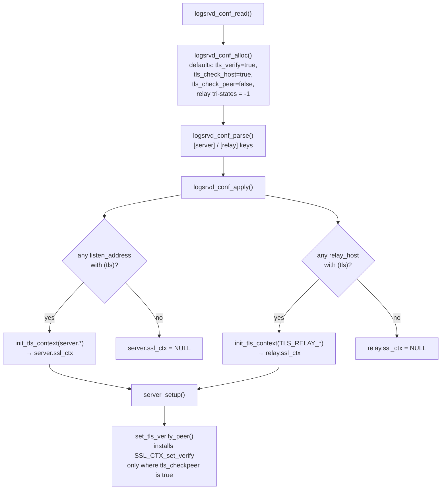
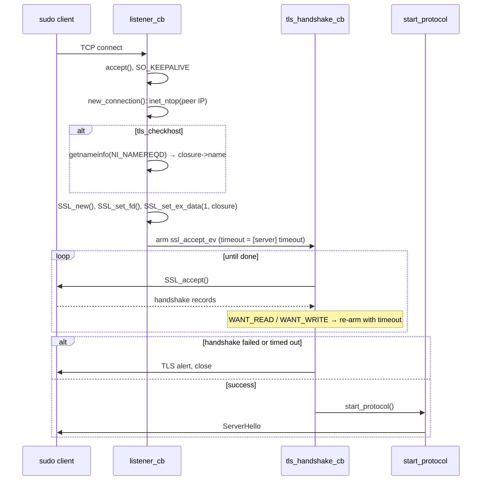

# 06. TLS, Authentication & Security Posture

> **Reference:** sudo 1.9.18 — `36f7128256a93571ec378daa5c209d6883036d31` (2026-07-19)
> **C sources:** `logsrvd/tls_init.c`, `logsrvd/tls_client.c`, `logsrvd/tls_common.h`,
> `logsrvd/logsrvd.c`, `logsrvd/logsrvd_conf.c`, `logsrvd/logsrvd_relay.c`,
> `logsrvd/logsrvd_journal.c`, `logsrvd/logsrv_util.h`, `logsrvd/logsrvd.h`,
> `logsrvd/iolog_writer.c`, `lib/iolog/hostcheck.c`, `lib/iolog/iolog_path.c`,
> `lib/iolog/iolog_swapids.c`, `lib/util/dotdot.c`, `lib/util/mkdir_parents.c`,
> `plugins/sudoers/log_client.c` (client side, for interop only)
> **Requirement prefix:** `TLS-`
> **Refresh:** see [README.md](README.md)

## Overview

`sudo_logsrvd` speaks the sudo logsrv protocol over plain TCP or over TLS. TLS is a pure
transport wrapper: there is no in-band upgrade, no `STARTTLS`, and nothing in the
protobuf schema negotiates it. Whether a connection is TLS is decided entirely by which
*listener* accepted it — each `listen_address` in `sudo_logsrvd.conf` carries an optional
`(tls)` suffix, and the resulting `struct server_address` has a `bool tls` that is copied
into the `struct listener` and then into the per-connection closure. The same is true on
the relay side: each `relay_host` entry independently decides whether the upstream leg is
TLS.

There are exactly two TLS contexts in the daemon, both built once when the configuration
is read (`logsrvd_conf_apply()`), not per connection: `config->server.ssl_ctx` for the
client-facing listeners and `config->relay.ssl_ctx` for the outbound relay leg. Both are
constructed by the same function, `init_tls_context()` in `tls_init.c`, which is shared
verbatim with sudo's own test client `sendlog`. The relay context inherits every setting
from the `[server]` section unless the `[relay]` section overrides it, via two macros
(`TLS_RELAY_STR` for strings, `TLS_RELAY_INT` for the tri-state ints).

`init_tls_context()` does five things, in order: create an `SSL_CTX` from `TLS_method()`
and pin the minimum protocol version to TLS 1.2; load the CA bundle (or fall back to the
system trust store) and publish it as the *client CA list*; load the certificate chain and
private key and optionally self-verify the chain; set the TLS 1.2 cipher list and the
TLS 1.3 ciphersuite list; and optionally load Diffie-Hellman parameters. Every step
except the DH parameter load is fatal — a failure returns `NULL`, which makes
`logsrvd_conf_apply()` fail, which makes startup fail (or, on `SIGHUP`, makes the reload
silently keep the previous configuration).

Notably, `init_tls_context()` never calls `SSL_CTX_set_verify()`. Peer verification is
configured *afterwards*, by `set_tls_verify_peer()` in `logsrvd.c`, which is called at the
end of `server_setup()` — i.e. at startup and again after every successful reload. It
installs a verify callback on the server context only if `tls_checkpeer` is true, and on
the relay context only if the relay's effective `tls_checkpeer` is true. Both default to
**false**, so out of the box `sudo_logsrvd` does not request a client certificate at all,
and does not validate the certificate presented by an upstream relay.

The TLS handshake is fully asynchronous and strictly precedes the application protocol.
For an inbound connection, `new_connection()` allocates the closure, records the peer IP,
optionally does a reverse DNS lookup, attaches the closure to the `SSL` object as ex_data
slot 1, and arms `ssl_accept_ev`; `tls_handshake_cb()` then drives `SSL_accept()` across
as many `WANT_READ`/`WANT_WRITE` rounds as OpenSSL needs, re-arming the event with the
`[server] timeout` each round. Only when `SSL_accept()` finally returns success does the
daemon call `start_protocol()` (or `connect_relay()`), which queues the `ServerHello`. A
client therefore never sees a `ServerHello` on a TLS port until the handshake completed.
On the relay side the mirror image happens in `tls_connect_cb()` (`tls_client.c`), driving
`SSL_connect()` under the relay `connect_timeout` before `start_relay()` runs.

Identity checking is done by a custom verify callback rather than by OpenSSL's built-in
`X509_VERIFY_PARAM` hostname support. The callback short-circuits on any pre-verification
failure, ignores intermediate certificates, and for the leaf calls `validate_hostname()`
from `lib/iolog/hostcheck.c`, which implements RFC 6125 §6.4.4 ordering by hand: check the
Subject Alternative Name extension first (dNSName entries against the name, iPAddress
entries against the textual IP), and only fall back to the Common Name if there is no SAN
extension at all. Wildcards are accepted only as a `*.` prefix on the left-most label and
match exactly one label.

Beyond TLS, the daemon's security posture is mostly conservative-by-default file handling
rather than sandboxing. `sudo_logsrvd` performs **no privilege dropping whatsoever** — no
`setuid`, `setgid`, `initgroups`, or `chroot` appears anywhere in the daemon. It runs for
its whole life with the credentials it was started with (root, in every packaged setup,
because it must `chown` I/O logs and bind privileged paths). It sets a `077` umask at
`main()` entry, opens every log-related file with `O_NOFOLLOW`, rejects `..` in expanded
I/O log paths, replaces `/` with `_` in every client-supplied escape value, caps wire
messages at 2 MB in both directions, and raises `RLIMIT_NOFILE` to the hard limit. It does
*not* cap the number of concurrent connections.

## TLS context construction



`init_tls_context()` guards library initialisation with a file-static `initialized` flag,
so `SSL_library_init()`, `OpenSSL_add_all_algorithms()` and `SSL_load_error_strings()` run
at most once per process even though the function is called twice per config load and
again on every reload (`tls_init.c:264-273`).

## Inbound handshake sequencing



## Peer verification and its defaults

The three knobs interact as follows on the client-facing side:

| `tls_checkpeer` | `tls_checkhost` | Behavior |
|---|---|---|
| `false` (default) | any | `SSL_VERIFY_NONE`; no CertificateRequest is sent; any client may connect |
| `true` | `true` (default) | `SSL_VERIFY_PEER｜SSL_VERIFY_FAIL_IF_NO_PEER_CERT`; chain must verify **and** the leaf must match the reverse-resolved host name or the peer IP |
| `true` | `false` | chain must verify; no identity check on the leaf |

On the relay side only `tls_checkpeer` exists as a `[relay]` key; the relay always uses
the host-checking variant of the callback when verification is enabled.

## Divergences between the C code and the man pages

Two disagreements were found while reading the source. The C code wins.

1. `sudo_logsrvd.conf(5)` documents a `tls_checkhost` key in the **`[relay]`** section
   (`docs/sudo_logsrvd.conf.man.in:434-443`), but `relay_conf_entries[]`
   (`logsrvd_conf.c:1149-1168`) has no such entry. Setting it produces
   `"[relay] illegal key: tls_checkhost"` and aborts the config parse, so the daemon
   fails to start. See TLS-026.
2. The relay-side identity check reads `SSL_get_ex_data(ssl, 1)` as a
   `struct connection_closure *`, but for relay connections that slot holds a
   `struct peer_info *`. See TLS-028 — this looks like an upstream bug, and it means the
   documented relay host-name check does not do what the manual describes.

## Requirements

### TLS-001 — TLS is transport-only and selected per listener, never negotiated in-band

- **C source:** `logsrvd/logsrvd_conf.c:522-599`, `logsrvd/logsrvd.c:1766-1804`, `logsrvd/logsrvd.c:1731-1764`, `lib/logsrv/log_server.proto:131-137`
- **Severity if divergent:** breaking

Whether a connection uses TLS is determined solely by the `(tls)` suffix on the
`listen_address` (server) or `relay_host` (relay) that produced it. `append_address()`
parses the suffix via `iolog_parse_host_port()` into `addr->tls`
(`logsrvd_conf.c:539-540, 587`); `register_listener()` copies it to `l->tls`
(`logsrvd.c:1790`); `listener_cb()` passes it to `new_connection()`
(`logsrvd.c:1751`). There is no protocol message that requests, advertises or upgrades to
TLS — `ServerHello` carries only `server_id`, `redirect`, `servers` and `subcommands`.
A reimplementation must not attempt any in-band TLS negotiation.

### TLS-002 — Default ports are 30343 (plaintext) and 30344 (TLS)

- **C source:** `logsrvd/logsrv_util.h:31-33`, `logsrvd/logsrvd_conf.c:1756-1790`
- **Severity if divergent:** medium

`DEFAULT_PORT` is `"30343"` and `DEFAULT_PORT_TLS` is `"30344"`. When no
`listen_address` is configured at all, `logsrvd_conf_apply()` adds
`*:30344(tls)` if a server certificate path is set, and otherwise adds `*:30343`
(`logsrvd_conf.c:1758-1763`, `1786-1790`). An address given without an explicit port
defaults to 30343 for plaintext and 30344 for TLS.

### TLS-003 — Exactly one SSL_CTX per role, built at config load and shared by all connections

- **C source:** `logsrvd/logsrvd_conf.c:1792-1828`, `logsrvd/logsrvd_conf.c:1580-1605`, `logsrvd/logsrvd.c:1600`, `logsrvd/logsrvd_relay.c:294`
- **Severity if divergent:** informational

`logsrvd_conf_apply()` calls `init_tls_context()` at most once for the server (first TLS
listener wins, `break` at `logsrvd_conf.c:1806`) and at most once for the relay
(`break` at `1826`). Per-connection `SSL` objects are created with `SSL_new()` against
that shared context. A failure to build either context aborts `logsrvd_conf_apply()`,
which means startup fails outright, or — on `SIGHUP` — `logsrvd_conf_read()` returns false
and `server_reload()` leaves the previous configuration and contexts in place
(`logsrvd.c:1879-1900`). Old contexts are freed by `logsrvd_conf_free()`
(`logsrvd_conf.c:1588-1589`, `1603-1604`); because `SSL_new()` takes a reference,
connections established under the old context keep working after a reload.

### TLS-004 — Minimum protocol version is TLS 1.2; no maximum version is set

- **C source:** `logsrvd/tls_init.c:275-292`
- **Severity if divergent:** high

The context is created from `TLS_method()` (the version-flexible method) and then
constrained:

```c
if (!SSL_CTX_set_min_proto_version(ctx, TLS1_2_VERSION)) { ...fatal... }
```

Where `SSL_CTX_set_min_proto_version` is unavailable, the fallback is
`SSL_CTX_set_options(ctx, SSL_OP_NO_SSLv2|SSL_OP_NO_SSLv3|SSL_OP_NO_TLSv1|SSL_OP_NO_TLSv1_1)`.
`SSL_CTX_set_max_proto_version()` is never called, so the maximum is whatever the linked
OpenSSL supports (TLS 1.3 on any modern build). Failure to set the minimum version is
fatal. The production sudoers client applies the identical TLS 1.2 floor
(`plugins/sudoers/log_client.c:211-222`).

### TLS-005 — TLS 1.2 cipher list defaults to `HIGH:!aNULL`, with non-fatal fallback on a bad config value

- **C source:** `logsrvd/tls_init.c:46`, `logsrvd/tls_init.c:117-149`
- **Severity if divergent:** medium

`DEFAULT_CIPHER_LST12` is `"HIGH:!aNULL"`. If `tls_ciphers_v12` is configured,
`SSL_CTX_set_cipher_list()` is tried with it; if that call fails the daemon **warns and
falls back to the default list** rather than failing. Only if the *default* list also
fails to apply does `init_tls_ciphersuites()` return false (fatal). A configured list that
OpenSSL accepts but that produces an empty intersection with the peer is not detected
here; it surfaces as a handshake failure.

### TLS-006 — TLS 1.3 ciphersuites default to `TLS_AES_256_GCM_SHA384` only, with the same fallback rule

- **C source:** `logsrvd/tls_init.c:47`, `logsrvd/tls_init.c:151-178`
- **Severity if divergent:** high

`DEFAULT_CIPHER_LST13` is `"TLS_AES_256_GCM_SHA384"` — a single suite, not OpenSSL's
default three. `SSL_CTX_set_ciphersuites()` is called with `tls_ciphers_v13` if set,
falling back to the default on failure (warn, not fatal); failure to set the default is
fatal. This block is compiled only when `HAVE_SSL_CTX_SET_CIPHERSUITES` is defined.
This matters for interop: a reimplementation that restricts TLS 1.3 differently, or that
leaves the library default, will negotiate a different suite than the C daemon. The sudo
client sets no TLS 1.3 restriction of its own, so the server's choice decides.

### TLS-007 — CA bundle: `tls_cacert` if set, otherwise the system default verify paths; load failure is fatal

- **C source:** `logsrvd/tls_init.c:294-319`, `logsrvd/logsrvd_conf.c:1662-1673`
- **Severity if divergent:** high

If `ca_bundle_file` is non-NULL the daemon calls `SSL_load_client_CA_file()` and
`SSL_CTX_load_verify_locations(ctx, ca_bundle_file, NULL)`; a failure of either is fatal
(`goto bad`). If it is NULL, `SSL_CTX_set_default_verify_paths()` is used and its failure
is also fatal. The default bundle path `/etc/ssl/sudo/cacert.pem` is only adopted when the
file is readable at config-load time (`access(..., R_OK) == 0`), so an absent file
silently means "use the system trust store", not "fail".

### TLS-008 — The CA bundle is also published as the acceptable-client-CA list

- **C source:** `logsrvd/tls_init.c:294-304`
- **Severity if divergent:** low

```c
STACK_OF(X509_NAME) *cacerts = SSL_load_client_CA_file(ca_bundle_file);
...
SSL_CTX_set_client_CA_list(ctx, cacerts);
```

When the server requests a client certificate (TLS-015), the CertificateRequest carries
the DNs from the bundle. This is observable on the wire and can change which certificate a
client selects. Because `init_tls_context()` is shared, the relay's client-side context
also gets a client CA list, where it has no effect.

### TLS-009 — Certificate chain and private key loading; key defaults to the certificate file

- **C source:** `logsrvd/tls_init.c:321-338`, `logsrvd/logsrvd_conf.c:1681-1685`
- **Severity if divergent:** medium

If a certificate path is set, `SSL_CTX_use_certificate_chain_file()` is called (PEM chain,
leaf first). If no key path is configured, the certificate path is reused as the key path.
`SSL_CTX_use_PrivateKey_file(..., SSL_FILETYPE_PEM)` and `SSL_CTX_check_private_key()`
must both succeed or the context build fails. In `sudo_logsrvd` specifically the
key-defaults-to-cert branch is unreachable, because `logsrvd_conf_alloc()` always sets
`server.tls_key_path` to `/etc/ssl/sudo/private/logsrvd_key.pem` even when the file does
not exist; the branch exists for the shared client code paths. Consequently a TLS listener
with a certificate but no readable key at the default path fails at startup.

### TLS-010 — `tls_verify` (default true) self-verifies the daemon's own chain and leaves `X509_V_FLAG_X509_STRICT` set on the context store

- **C source:** `logsrvd/tls_init.c:53-115`, `logsrvd/tls_init.c:340-347`, `logsrvd/logsrvd_conf.c:1686`
- **Severity if divergent:** medium

When `tls_verify` is true (the default), `verify_cert_chain()` runs at context build time:
it takes the loaded leaf via `SSL_CTX_get0_certificate()`, the extra chain via
`SSL_CTX_get0_chain_certs()`, and verifies them against the context's own store with
`X509_verify_cert()`. Any failure is fatal — the daemon will not start with a certificate
it cannot verify, which is why self-signed deployments must set `tls_verify = false`.

The side effect matters as much as the check: before verifying, the function does

```c
ca_store = SSL_CTX_get_cert_store(ctx);
X509_STORE_set_flags(ca_store, X509_V_FLAG_X509_STRICT);
```

on the *context's* store, and never clears it. Every subsequent peer-certificate
verification on that context therefore also runs in RFC 5280 strict mode. Turning
`tls_verify` off disables strict mode for peer verification too. When
`SSL_CTX_get0_certificate` is unavailable at build time the whole function is compiled
away and returns true unconditionally (`tls_init.c:111-114`).

### TLS-011 — Diffie-Hellman parameters are optional and load failure is not fatal

- **C source:** `logsrvd/tls_init.c:183-255`, `logsrvd/tls_init.c:355-367`
- **Severity if divergent:** low

If `tls_dhparams` is set, the PEM file is read via `PEM_read_bio_Parameters()` +
`SSL_CTX_set0_tmp_dh_pkey()` (or the legacy `PEM_read_bio_DHparams()` +
`SSL_CTX_set_tmp_dh()`). Unlike every other step in `init_tls_context()`, a failure here —
including the file not existing — only logs and continues with OpenSSL's built-in
parameters. No DH parameters are configured by default.

### TLS-012 — Built-in TLS paths, and the "only if it exists" rule for cacert and cert

- **C source:** `logsrvd/logsrvd_conf.c:60-63`, `logsrvd/logsrvd_conf.c:1662-1689`
- **Severity if divergent:** low

Defaults are `/etc/ssl/sudo/cacert.pem`, `/etc/ssl/sudo/certs/logsrvd_cert.pem` and
`/etc/ssl/sudo/private/logsrvd_key.pem`. The CA and certificate defaults are adopted only
if `access(path, R_OK) == 0`, explicitly so that the mere presence of the code does not
enable TLS on a host that was never configured for it (comment at
`logsrvd_conf.c:1663-1666`). The key default is adopted unconditionally. Boolean defaults
are `tls_verify = true`, `tls_check_host = true`, `tls_check_peer = false`; the two relay
tri-states are initialised to `-1` meaning "inherit from `[server]`"
(`logsrvd_conf.c:1645-1648`).

### TLS-013 — A readable default certificate silently enables a TLS listener

- **C source:** `logsrvd/logsrvd_conf.c:1756-1790`
- **Severity if divergent:** medium

If the configuration file specifies no `listen_address` at all and
`server.tls_cert_path` ended up non-NULL (either configured or defaulted because
`/etc/ssl/sudo/certs/logsrvd_cert.pem` is readable), the daemon listens on `*:30344(tls)`
and *not* on the plaintext port. Only when there is no certificate does it fall back to
`*:30343`. Conversely, if a TLS listener is configured explicitly but `tls_cert` is not
set, `logsrvd_conf_apply()` fills in the default certificate path
(`logsrvd_conf.c:1769-1781`) — which then must exist and load, or startup fails.

### TLS-014 — Client certificates are not requested by default

- **C source:** `logsrvd/logsrvd.c:1444-1462`, `logsrvd/logsrvd_conf.c:1688`
- **Severity if divergent:** high

`tls_checkpeer` defaults to false, and `set_tls_verify_peer()` only calls
`SSL_CTX_set_verify()` when it is true. With the default `SSL_VERIFY_NONE` mode an OpenSSL
server sends no CertificateRequest, so any client that completes the handshake is accepted
and any certificate it might volunteer is ignored. A reimplementation must not require
client certificates by default, and must not fail connections from certificate-less
clients in the default configuration.

### TLS-015 — When `tls_checkpeer` is true, a client certificate is mandatory

- **C source:** `logsrvd/logsrvd.c:1451-1462`
- **Severity if divergent:** breaking

```c
SSL_CTX_set_verify(server_ctx,
    SSL_VERIFY_PEER|SSL_VERIFY_FAIL_IF_NO_PEER_CERT,
    verify_peer_identity);        /* or verify_peer_identity_nohost */
```

The `SSL_VERIFY_FAIL_IF_NO_PEER_CERT` bit means a client that presents no certificate is
rejected during the handshake, not merely unverified. The callback variant is chosen by
`logsrvd_conf_server_tls_check_host()` at the time `set_tls_verify_peer()` runs, which is
once per config load — the choice is not re-evaluated per connection.

### TLS-016 — The verify callback propagates pre-verification failure and only identity-checks the leaf

- **C source:** `logsrvd/logsrvd.c:1380-1439`, `logsrvd/tls_client.c:55-103`
- **Severity if divergent:** high

`verify_peer()` is invoked once per certificate in the chain. If `preverify_ok != 1` it
logs the subject DN and the `X509_verify_cert_error_string()` reason and returns 0
immediately — chain, expiry, signature and (because of TLS-010) strict-mode errors are
never overridden. If pre-verification passed but the current certificate is not the leaf
(`X509_STORE_CTX_get_current_cert() != X509_STORE_CTX_get0_cert()`), it returns 1 without
further checks. Only for the leaf does it perform the host-name check. The variant in
`tls_client.c` additionally returns 0 if the `SSL` object or its ex_data is NULL
(`tls_client.c:90-97`); the copy in `logsrvd.c` has no such NULL guard.

### TLS-017 — `tls_checkhost` (default true) reverse-resolves the peer IP, and a lookup failure is only a warning

- **C source:** `logsrvd/logsrvd.c:1614-1630`, `logsrvd/logsrvd.c:1577-1590`
- **Severity if divergent:** medium

Before the handshake, if `tls_checkhost` is enabled, `new_connection()` calls
`getnameinfo(&sa_un->sa, salen, hbuf, sizeof(hbuf), NULL, 0, NI_NAMEREQD)` and stores the
result in `closure->name`. `NI_NAMEREQD` means no numeric fallback: if there is no PTR
record the call fails, the daemon logs `"unable to resolve host <ip>"`, and
`closure->name` stays NULL. The connection is **not** rejected — verification proceeds
with a NULL name, which means only the IP address can match (TLS-019, TLS-021). The peer
IP itself is always recorded, from `inet_ntop()` on the accepted `sockaddr`; a socket
family that is neither `AF_INET` nor `AF_INET6` is rejected with `EAFNOSUPPORT`.

Note that the resolved name is *not* re-validated by a forward lookup, so identity
ultimately rests on the certificate matching either the PTR name or the literal IP.

### TLS-018 — Identity matching follows RFC 6125 §6.4.4: SAN first, CN only if no SAN extension exists

- **C source:** `lib/iolog/hostcheck.c:256-271`, `lib/iolog/hostcheck.c:176-238`
- **Severity if divergent:** high

`validate_hostname(cert, hostname, ipaddr)` first calls
`matches_subject_alternative_name()`. That function returns `NoSANPresent` only when
`X509_get_ext_d2i(cert, NID_subject_alt_name, ...)` returns NULL — i.e. the extension is
entirely absent. Only in that case does `validate_hostname()` fall back to
`matches_common_name()`. A certificate that has a SAN extension which does not match is
`MatchNotFound`; its CN is never consulted. The verify callback treats anything other than
`MatchFound` as failure (`logsrvd.c:1417-1425`).

### TLS-019 — SAN dNSName and CN matching: case-insensitive, single trailing dot tolerated, one-label `*.` wildcard, NUL rejected

- **C source:** `lib/iolog/hostcheck.c:65-108`, `lib/iolog/hostcheck.c:121-157`
- **Severity if divergent:** medium

`validate_name()` is the shared comparator for both dNSName SAN entries and the CN:

- An embedded NUL byte anywhere in the certificate name yields `MalformedCertificate`
  (`memchr(certname_s, '\0', certname_len)`), which is not `MatchFound` and therefore
  fails.
- A single trailing `.` on the *expected* host name is stripped before comparison.
- If the certificate name begins with `*.` **and** is longer than 2 bytes, the expected
  host name's first label (everything up to and including the first `.`) is stripped and
  the remainders are compared. A wildcard therefore matches exactly one label and only in
  the left-most position; `*` alone or `a*.example.com` are not treated as wildcards.
- Comparison is length-equality plus `strncasecmp()`, so it is case-insensitive and
  byte-oriented (no IDNA/punycode handling).
- If `hostname` is NULL, `matches_common_name()` returns `MatchNotFound` immediately, and
  the SAN loop skips all `GEN_DNS` entries.

Missing-CN cases (`X509_NAME_get_index_by_NID` < 0, or a NULL entry/data) return `Error`,
which is also treated as failure.

### TLS-020 — SAN iPAddress matching is textual, over 4-byte and 16-byte entries only

- **C source:** `lib/iolog/hostcheck.c:201-233`
- **Severity if divergent:** medium

For `GEN_IPADD` entries the raw ASN.1 octets are converted with `inet_ntop()` — `AF_INET`
for length 4, `AF_INET6` for length 16 — and compared to the peer's own `inet_ntop()`
rendering with `strcasecmp()`. Any other length yields `MalformedCertificate` and
**breaks out of the SAN loop immediately**, so a malformed IP entry can mask a later
matching entry. IPv6 entries are only considered when the build has
`HAVE_STRUCT_IN6_ADDR`. Because the comparison is on canonical `inet_ntop()` output on both
sides, textual form differences (compressed vs expanded IPv6) do not matter.

### TLS-021 — Verification failure aborts the TLS handshake; the client gets a TLS alert, not a protocol error

- **C source:** `logsrvd/logsrvd.c:1473-1558`, `logsrvd/logsrvd.c:1420-1424`
- **Severity if divergent:** breaking

A verify callback returning 0 makes `SSL_accept()` fail with a fatal alert. In
`tls_handshake_cb()` this lands in the `SSL_ERROR_SYSCALL` or `default` arm, which logs
`"<ip>: SSL_accept: <reason>"` and calls `connection_close(closure)`. No `ServerHello`,
no `error` ServerMessage, and no log entry for the session is produced — the connection
simply dies at the TLS layer. The same is true of a handshake that exceeds the timeout
(TLS-022).

### TLS-022 — The TLS handshake is bounded by the `[server] timeout` (default 30s; 0 disables)

- **C source:** `logsrvd/logsrvd.c:1643-1647`, `logsrvd/logsrvd.c:1481-1484`, `logsrvd/logsrvd.c:1506-1510`, `logsrvd/logsrvd.c:1524-1528`, `logsrvd/logsrvd_conf.c:252-260`, `logsrvd/logsrvd.h:41`
- **Severity if divergent:** medium

`ssl_accept_ev` is armed with `logsrvd_conf_server_timeout()` on the initial add and again
on every `WANT_READ`/`WANT_WRITE` re-arm, so the timeout is *per handshake round*, not per
handshake. On expiry the callback is entered with `SUDO_EV_TIMEOUT`, logs
`"TLS handshake with <ip> timed out"` and closes the connection.
`logsrvd_conf_server_timeout()` returns NULL — meaning no timeout — when the configured
value is zero. The default is `DEFAULT_SOCKET_TIMEOUT_SEC` = 30.

### TLS-023 — `ServerHello` is queued only after the handshake completes

- **C source:** `logsrvd/logsrvd.c:1540-1552`, `logsrvd/logsrvd.c:1650-1659`, `logsrvd/logsrvd.c:1350-1377`
- **Severity if divergent:** breaking

On a plaintext connection `new_connection()` calls `start_protocol()` (or
`connect_relay()`) inline. On a TLS connection neither is called until
`tls_handshake_cb()` observes `SSL_ERROR_NONE`. `start_protocol()` formats the
`ServerHello` into the write queue and arms the write event with the server timeout; the
read event is armed with **no** timeout, because client messages may arrive at arbitrary
times. In store-and-forward relay mode (`store_first`) the relay connection is likewise
deferred until after the client-facing handshake.

### TLS-024 — The relay leg performs its own TLS handshake after TCP connect and before relaying anything

- **C source:** `logsrvd/logsrvd_relay.c:288-318`, `logsrvd/logsrvd_relay.c:388-405`, `logsrvd/logsrvd_relay.c:454-473`, `logsrvd/tls_client.c:105-233`
- **Severity if divergent:** breaking

When the selected `relay_host` has the `(tls)` flag, `connect_relay_tls()` runs as soon as
the TCP connection completes — both in the immediate-success path
(`logsrvd_relay.c:394-399`) and in `connect_cb()` for the asynchronous case
(`logsrvd_relay.c:456-464`). It allocates a `SUDO_EV_WRITE` event on the relay socket
pointing at `tls_connect_cb()`, sets `peer_name` to `&relay_closure->relay_name`, copies
the relay `connect_timeout` into the closure, and calls `tls_ctx_client_setup()`, which
does `SSL_new()`, `SSL_set_ex_data(ssl, 1, peer_name)` and `SSL_set_fd()`.
`tls_connect_cb()` then drives `SSL_connect()` to completion, re-arming with the
`connect_timeout` on `WANT_READ`/`WANT_WRITE` and treating `SUDO_EV_TIMEOUT` as
`"TLS handshake timeout occurred"`. Only on success does `start_relay()` run and the
`ClientHello`/relayed traffic begin. A handshake failure invokes `connect_error_fn`, which
tries the next relay in the list and, if none remain, sends
`"unable to connect to relay host"` downstream.

### TLS-025 — Relay TLS settings inherit from `[server]` on a per-key basis

- **C source:** `logsrvd/logsrvd_conf.c:65-71`, `logsrvd/logsrvd_conf.c:1809-1827`, `logsrvd/logsrvd_conf.c:340-346`
- **Severity if divergent:** medium

The relay context is built with `TLS_RELAY_STR(config, f)` = `relay.f ?: server.f` for
`tls_cacert`, `tls_cert`, `tls_key`, `tls_dhparams`, `tls_ciphers_v12`, `tls_ciphers_v13`,
and `TLS_RELAY_INT(config, f)` = `relay.f != -1 ? relay.f : server.f` for `tls_verify`.
`logsrvd_conf_relay_tls_check_peer()` applies the same tri-state rule to `tls_checkpeer`
at call time. Inheritance is per key, not all-or-nothing: setting only `[relay] tls_cacert`
leaves the relay using the server's certificate and key.

### TLS-026 — `tls_checkhost` is not a recognised `[relay]` key, despite the manual

- **C source:** `logsrvd/logsrvd_conf.c:1149-1168`, `logsrvd/logsrvd_conf.c:1283-1297`, `docs/sudo_logsrvd.conf.man.in:434-443`
- **Severity if divergent:** low

`relay_conf_entries[]` contains `tls_key`, `tls_cacert`, `tls_cert`, `tls_dhparams`,
`tls_ciphers_v12`, `tls_ciphers_v13`, `tls_checkpeer` and `tls_verify` — but no
`tls_checkhost`, even though `sudo_logsrvd.conf(5)` documents one. An unrecognised key
makes `logsrvd_conf_parse()` emit `"%s:%d [%s] illegal key: %s"` and fail, which fails the
whole config read. Reading the C source is authoritative here: a `[relay] tls_checkhost`
line prevents the daemon from starting.

### TLS-027 — The relay does not verify the upstream certificate by default

- **C source:** `logsrvd/logsrvd.c:1463-1468`, `logsrvd/logsrvd_conf.c:340-346`, `logsrvd/logsrvd_conf.c:1647`, `logsrvd/logsrvd_conf.c:1688`
- **Severity if divergent:** high

`set_tls_verify_peer()` installs a verify callback on the relay context only when
`logsrvd_conf_relay_tls_check_peer()` is true. That function returns `relay.tls_check_peer`
if it is not `-1`, else `server.tls_check_peer` — and both default to false/`-1`
respectively. With `SSL_VERIFY_NONE` on a client-side context, OpenSSL completes the
handshake regardless of whether the upstream certificate chains to a trusted CA or matches
the configured relay host name. Enabling upstream verification requires explicitly setting
`tls_checkpeer = true` in `[relay]` (or in `[server]`, which the relay inherits).

### TLS-028 — When relay peer verification *is* enabled, the identity check reads mistyped ex_data (apparent upstream bug)

- **C source:** `logsrvd/logsrvd.c:1413-1425`, `logsrvd/logsrvd.c:1463-1468`, `logsrvd/tls_client.c:210-215`, `logsrvd/logsrv_util.h:38-45`, `logsrvd/logsrvd.h:89-127`
- **Severity if divergent:** informational

`set_tls_verify_peer()` installs `logsrvd.c`'s `verify_peer_identity` on the *relay*
context. That callback recovers its context with

```c
ssl = X509_STORE_CTX_get_ex_data(ctx, SSL_get_ex_data_X509_STORE_CTX_idx());
closure = (struct connection_closure *)SSL_get_ex_data(ssl, 1);
...
validate_hostname(peer_cert, closure->name, closure->ipaddr);
```

but for relay connections ex_data slot 1 was set by `tls_ctx_client_setup()` to a
`struct peer_info *` (`{ const char *name; char ipaddr[46]; }`), not a
`struct connection_closure *`. The two layouts are unrelated, so `closure->name` and
`closure->ipaddr` read unrelated bytes of the enclosing `struct relay_closure`. The
sibling callback in `tls_client.c:55-103` — which correctly interprets slot 1 as
`struct peer_info *` and is the one `tls_client_setup()` installs — is never reached by
`sudo_logsrvd`, because the daemon calls `tls_ctx_client_setup()` directly
(`logsrvd_relay.c:312`) and installs its own callback.

This requirement records the C behavior for fidelity, not as something to reproduce. A
reimplementation should verify the upstream certificate against the configured relay host
name and its resolved IP address — which is `relay_closure->relay_name` (populated from
`relay->sa_host` and `inet_ntop()` of the connected address at
`logsrvd_relay.c:383-386`) and is plainly the intended input.

### TLS-029 — A TLS 1.3 upstream rejecting our client certificate surfaces as a read error and is reported downstream

- **C source:** `logsrvd/logsrvd_relay.c:805-827`
- **Severity if divergent:** low

Under TLS 1.3 the client finishes its handshake before the server has processed the client
Certificate, so an upstream verification failure arrives as an alert on the relay's first
read. `relay_server_msg_cb()` special-cases this: if `closure->state == INITIAL` and
`ERR_GET_REASON(errcode) == SSL_R_TLSV1_ALERT_INTERNAL_ERROR`, the error reported to the
downstream sudo client is `"relay host name does not match certificate"`; otherwise it is
`"error reading from relay"`. Either way the daemon sends an `error` ServerMessage
downstream before closing. The special case is compiled out for wolfSSL builds.

### TLS-030 — `SSL_shutdown()` is attempted before the socket is closed, on both legs

- **C source:** `logsrvd/logsrvd.c:114-147`, `logsrvd/logsrvd_relay.c:76-85`
- **Severity if divergent:** low

`connection_closure_free()` calls `SSL_shutdown()`; if it returns 0 (close_notify sent but
peer's not yet received) it calls it exactly once more, then `SSL_free()`, then
`shutdown(sock, SHUT_RDWR)` and `close()`. Errors are logged, never retried further. The
relay path does the same, more tersely. Correspondingly, a peer that closes the TCP
connection without a close_notify triggers
`"EOF from %s without proper TLS shutdown"` (`logsrvd.c:1185-1191`,
`logsrvd_relay.c:828-834`) — a warning only; the EOF is then handled normally and the
connection is closed.

### TLS-031 — No SNI, ALPN, session-id context, renegotiation control, or session-cache tuning is configured

- **C source:** `logsrvd/tls_init.c:257-377`, `logsrvd/tls_client.c:194-233`, `logsrvd/logsrvd.c:1594-1648`
- **Severity if divergent:** informational

Grepping the daemon and the sudoers client finds no call to
`SSL_set_tlsext_host_name()`, `SSL_CTX_set_alpn_protos()`,
`SSL_CTX_set_session_id_context()`, `SSL_CTX_set_session_cache_mode()`,
`SSL_CTX_set_options(SSL_OP_NO_TICKET)`, `SSL_renegotiate()` or
`SSL_verify_client_post_handshake()`. Whatever session resumption or ticket behavior
occurs is purely the linked OpenSSL's default. The protocol carries no dependency on
resumption: every connection is independent, and the sudo client neither stores nor
presents sessions. A reimplementation is free to disable resumption entirely.

### TLS-032 — The daemon never drops privileges, changes groups, or chroots

- **C source:** `logsrvd/logsrvd.c:2210-2308`, `logsrvd/logsrvd.c:2112-2162`
- **Severity if divergent:** informational

`main()` reads `sudo.conf`, parses options, reads `sudo_logsrvd.conf`, raises
`RLIMIT_NOFILE`, sets up listeners, scans the relay queue, registers signals, and
daemonizes. There is no `setuid`, `setgid`, `setgroups`, `initgroups`, `chroot`,
`pledge`, `unveil`, or capability manipulation anywhere in `logsrvd.c` — the process keeps
the credentials it was started with for its entire lifetime. `daemonize()` does
`chdir("/")`, forks, `setsid()`, writes the pid file and redirects stdin/stdout/stderr to
`/dev/null` (in `-n` mode stdout/stderr are preserved if already open). The only
credential switching in the whole daemon is the temporary `seteuid`/`setegid` swap to the
I/O log owner in `iolog_swapids()`, used as an `EACCES` fallback for directory creation and
rename (`lib/iolog/iolog_swapids.c:41-97`, `logsrvd/iolog_writer.c:809-827`).

### TLS-033 — Startup umask is `077`, with narrowly-scoped relaxations

- **C source:** `logsrvd/logsrvd.c:2231-2232`, `logsrvd/logsrvd.c:2053-2074`, `logsrvd/logsrvd_conf.c:1306-1330`, `logsrvd/logsrvd_journal.c:110-140`
- **Severity if divergent:** medium

`main()` begins with `umask(S_IRWXG|S_IRWXO)` — octal `077`, so anything created without
an explicit relaxation is owner-only. Server log and event log files are opened by
`logsrvd_open_log_file()` under a temporary `umask(S_IRWXG|S_IRWXO)` with mode
`S_IRUSR|S_IWUSR` and `O_NOFOLLOW`, i.e. mode `0600`. `write_pidfile()` temporarily relaxes
to `umask(S_IWGRP|S_IWOTH)` (`022`) and creates the pid file `0644` with `O_NOFOLLOW`,
creating the parent directory as `root:root` mode `0751` via `sudo_open_parent_dir()`.
Relay journal files are created `O_CREAT|O_EXCL|O_RDWR|O_NOFOLLOW` mode `0600`.

### TLS-034 — I/O log files are chowned to `iolog_user`/`iolog_group` and use `iolog_mode` (default `0600`)

- **C source:** `logsrvd/logsrvd_conf.c:438-485`, `logsrvd/logsrvd_conf.c:1694`, `logsrvd/logsrvd_conf.c:1700-1702`, `logsrvd/logsrvd_conf.c:1382-1394`, `logsrvd/iolog_writer.c:723-728`
- **Severity if divergent:** medium

`iolog_user` is resolved with `getpwnam()` (unknown user is a fatal config error) and sets
both uid and, unless a group was set explicitly, gid; `iolog_group` uses `getgrnam()` and
pins the gid. Defaults are `ROOT_UID`/`ROOT_GID`. `iolog_mode` is parsed with
`sudo_strtomode()` and defaults to `S_IRUSR|S_IWUSR` (`0600`). These are pushed into the
iolog library by `logsrvd_conf_iolog_setconf()` via `iolog_set_owner()` and
`iolog_set_mode()`; individual files are then `fchown()`ed (a failure is logged at debug
level only and does not abort the session, e.g. `iolog_store_uuid()`).

### TLS-035 — `RLIMIT_NOFILE` is raised as far as possible and there is no cap on concurrent connections

- **C source:** `logsrvd/logsrvd.c:2079-2107`, `logsrvd/logsrvd.c:1731-1764`, `logsrvd/logsrvd.c:1696`
- **Severity if divergent:** low

`unlimit_nofile()` tries `RLIM_INFINITY` for both soft and hard limits and, failing that,
sets both to the current hard limit. The daemon maintains no connection counter and
enforces no maximum: `listener_cb()` accepts unconditionally, and the `TODO` comments at
`logsrvd.c:1752` and `1759` acknowledge that it does not pause accepting on `ENOMEM`,
`ENFILE` or `EMFILE`. The listen backlog is `SOMAXCONN`. A reimplementation that imposes a
connection cap is being stricter than the reference, which is defensible but observable.

### TLS-036 — Wire messages are capped at 2 MB in both directions

- **C source:** `logsrvd/logsrv_util.h:36`, `logsrvd/logsrvd.c:1229-1247`, `logsrvd/logsrvd.c:356-361`
- **Severity if divergent:** breaking

`MESSAGE_SIZE_MAX` is `2 * 1024 * 1024`. A client-declared length above it produces the
warning `"client message too large: %zu"`, sets `closure->errstr` to
`"client message too large"`, and takes the `send_error` path — the daemon attempts to send
an `error` ServerMessage before closing, rather than closing abruptly. Outbound,
`fmt_server_message()` refuses to serialise a `ServerMessage` whose packed size exceeds the
same limit. Under the limit, an incomplete message causes the read buffer to be expanded to
`msg_len + 4` and the parse to be retried on the next read.

### TLS-037 — Client-supplied path escapes cannot introduce path separators, and `..` is rejected after expansion

- **C source:** `logsrvd/iolog_writer.c:472-568`, `lib/iolog/iolog_path.c:127-151`, `logsrvd/iolog_writer.c:586-616`, `lib/util/dotdot.c:35-51`
- **Severity if divergent:** high

Every escape whose value comes from the client — `%{user}`, `%{group}`, `%{runas_user}`,
`%{runas_group}`, `%{hostname}`, `%{command}` — is copied with `strlcpy_no_slash()`, which
replaces each `/` with `_`. After expanding both `iolog_dir` and `iolog_file`,
`create_iolog_path()` runs `sudo_contains_dot_dot()` on each and refuses with
`"unable to expand iolog path %s: path traversal attack"` if it matches. That helper flags
a `..` component only when it is bounded by start-of-string or `/` on the left and `/` or
end-of-string on the right, so `..foo` and `a..b` are fine while `..`, `../x`, `x/..` and
`x/../y` are rejected. `%{command}` additionally uses only the basename of the command.

### TLS-038 — Every log-related open uses `O_NOFOLLOW`, and the session directory is held as a directory fd

- **C source:** `logsrvd/iolog_writer.c:633-638`, `logsrvd/iolog_writer.c:717`, `lib/iolog/iolog_open.c:83`, `lib/iolog/iolog_mkdirs.c:56-60`, `logsrvd/logsrvd_local.c:301`, `logsrvd/logsrvd_local.c:492`, `logsrvd/logsrvd_journal.c:131`
- **Severity if divergent:** high

`create_iolog_path()` opens the session directory `O_RDONLY|O_DIRECTORY|O_NOFOLLOW` and
keeps the descriptor in `closure->iolog_dir_fd`; all subsequent per-session files
(`uuid`, `log`, `log.json`, `timing`, the I/O streams) are created with `openat()` relative
to that descriptor, each with `O_NOFOLLOW` added. Directory creation
(`iolog_mkdirs.c`) also uses `O_DIRECTORY|O_NOFOLLOW`. The effect is that a symlink planted
at any component *inside* the session directory is refused; the descriptor is not,
however, an `openat2(RESOLVE_BENEATH)`-style containment, and the path leading *to* the
session directory is still resolved by name once.

### TLS-039 — Configuration parsing is strict: unknown sections, unknown keys and unparseable values are fatal

- **C source:** `logsrvd/logsrvd_conf.c:1217-1304`, `logsrvd/logsrvd_conf.c:777-817`
- **Severity if divergent:** low

`logsrvd_conf_parse()` aborts the entire read on an unmatched `[`, garbage after `]`, an
unknown section name, a line with no `=`, a key/value line before any section header, an
unknown key within a known section, or any setter returning false. Section and key names
are matched case-insensitively (`strcasecmp`). The boolean TLS setters
(`cb_tls_verify`, `cb_tls_checkhost`, `cb_tls_checkpeer`) use `sudo_strtobool()` and return
false on anything it cannot parse, so `tls_checkpeer = yes-please` prevents startup rather
than defaulting. Note the comment character is `#` (handled by `sudo_parseln`), with `;`
also skipped explicitly at `logsrvd_conf.c:1232`.

### TLS-040 — The `-R` option randomly drops connections and is a debugging tool only

- **C source:** `logsrvd/logsrvd.c:91`, `logsrvd/logsrvd.c:2257-2264`, `logsrvd/logsrvd.c:765-774`
- **Severity if divergent:** informational

`-R`/`--random-drop` takes a percentage, divides it by 100, and stores it in a global. On
each received `IoBuffer`, if `arc4random() / (double)UINT32_MAX` is below that value, the
handler fails with `closure->errstr = "randomly dropping connection"`, exercising the
client's restart logic. It affects no other message type. There is no equivalent
configuration-file setting.

### TLS-041 — Listener sockets set `SO_REUSEADDR`, `IPV6_V6ONLY`, non-blocking mode, and optional `SO_KEEPALIVE`

- **C source:** `logsrvd/logsrvd.c:1667-1713`, `logsrvd/logsrvd.c:1744-1750`, `logsrvd/logsrvd_conf.c:1654`
- **Severity if divergent:** low

`open_listener_socket()` sets `SO_REUSEADDR` on every listener, sets `IPV6_V6ONLY` on
`AF_INET6` sockets so IPv4-mapped addresses are refused (a wildcard address therefore
yields *two* listeners, one per family, from `getaddrinfo()` with `AI_PASSIVE`), listens
with `SOMAXCONN`, and switches the socket to `O_NONBLOCK`. Failure to set the socket
options is warned about but not fatal; failure to bind or listen skips that address.
Accepted sockets get `SO_KEEPALIVE` when `[server] tcp_keepalive` is true, which is the
default; the relay leg does the same under `[relay] tcp_keepalive`
(`logsrvd_relay.c:352-358`).
